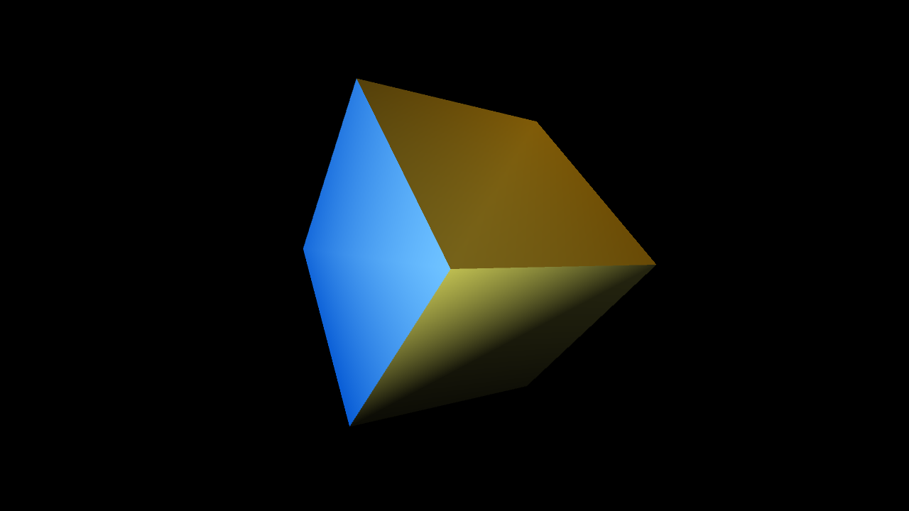
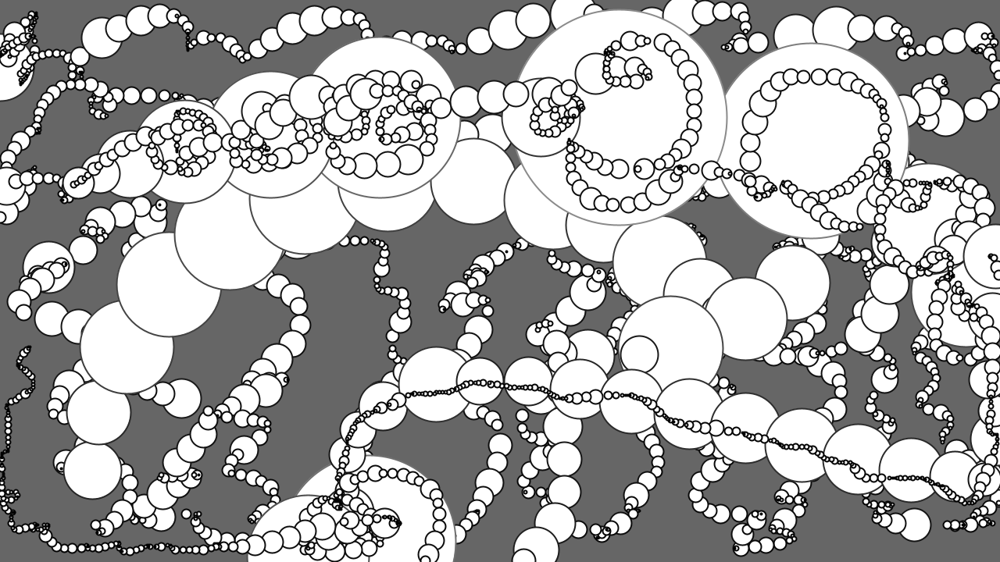
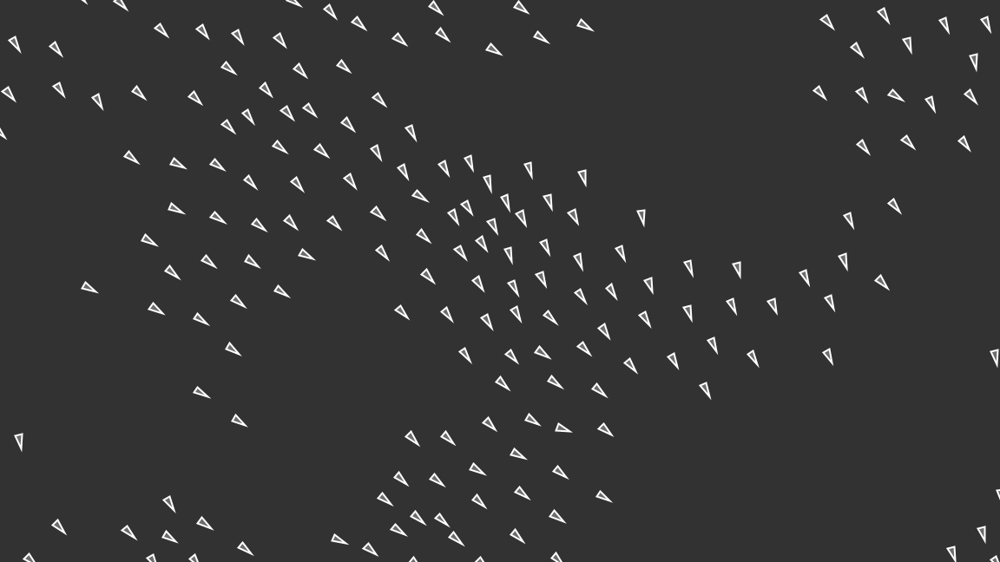

# metaphor

[](https://github.com/shinyaoguri/metaphor/releases/latest)
[](https://github.com/shinyaoguri/metaphor/actions/workflows/ci.yml)
[](https://www.swift.org)
[](https://developer.apple.com/macos/)
[](LICENSE)

**Processing の書き味 × Apple Silicon ネイティブ × AI が「いま見えている絵」を観測しながら作れる。**

`metaphor` は Swift + Metal のクリエイティブコーディング・ランタイムです。`setup()` / `draw()` を書けばウィンドウが開き、2D / 3D 描画、GPU compute、ポストエフェクト、音声・映像、OSC / MIDI、Core ML、レイトレーシング、Syphon 出力までを、ひと続きの API で扱えます。そして **Probe + ライブビューア + ローカル MCP** により、AI エージェントがレンダリング結果と内部状態を観測しながら、人間と同じ作品を一緒に作れます。

<table>
  <tr>
    <td align="center"><a href="Examples/Topics/Fractals%20and%20L-Systems/Tree"></a><br><sub>Fractal Tree</sub></td>
    <td align="center"><a href="Examples/Topics/Cellular%20Automata/GameOfLife"></a><br><sub>Game of Life</sub></td>
    <td align="center"><a href="Examples/Basics/Lights/Mixture"></a><br><sub>3D Lights (Blinn-Phong)</sub></td>
  </tr>
  <tr>
    <td align="center"><a href="Examples/Topics/Fractals%20and%20L-Systems/Mandelbrot"></a><br><sub>Mandelbrot</sub></td>
    <td align="center"><a href="Examples/Topics/Drawing/Pattern"></a><br><sub>Generative Pattern</sub></td>
    <td align="center"><a href="Examples/Topics/Simulate/Flocking"></a><br><sub>Flocking</sub></td>
  </tr>
</table>

```swift
import metaphor

@main
final class Hello: Sketch {
    var config: SketchConfig { SketchConfig(width: 800, height: 600) }

    func draw() {
        background(13)
        fill(255, 102, 51)
        circle(mouseX, mouseY, 120)
    }
}
```

## 60 秒ではじめる

```bash
brew install shinyaoguri/tap/metaphor   # CLI をインストール
metaphor new MySketch                   # テンプレートからスケッチを作成
cd MySketch
metaphor run                            # 解決・ビルド・ウィンドウ表示までまとめて実行
```

`metaphor watch` に替えると、ファイル保存のたびにライブビューア窓を保ったまま再ビルドされます。CLI（インストールの他の方法・全コマンド・テンプレート）は **[metaphor-cli](https://github.com/shinyaoguri/metaphor-cli)** が提供します。CLI を使わずライブラリだけ使う場合は [SwiftPM パッケージとして組み込む](#swiftpm-パッケージとして組み込む) へ。

## なぜ metaphor か

1. **AI が「いま見えている絵」を見ながら直せる。** 一般的な LLM はソースコードしか読めませんが、metaphor では Probe プラグインがフレーム画像と内部状態を書き出し、`metaphor mcp` がそれを MCP ツールとして AI エージェントに渡します。AI が **観測 → 編集 → 再観測 → 検証** のループを自分で回せる — 差別化は Swift/Metal そのものではなく、この観測ループにあります。→ [AI と協調する](#ai-と協調する観測--操作--反復)
2. **Processing の書き味のまま、Metal の速度。** `circle` を並べて書くだけで同じ形状の連続描画が **GPU インスタンシングに自動バッチ** されます（10,000 個の円でも draw call 1 回）。100 万粒子の GPU パーティクルも `createParticleSystem` 1 行。`fill` / `push` / `translate` などの語彙は 2D でも 3D でも同じ感覚で使えます。
3. **Apple のグラフィックス関連フレームワーク全部入り、書き出しまで完結。** Metal / MPS（レイトレーシング含む）/ Core ML & Vision / Core Image / AVFoundation / GameplayKit Noise / Core MIDI / Syphon を 1 枚の `Sketch` から統一 API で。シェーダーホットリロード、OSC / MIDI、Performance HUD などライブ / VJ 装備も標準。動画 / GIF / 静止画エクスポートと決定論レンダリング（fixed-FPS の高解像度焼き出し）まで揃います。

## できること

| 領域 | 主な機能 |
|---|---|
| 2D 描画 | プリミティブ、パス、凹多角形（穴あり）、テキスト、画像、ブレンドモード |
| 3D 描画 | プリミティブ / 自作メッシュ / OBJ・USDZ・ABC ローダー、カメラ、ライト（PBR + Blinn-Phong）、シャドウマップ |
| GPU compute | カスタム MSL カーネル、indirect draw、100万粒子の GPU パーティクル |
| Post-process | bloom、blur、edge detect、カスタム MSL シェーダー、FBO フィードバック |
| 音声 | マイク入力、FFT、ビート検出、サウンドファイル再生 |
| 映像 | カメラ入力、動画再生、動画 / GIF エクスポート |
| 入力 | OSC、MIDI 入出力、マウス、キー、オービットカメラ |
| ML | Core ML、Vision（分類 / 検出 / ポーズ / セグメント / OCR / 顔 など） |
| 高度な機能 | RenderGraph、SceneGraph、2D 物理、Syphon 出力、MPS レイトレーシング |

## はじめてのスケッチ

`metaphor new` が生成する `App.swift` は、Processing と同じ「`setup` で初期化、`draw` を毎フレーム呼ぶ」モデルです。

```swift
import metaphor

@main
final class MySketch: Sketch {
    // ウィンドウサイズや title などの設定
    var config: SketchConfig {
        SketchConfig(width: 1280, height: 720, title: "MySketch")
    }

    // 起動時に1回だけ呼ばれる
    func setup() {
        // 初期化・リソース読み込み
    }

    // 毎フレーム呼ばれる
    func draw() {
        background(13)
        fill(255, 102, 51)
        circle(mouseX, mouseY, 96)
    }
}
```

| ライフサイクル | 呼ばれるタイミング |
|---|---|
| `setup()` | 起動時に1回 |
| `compute()` | 毎フレーム、`draw` の前（GPU compute 用） |
| `draw()` | 毎フレーム |
| `mousePressed()` / `mouseDragged()` / `mouseScrolled()` など | マウスイベント |
| `keyPressed()` / `keyReleased()` | キーボードイベント |

`noLoop()` で 1 フレームだけ描画して停止、`loop()` で再開、`frameRate(n)` で FPS を指定できます。

### よく使う関数

```swift
// --- 2D shapes
circle(x, y, diameter)
rect(x, y, w, h)
line(x1, y1, x2, y2)
triangle(x1, y1, x2, y2, x3, y3)
arc(x, y, w, h, start, stop)
text("hello", x, y)

// --- 3D shapes
box(size)
sphere(radius)
plane(w, h)
cylinder(radius: 0.5, height: 1)
torus(ringRadius: 0.5, tubeRadius: 0.2)

// --- スタイル（色は既定で 0〜255。Processing と同じ。colorMode で変更可）
background(r, g, b)
fill(r, g, b);  fill(gray)
stroke(r, g, b); strokeWeight(2)
noFill();  noStroke()
blendMode(.additive)

// --- 変換（push/pop でスタック）
push()
translate(x, y);  translate(x, y, z)
rotate(angle);    rotateX(a); rotateY(a); rotateZ(a)
scale(s)
pop()

// --- 状態 / ユーティリティ
mouseX, mouseY, frameCount, deltaTime, width, height
random(0, 1);  noise(x, y);  map(v, 0, 1, 100, 200)
```

API 全体は [`llms.txt`](llms.txt) にまとまっています。「Processing でいうところの○○」を探すときは [Examples](#examples) から近いサンプルを見つけるのが早道です。

## AI と協調する（観測 → 操作 → 反復）

metaphor は、AI エージェントが**実行中のスケッチを観測しながら**開発できるよう設計されています。`metaphor mcp` を AI クライアント（Claude Code / Cursor など）に MCP サーバとして登録すると、エージェントがレンダリング結果の画像と内部状態を取得し、再ビルドの結果まで確認しながら「観測 → 編集 → 再観測 → 検証」を自律的に反復できます。

| ツール | 役割 |
|---|---|
| `snapshot` | 現在フレームの画像（PNG）と内部状態（`frameCount` / `time` / `probe()` 値 / 色・領域統計 / 警告）を返す |
| `capture_sequence` | 連続フレーム列を採取し、コンタクトシート画像とフレーム別 manifest を返す（動き・リズム・遷移を観測する） |
| `input` | 実行中のスケッチへマウス・キー入力を送る |
| `build_status` | 直近の `swift build` の成否とエラーを返す |
| `api_reference` | metaphor の API ドキュメント（作法ガイド / 全 API / サンプル索引）を返す。新しい API を使う前に参照する |

さらに、人間が `metaphor watch` を起動しておくと、AI の `metaphor mcp` は**同じ実行中スケッチにアタッチ**して観測します（共有セッション）。人間はライブビューア窓で見ながら編集し、AI はファイル編集と `snapshot` で協調できます。

この観測の仕組み自体は metaphor 本体の機能（**Probe** プラグイン）です。内部状態を AI に渡すには `draw()` 内で `probe("count", n)` のように申告します（例: [`Examples/Samples/ProbeSnapshot`](Examples/Samples/ProbeSnapshot)）。

**AI に metaphor 流のコードを書かせる**ための静的コンテキストも同梱しています。

- [`llms-sketch.txt`](llms-sketch.txt) — スケッチ作者向けの短い AI コンテキスト。`setup()` / `draw()` の書き方、よく使う API、避けるべき重い処理。
- [`llms.txt`](llms.txt) — 全 API を 1 ファイルにまとめた LLM 向けリファレンス。**AI のコンテキストに丸ごと貼るだけ**で metaphor の流儀に沿ったコードを書かせられます。
- [`docs/ai/`](docs/ai/) — [スケッチ作者向けガイド](docs/ai/for-sketch-authors.md)、[サンプル索引](docs/ai/examples-index.md)、[用途別プロンプト](docs/ai/prompts/)、[インストール形態ごとの効き方](docs/ai/install-scenarios.md)。

セットアップ手順（`claude mcp add` / `.mcp.json`）・共有セッションの運用は **[metaphor-cli の「AI と協調する」](https://github.com/shinyaoguri/metaphor-cli#ai-と協調する)**、設計の背景は [docs/design/ai-mcp-server.md](docs/design/ai-mcp-server.md) / [docs/design/shared-session.md](docs/design/shared-session.md) を参照してください。

## Examples

[Examples/](Examples/) には、Processing 公式サンプルの Swift / Metal 移植と、metaphor 独自機能のサンプルが 270 本以上揃っています。各サンプルは独立した SwiftPM パッケージです。

```bash
cd Examples/Basics/Form/ShapePrimitives
swift run
```

- [Basics/](Examples/Basics/) — Processing 標準サンプルの移植（Form / Color / Image / Lights / Math / Transform …）
- [Topics/](Examples/Topics/) — Curves / Shaders / Simulate / Fractals / GUI などトピック別
- [Demos/](Examples/Demos/) — パフォーマンス系デモ
- [Samples/](Examples/Samples/) — RayTracing / SceneGraph / Syphon / Plugins / Probe など metaphor 独自機能
- [ML/](Examples/ML/) — Vision / CoreML 連携

「やりたいこと」から探すには [docs/ai/examples-index.md](docs/ai/examples-index.md)（タグ・難度つきの全サンプル索引）が便利です。

## 他ツールとの比較

`metaphor` の立ち位置はひとことで言うと **「Processing の書き味 × Apple Silicon ネイティブ × AI が観測・操作・反復できる」**。macOS に振り切ることで、Web やゲームエンジン、ノードベース VJ ツールの中間に空いていた場所を、AI と協調できるコードファーストのランタイムとして埋めることを目指しています。

- **vs Processing / p5.js** — `setup` / `draw` の書き味は同じ。代わりに Metal ネイティブの GPU compute、PBR、Core ML、100 万粒子といった重い処理に踏み込めます。クロスプラットフォームが必要なら向こうが有利。
- **vs openFrameworks** — Swift と SPM で依存解決とビルドが速く、Metal が第一級。Win / Linux 対応や C++ addon の蓄積は openFrameworks に分があります。
- **vs Unity** — コード中心で `App.swift` 1 ファイルから即起動、ライセンス料なし。フル機能のゲーム開発やエディタ GUI が必要なら Unity。
- **vs TouchDesigner** — git で version control できるコードベースで、AI 開発フローと相性が良い。ノードベースで即興・非プログラマと協業するなら TouchDesigner。

**選ぶべきとき**: AI と協調して作品を作りたい / macOS で動く作品を作りたい / Apple Silicon の性能（Metal・Core ML・MPS・Syphon）を引き出したい / Syphon・OSC・MIDI を使ったライブパフォーマンスを組みたい。

**向かないとき**: Windows・Linux・モバイル・Web ターゲット / ノードベースの即興 / フル機能のゲーム開発。

## SwiftPM パッケージとして組み込む

CLI を使わず、`metaphor` を通常の Swift Package として依存に追加することもできます（Xcode や既存プロジェクトに組み込む場合など）。

```swift
dependencies: [
    .package(url: "https://github.com/shinyaoguri/metaphor.git", from: "0.5.3"),
]
```

ターゲット側:

```swift
.executableTarget(
    name: "MySketch",
    dependencies: [.product(name: "metaphor", package: "metaphor")]
)
```

この形でもライブラリは完全に使えます（AI には `llms.txt` を渡せばコード生成も可能）。ただし AI に「いま見えている絵」を観測させる MCP ループには CLI（`metaphor mcp`）が必要です。はじめて使う場合は `metaphor new` を推奨します — `Package.swift`、テンプレート、リソースディレクトリ、AI 向けガイド、更新導線が最初から揃います。

## Requirements

- Apple Silicon Mac
- macOS 14.0+
- Xcode 15.4+ / Swift 5.10+（最小サポート。CI が Xcode 15.4 でのビルドを毎 PR 検証します。GitHub Actions の macos-14 ランナーが廃止され CI で検証できなくなった時点で、最小バージョンの引き上げを検討します）

## Troubleshooting

- **`make build` が失敗する / Syphon.xcframework が無い** — 初回は `make setup` を実行してサブモジュール初期化と Syphon.xcframework のビルドを済ませてください。状態は `make check` で確認できます。
- **ライブビューア（`metaphor watch`）が真っ黒** — CLI 側の事象です。[metaphor-cli の Troubleshooting](https://github.com/shinyaoguri/metaphor-cli#troubleshooting) を参照してください。
- **AI から「いま見えている絵」を観測できない** — `metaphor watch`（共有セッション）が動いているか、`metaphor mcp` を同じディレクトリで実行しているかを確認してください。
- **`llms.txt` が古い / CI で stale と言われる** — public API を変更したら `make llms-txt` を実行してコミットしてください（pre-push フックと CI が鮮度を検証します）。

## フィードバック / Issue 報告

metaphor はまだ発展途上です。問題や改善のアイデアを見つけたら、小さなことでも**気軽に [Issues](https://github.com/shinyaoguri/metaphor/issues) へ報告・提案してください**。「ドキュメントのこの説明が分かりにくい」「エラーメッセージが不親切」といった指摘も歓迎です。

バグ報告には次があると助かります:

- 環境（macOS / Xcode / Swift のバージョン、`metaphor doctor` があればその出力）
- 再現手順か最小限のスケッチコード（[Examples/](Examples/) のどれかで再現するとベスト）
- 期待した動作と実際の動作

CLI（`metaphor new` / `metaphor watch` / MCP など）に関する問題は [metaphor-cli の Issues](https://github.com/shinyaoguri/metaphor-cli/issues) へ。どちらか迷ったら、こちら（metaphor）に立ててもらえれば適切に振り分けます。

AI エージェント経由で使っている場合も同様です — エージェントに「この問題を GitHub Issue として報告して」と頼めば、再現手順つきで起票できます。

## ライブラリ本体の開発

`metaphor` 本体の開発（セットアップ、テスト、Syphon.xcframework の取り扱い、生成物の管理、リリース手順）は [DEVELOPMENT.md](DEVELOPMENT.md) に、ドキュメント全体の地図は [docs/README.md](docs/README.md) にまとめています。AI エージェントと保守する場合の起点は [CLAUDE.md](CLAUDE.md) です。

## Acknowledgements

[Examples/](Examples/) ディレクトリの多くのサンプルは、Casey Reas、Ben Fry、Daniel Shiffman による [Processing](https://processing.org/) サンプルスケッチ（public domain）の Swift / Metal 移植です。個別の帰属情報は各ファイルのヘッダーコメントを参照してください。

- Processing: https://processing.org/
- Processing examples: https://github.com/processing/processing-examples
