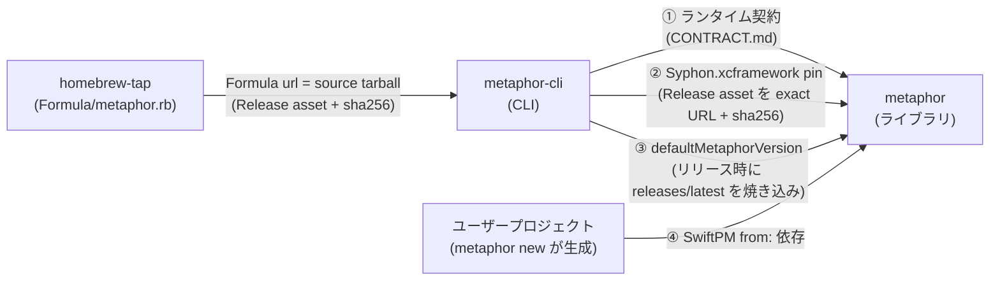
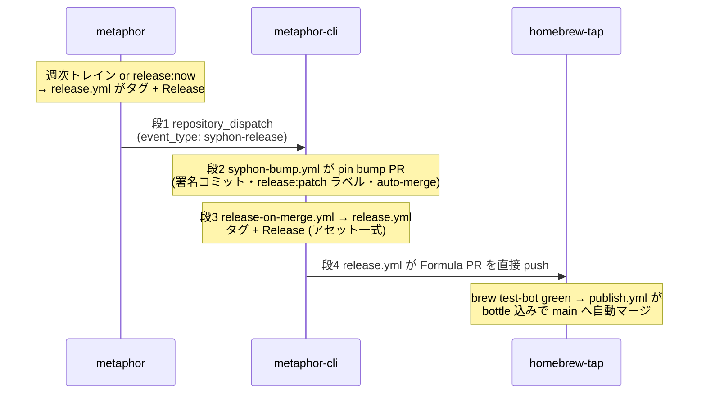

# リリースパイプライン全体地図（metaphor / metaphor-cli / homebrew-tap）

3 つのリポジトリがどう結合し、リリースがどう自動で流れるかの**全体像**です。
このページは地図に徹します — 各部分の詳細な正本は[末尾の表](#正本への導線)から辿ってください。
metaphor 側の具体的なリリース手順は [releasing.md](releasing.md)、
metaphor-cli → homebrew-tap の詳細は
[metaphor-cli の docs/homebrew.md](https://github.com/shinyaoguri/metaphor-cli/blob/main/docs/homebrew.md) が正本です。

## 3 つのリポジトリの役割

| リポジトリ | 役割 | リリースの成果物 |
|---|---|---|
| [shinyaoguri/metaphor](https://github.com/shinyaoguri/metaphor) | ライブラリ本体。設計・クロスリポ契約の正本もここ | `vX.Y.Z` タグ + GitHub Release（`Syphon.xcframework.zip` asset 同梱） |
| [shinyaoguri/metaphor-cli](https://github.com/shinyaoguri/metaphor-cli) | CLI（`metaphor new` / `run` / `watch` / `mcp`）。インストール・AI 協調操作の正本 | `vX.Y.Z` タグ + Release（arm64 バイナリ・source tarball・Formula 草稿・checksums） |
| [shinyaoguri/homebrew-tap](https://github.com/shinyaoguri/homebrew-tap) | 配布。`brew install shinyaoguri/tap/metaphor` の実体 | `Formula/metaphor.rb` の更新 + bottle（tap 自身の Release にホスト） |

バージョンは 3 リポで**独立**です。metaphor と metaphor-cli はそれぞれ自分の SemVer を刻み、
homebrew-tap は自身の版を持たず Formula が metaphor-cli のタグに追従します
（formula 名はリポジトリ名 `metaphor-cli` ではなく **`metaphor`** — インストール直後に
`metaphor new` と打てるように、コマンド名へ揃えてあります）。

## 依存関係 — 何が何にどう結合しているか



最重要の前提: **metaphor-cli は metaphor に SwiftPM 依存していません**
（`Package.swift` の `dependencies` は空）。結合は次の 4 本だけです:

1. **ランタイム契約**（正本: [CONTRACT.md](../CONTRACT.md)） — `METAPHOR_*` 環境変数、
   stdin JSON Lines 入力、Probe wire format。バージョンではなく**スキーマ**で守る
   （`schemaVersion` はライブラリの SemVer と独立）。
2. **Syphon.xcframework の Release pin** — metaphor-cli の `Package.swift` が、metaphor の
   Release asset を `binaryTarget(url: .../releases/download/vX.Y.Z/Syphon.xcframework.zip,
   checksum: ...)` で**タグ完全固定**参照。これがリリース連鎖（後述の段 1–2）の実体。
3. **`defaultMetaphorVersion`** — metaphor-cli のリリース時に metaphor の `releases/latest` を
   `BuildInfo.swift` へ焼き込む（`metaphor new` がオフライン時に使う fallback。
   オンライン時は実行時に最新を取得するので通常は使われない）。
4. **ユーザープロジェクトの `from:` 依存** — `metaphor new` が生成する `Package.swift` は
   metaphor へ `.package(url: ..., from: "X.Y.Z")`。ここだけが通常の SwiftPM 依存。

この構造の帰結:

- **公開済みタグと Release asset は不変**。metaphor の `Syphon.xcframework.zip` は
  metaphor-cli と、過去の全タグの `Package.swift` から resolve のたびに取得されるため、
  asset を消すとそのタグ（と間借りしているタグ）が恒久的に壊れます
  （詳細と復旧手順: [releasing.md「配布防御」](releasing.md#配布防御タグと-release-asset)）。
- **流れは単方向**（metaphor → metaphor-cli → homebrew-tap）。下流の都合で上流は変わりません。

## リリースの自動連鎖（4 段）

metaphor の安定版タグが `brew upgrade` のユーザーに届くまで:



| 段 | 何が起きる | 担い手 |
|---|---|---|
| 1 | 安定版リリースが `repository_dispatch`（`syphon-release`）を撃つ | metaphor `release.yml` |
| 2 | Syphon pin bump PR が出て、CI green で auto-merge | metaphor-cli `syphon-bump.yml` |
| 3 | その PR の `release:patch` ラベルで metaphor-cli のリリースが出る | metaphor-cli `release-on-merge.yml` → `release.yml` |
| 4 | homebrew-tap へ Formula 更新 PR → brew test-bot green で bottle 込み main へ | metaphor-cli `release.yml` → homebrew-tap `publish.yml` |

各段の設計上の要点:

- **段 1 は stable のみ**。prerelease（`-beta.N` 等）は連鎖せず、metaphor 単独で完結します。
  同様に metaphor-cli の prerelease も tap には届きません。
- **段 2 は dispatch の値を信用しない**。checksum は公開済み asset をダウンロードして
  再導出します（dispatch は「起きたこと」の通知であって、真実は asset そのもの）。
  dispatch を取りこぼしても、週次 poll（月曜 06:17 UTC）が backstop として同じ処理を走らせます。
- **段 3 の結合はラベル 1 枚**。pin bump PR のタイトルは `chore:` なので、それ単独では
  metaphor-cli のリリースは出ません。`syphon-bump.yml` が `release:patch` ラベルを明示的に
  貼ることでリリースへ接続しています。このラベル結合は両リポの
  `scripts/check-contract.sh` が機械検査します（cli#117 — ラベルが消える・改名される
  変更は 48 時間後の監査ではなく PR の CI で止まる）。
- **段 4 に dispatch は無い**。homebrew-tap には `repository_dispatch` の受け口が存在せず、
  metaphor-cli が GitHub App トークンで Formula PR を**直接 push** します。tap 側は
  `tests.yml`（brew test-bot、PR でのみ実ビルド + bottle 生成）→ `publish.yml`
  （`brew pr-pull` で bottle を tap 自身の Release へ上げつつ squash merge）で締めます。
  人の承認はどの段にも挟みません — 実質のレビューは brew test-bot の実ビルドです。

## バージョン付番 — 誰がいつ番号を決めるか

| | metaphor | metaphor-cli |
|---|---|---|
| リリースの単位 | **週次トレイン**（月曜 09:00 JST、履歴から bump を導出） | **マージごと**（ラベル > PR タイトルで判定） |
| minor | 前回タグ以降に `feat` が 1 本でもあった週 | `feat` タイトルの PR がマージされた瞬間 |
| patch | `fix` / `perf` だけの週 | `fix` / `perf` の PR、Syphon pin bump PR |
| major | **`release:major` ラベルのみ**（`0.x` の `!` マーカーは minor に載る。`1.0.0` 以降はトレインが停車して人を呼ぶ） | **`release:major` ラベルのみ**（自動推論しない） |
| 出ない | `docs` / `chore` / `ci` 等だけの週 | 上記以外の type、または `release:skip` ラベル |
| 即時に出す | `release:now`（または `release:patch/minor/major`）ラベル | 常時即時（マージごと） |
| prerelease | `release.yml` の手動 `workflow_dispatch` | 同左 |

粒度が違うのは意図的です: metaphor は 1 リリースごとに Syphon asset を焼き、下流に
1 リリースを誘発するので週次に集約（マージごとだと 9 日で上下流 38 リリースになる実測が根拠）。
metaphor-cli は配布物そのものなので、マージごとに即時に出します。

どちらも squash merge 前提で **PR タイトル = main のコミット subject = bump の判定材料**です。
PR タイトルの Conventional Commits lint が CI で強制されているのはこのためです。

## 資格情報 — GitHub App 1 つで 3 用途

リポジトリ横断の書き込みはすべて GitHub App **`metaphor-tap-publisher`** の
インストールトークン（1 時間で失効、rotate 不要）で行います。PAT は使いません。

| 項目 | 内容 |
|---|---|
| Secret 名 | `REPO_AUTOMATION_APP_CLIENT_ID` / `REPO_AUTOMATION_APP_PRIVATE_KEY`（用途中立の名前） |
| Secret の登録先 | **metaphor と metaphor-cli の両リポ**（tap 自身にカスタム secret は無い） |
| App の install 先 | **metaphor-cli と homebrew-tap の 2 リポ**（metaphor 自体への install は不要） |
| 権限 | Contents: Read and write / Pull requests: Read and write |
| 3 用途 | ① metaphor → metaphor-cli の dispatch（段 1）② Syphon bump PR の署名コミット（段 2）③ tap への Formula PR（段 4） |

App の初回セットアップ手順は
[metaphor-cli の docs/homebrew.md「Tap Credentials」](https://github.com/shinyaoguri/metaphor-cli/blob/main/docs/homebrew.md)が正本です。

## 監視と自己修復 — 「どの段が止まっても前後は緑に見える」への対策

各段は独立したワークフローなので、1 段が死んでも他は正常に見えます
（実際、段 1 は資格情報未設定のまま v0.1.0〜v0.9.0 の全リリースで黙って skip されていました）。
現在は次の多層防御で守っています:

| いつ | 何を | どこ |
|---|---|---|
| PR ごと | 段 2→3 を繋ぐ `release:patch` ラベルの存在（契約チェック。cli#117） | 両リポ `ci.yml` → `scripts/check-contract.sh` |
| リリース時 | 公開した Syphon asset を DL し checksum 照合（壊れた pin を下流に流さない） | metaphor `release.yml` の *Verify published Syphon asset* |
| リリース時 | 段 1 の dispatch 失敗を**ジョブの赤**として顕在化（黙って skip しない） | metaphor `release.yml` の *Dispatch Syphon pin bump to metaphor-cli* |
| 毎週（トレイン発車時） | dispatch 用資格情報の死活確認（トークンを発行して捨てる） | metaphor `release-train.yml` の *Verify downstream dispatch credentials* |
| 毎週（月曜 06:17 UTC） | dispatch 取りこぼしの backstop（poll で pin bump） | metaphor-cli `syphon-bump.yml` の schedule |
| 毎週（月曜 05:00 JST） | 全 `v*` タグの binaryTarget URL が 200 を返すか | metaphor `asset-health.yml` |
| 毎日（07:00 UTC） | **端から端の監査**: tap の Formula から逆算し、48h 超の未達なら詰まった段を名指しして Issue 起票（回復で自動クローズ） | metaphor-cli `release-pipeline-audit.yml` → `scripts/audit-release-pipeline.py` |

手元で端から端の健全性を確かめるには:

```bash
# metaphor-cli リポジトリで
python3 scripts/audit-release-pipeline.py --dry-run
```

## 触るときの注意

- **契約系トークンは両リポ同時に変える**。dispatch のイベント名（`syphon-release`）、
  pin の形式、`release:patch` ラベル名などは 2 リポの合意で成り立っています。
  `scripts/check-contract.sh` が形式を機械検証しており、変更手順は
  [CONTRACT.md](../CONTRACT.md) が正本です（metaphor-contrib:cross-repo-contract スキルが案内）。
- **4 段の表はコピーが 4 か所にある**（本ページ・[releasing.md](releasing.md)・
  metaphor-cli `docs/homebrew.md`・`scripts/audit-release-pipeline.py` の docstring）。
  段を増減するときは全部に反映してください。
- **tap の `publish.yml` は `Formula/` 以外の変更を含む PR を自動マージしない**。
  tap のワークフローや README を変える PR は人手マージが必要です。また tap の実ビルド
  （brew test-bot `--only-formulae`）は PR でしか走りません — main への直 push は
  構文チェックのみで bottle も作られないため、Formula 更新は必ず PR 経由にします。
- **bottle のアップロード先と `root_url` を食い違わせない**。bottle は tap 自身の
  Release（タグ `metaphor-<version>`）にホストされます。ghcr.io 等へ振り替えるときに
  片側だけ変えると `brew install` が 404 になります（2026-08-10 に実際に起きた事故。
  homebrew-tap #3 / #4）。
- **タグ・Release asset の削除は連鎖破壊**。上の「依存関係」の帰結どおり、
  復旧手順まで含めて [releasing.md「配布防御」](releasing.md#配布防御タグと-release-asset)に従ってください。

## 正本への導線

| 知りたいこと | 正本 |
|---|---|
| metaphor のリリース手順（トレイン・express・prerelease・changelog.d・配布防御） | [releasing.md](releasing.md) |
| metaphor-cli のリリース手順（マージごと・bump 判定） | [metaphor-cli AGENTS.md](https://github.com/shinyaoguri/metaphor-cli/blob/main/AGENTS.md) |
| metaphor-cli → homebrew-tap の詳細（Formula・bottle・GitHub App セットアップ・PATH shadowing） | [metaphor-cli docs/homebrew.md](https://github.com/shinyaoguri/metaphor-cli/blob/main/docs/homebrew.md) |
| ランタイム契約（環境変数・Probe・stdin・Syphon pin の変更ルール） | [CONTRACT.md](../CONTRACT.md) |
| 何が公開 API で何が壊れうるか（SemVer の適用範囲） | [api-stability-policy.md](api-stability-policy.md) |
| パイプライン監査の実装 | [metaphor-cli scripts/audit-release-pipeline.py](https://github.com/shinyaoguri/metaphor-cli/blob/main/scripts/audit-release-pipeline.py) |
