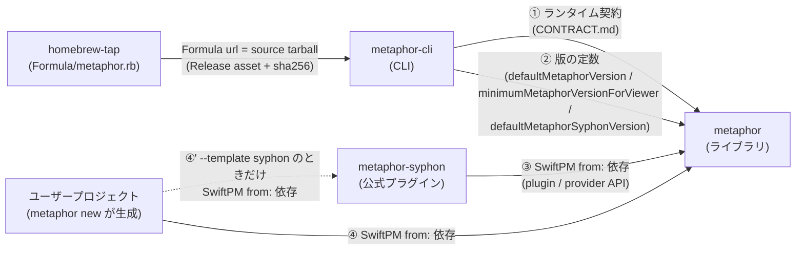
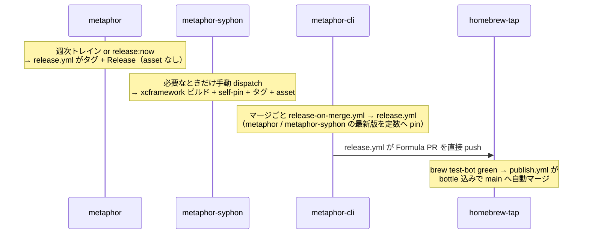

# リリースパイプライン全体地図（metaphor / metaphor-syphon / metaphor-cli / homebrew-tap）

4 つのリポジトリがどう結合し、リリースがどう流れるかの**全体像**です。
このページは地図に徹します — 各部分の詳細な正本は[末尾の表](#正本への導線)から辿ってください。
metaphor 側の具体的なリリース手順は [releasing.md](releasing.md)、
metaphor-cli → homebrew-tap の詳細は
[metaphor-cli の docs/homebrew.md](https://github.com/shinyaoguri/metaphor-cli/blob/main/docs/homebrew.md) が正本です。

> v0.11.0 までは「metaphor のリリース → cli の Syphon pin bump → cli のリリース → tap」の 4 段が
> 自動で連鎖していました。v0.12.0（#792 / [ADR-0014](adr/0014-viewer-frame-ipc-and-syphon-plugin.md)）で
> Syphon が独立パッケージに出て cli が Syphon.framework を同梱しなくなったため、**本体のリリースは
> 下流のリリースを起こしません**。当時の連鎖と事故の記録は metaphor-cli の
> [ADR 0003](https://github.com/shinyaoguri/metaphor-cli/blob/main/docs/decisions/0003-syphon-pin-automation.md) →
> [ADR 0014](https://github.com/shinyaoguri/metaphor-cli/blob/main/docs/decisions/0014-viewer-frame-ipc-drops-syphon-bundle.md)。

## 4 つのリポジトリの役割

| リポジトリ | 役割 | リリースの成果物 |
|---|---|---|
| [shinyaoguri/metaphor](https://github.com/shinyaoguri/metaphor) | ライブラリ本体。設計・クロスリポ契約の正本もここ | `vX.Y.Z` タグ + GitHub Release（**asset なし**。ソースだけ） |
| [shinyaoguri/metaphor-syphon](https://github.com/shinyaoguri/metaphor-syphon) | 公式プラグイン（Syphon 出力）。`Syphon.xcframework` を抱える唯一のパッケージ | `vX.Y.Z` タグ + Release（`Syphon.xcframework.zip` asset + checksum。`Package.swift` が自分の asset を self-pin） |
| [shinyaoguri/metaphor-cli](https://github.com/shinyaoguri/metaphor-cli) | CLI（`metaphor new` / `run` / `watch` / `mcp`）。インストール・AI 協調操作の正本 | `vX.Y.Z` タグ + Release（arm64 バイナリ + templates の tarball・source tarball・Formula 草稿・checksums） |
| [shinyaoguri/homebrew-tap](https://github.com/shinyaoguri/homebrew-tap) | 配布。`brew install shinyaoguri/tap/metaphor` の実体 | `Formula/metaphor.rb` の更新 + bottle（tap 自身の Release にホスト） |

バージョンは 4 リポで**独立**です。metaphor / metaphor-syphon / metaphor-cli はそれぞれ自分の
SemVer を刻み、homebrew-tap は自身の版を持たず Formula が metaphor-cli のタグに追従します
（formula 名はリポジトリ名 `metaphor-cli` ではなく **`metaphor`** — インストール直後に
`metaphor new` と打てるように、コマンド名へ揃えてあります）。

## 依存関係 — 何が何にどう結合しているか



最重要の前提: **metaphor-cli は metaphor に SwiftPM 依存していません**
（`Package.swift` の `dependencies` は空）。結合は次の 4 本です:

1. **ランタイム契約**（正本: [CONTRACT.md](../CONTRACT.md)） — `METAPHOR_*` 環境変数、
   stdin JSON Lines 入力、Probe / Parameter Store / State のファイル、viewer frame IPC、
   AI ドキュメントのパス。バージョンではなく**スキーマ**で守る（`schemaVersion` / `protocolVersion`
   はライブラリの SemVer と独立）。
2. **版の定数** — metaphor-cli のリリース時に metaphor / metaphor-syphon の `releases/latest` を
   `BuildInfo.swift` の `defaultMetaphorVersion` / `defaultMetaphorSyphonVersion` へ焼き込む
   （`metaphor new` がオフライン時に使う `from:` の下限。オンライン時は実行時に最新を取得）。
   `minimumMetaphorVersionForViewer`（frame IPC を話せる最小の本体）はコードの定数で、
   `doctor` / `watch` が古い本体のスケッチにその版を案内します。
3. **metaphor-syphon の `from:` 依存** — プラグインは本体の plugin / provider API
   （`MetaphorPlugin` / `MetaphorOutputProviders` / `PluginFactory(requirements:)` など）に依存します。
   本体の minor がこの面を壊したときだけ、プラグインの追随リリースが要ります
   （metaphor-syphon の CI が本体 `main` に対する互換ビルドを毎晩回して検知）。
4. **ユーザープロジェクトの `from:` 依存** — `metaphor new` が生成する `Package.swift` は
   metaphor へ `.package(url: ..., from: "X.Y.Z")`。`--template syphon` はこれに加えて
   metaphor-syphon への同じ形の依存を足します。

この構造の帰結:

- **metaphor のタグは Release asset を持たない**ので、公開後に壊れる要素がありません。
  v0.11.0 以前のタグは `Syphon.xcframework.zip` を抱えており、それらの asset は今後も消しません
  （`from: "0.x"` の利用者が resolve できなくなる。詳細: [releasing.md「配布防御」](releasing.md#配布防御タグと-release-asset)）。
  metaphor-syphon の asset には同じ不変ルールが当てはまります（正本は metaphor-syphon 側の releasing docs）。
- **流れは単方向**（metaphor → metaphor-syphon / metaphor-cli → homebrew-tap）。下流の都合で上流は変わりません。

## リリースの流れ — 連鎖は cli → tap の 1 段だけ



| 流れ | 引き金 | 担い手 |
|---|---|---|
| metaphor のリリース | 週次トレイン（月曜 09:00 JST）/ `release:now` | `release-train.yml` → `release.yml` |
| metaphor-syphon のリリース | 手動 `workflow_dispatch`（本体の breaking minor に追随するとき、プラグイン自身の変更を出すとき） | metaphor-syphon `release.yml` |
| metaphor-cli のリリース | PR のマージごと | `release-on-merge.yml` → `release.yml` |
| homebrew-tap の更新 | metaphor-cli の stable リリース | metaphor-cli `release.yml` → homebrew-tap `publish.yml` |

設計上の要点:

- **本体のリリースは誰も起こさない**。cli は自分のマージで出るし、プラグインは互換ビルドが
  赤になったときに人が出す。連鎖が無いので「どこかの段が黙って止まる」事故の面積が小さい。
- **cli → tap に dispatch は無い**。homebrew-tap には `repository_dispatch` の受け口が存在せず、
  metaphor-cli が GitHub App トークンで Formula PR を**直接 push** します。tap 側は
  `tests.yml`（brew test-bot、PR でのみ実ビルド + bottle 生成）→ `publish.yml`
  （`brew pr-pull` で bottle を tap 自身の Release へ上げつつ squash merge）で締めます。
  人の承認はどの段にも挟みません — 実質のレビューは brew test-bot の実ビルドです。
- **prerelease は連鎖しない**。metaphor-cli の prerelease（`-beta.N` 等）は tap に届きません。

## バージョン付番 — 誰がいつ番号を決めるか

| | metaphor | metaphor-cli |
|---|---|---|
| リリースの単位 | **週次トレイン**（月曜 09:00 JST、履歴から bump を導出） | **マージごと**（ラベル > PR タイトルで判定） |
| minor | 前回タグ以降に `feat` が 1 本でもあった週 | `feat` タイトルの PR がマージされた瞬間 |
| patch | `fix` / `perf` だけの週 | `fix` / `perf` の PR |
| major | **`release:major` ラベルのみ**（`0.x` の `!` マーカーは minor に載る。`1.0.0` 以降はトレインが停車して人を呼ぶ） | **`release:major` ラベルのみ**（自動推論しない） |
| 出ない | `docs` / `chore` / `ci` 等だけの週 | 上記以外の type、または `release:skip` ラベル |
| 即時に出す | `release:now`（または `release:patch/minor/major`）ラベル | 常時即時（マージごと） |
| prerelease | `release.yml` の手動 `workflow_dispatch` | 同左 |

粒度が違うのは意図的です: metaphor はライブラリなので週次に集約し（マージごとだと 9 日で
19 リリースになる実測が根拠）、metaphor-cli は配布物そのものなので、マージごとに即時に出します。
metaphor-syphon は `Syphon.xcframework` のビルドを伴うため、必要なときだけ手動で出します
（本体の **plugin / provider API は S0 以降 1.0 扱いで凍結**し、変更は deprecate → 次 minor で削除。
これで本体の minor のたびにプラグインのリリースを強制しません）。

どちらも squash merge 前提で **PR タイトル = main のコミット subject = bump の判定材料**です。
PR タイトルの Conventional Commits lint が CI で強制されているのはこのためです。

## 資格情報 — GitHub App 1 つで 1 用途

リポジトリ横断の書き込みは GitHub App **`metaphor-tap-publisher`** の
インストールトークン（1 時間で失効、rotate 不要）で行います。PAT は使いません。

| 項目 | 内容 |
|---|---|
| Secret 名 | `REPO_AUTOMATION_APP_CLIENT_ID` / `REPO_AUTOMATION_APP_PRIVATE_KEY`（かつて 3 用途だったので用途中立の名前） |
| Secret の登録先 | **metaphor-cli**（tap 自身にカスタム secret は無い。metaphor には不要） |
| App の install 先 | **homebrew-tap**（metaphor-cli への install が残っていても害は無い） |
| 権限 | Contents: Read and write / Pull requests: Read and write |
| 用途 | tap への Formula PR（metaphor-cli `release.yml`） |

App の初回セットアップ手順は
[metaphor-cli の docs/homebrew.md「Tap Credentials」](https://github.com/shinyaoguri/metaphor-cli/blob/main/docs/homebrew.md)が正本です。

## 監視と自己修復

| いつ | 何を | どこ |
|---|---|---|
| PR ごと | ランタイム契約のトークンと契約ファイルの byte-identity（両リポ） | 両リポ `ci.yml` → `scripts/check-contract.sh` / `check-contract-identity.sh` |
| PR ごと | 本体の `Package.swift` に binaryTarget が戻っていないこと | metaphor `ci.yml` → `scripts/check-no-binary-targets.sh` |
| 毎晩 | 本体 `main` に対する metaphor-syphon の互換ビルド | metaphor-syphon の nightly |
| 毎週（月曜 05:00 JST） | v0.11.0 以前のタグの binaryTarget URL が 200 を返すか（v0.12.0 以降は SKIP） | metaphor `asset-health.yml` → `scripts/check-release-assets.sh` |
| 毎日（07:00 UTC） | metaphor-cli の最新リリースが tap の Formula まで届いたか。48h 超の未達なら Issue 起票（回復で自動クローズ） | metaphor-cli `release-pipeline-audit.yml` → `scripts/audit-release-pipeline.py` |

手元で cli → tap の健全性を確かめるには:

```bash
# metaphor-cli リポジトリで
python3 scripts/audit-release-pipeline.py --dry-run
```

## 触るときの注意

- **契約系トークンは両リポ同時に変える**。環境変数名・wire スキーマ・AI ドキュメントのパスなどは
  2 リポの合意で成り立っています。`scripts/check-contract.sh` が形式を機械検証しており、
  変更手順は [CONTRACT.md](../CONTRACT.md) が正本です（metaphor-contrib:cross-repo-contract スキルが案内）。
- **本体の plugin / provider API を変えるときは metaphor-syphon を道連れにする**。deprecate → 次 minor で
  削除の順を守り、削除する minor の前にプラグイン側で読み取りを外したリリースを出します
  （順序の例: metaphor#1042）。
- **tap の `publish.yml` は `Formula/` 以外の変更を含む PR を自動マージしない**。
  tap のワークフローや README を変える PR は人手マージが必要です。また tap の実ビルド
  （brew test-bot `--only-formulae`）は PR でしか走りません — main への直 push は
  構文チェックのみで bottle も作られないため、Formula 更新は必ず PR 経由にします。
- **bottle のアップロード先と `root_url` を食い違わせない**。bottle は tap 自身の
  Release（タグ `metaphor-<version>`）にホストされます。ghcr.io 等へ振り替えるときに
  片側だけ変えると `brew install` が 404 になります（2026-08-10 に実際に起きた事故。
  homebrew-tap #3 / #4）。
- **タグ・Release asset の削除は連鎖破壊**。v0.11.0 以前の本体タグと metaphor-syphon の asset は
  resolve のたびに取得されます。復旧手順まで含めて [releasing.md「配布防御」](releasing.md#配布防御タグと-release-asset)に従ってください。

## 正本への導線

| 知りたいこと | 正本 |
|---|---|
| metaphor のリリース手順（トレイン・express・prerelease・changelog.d・配布防御） | [releasing.md](releasing.md) |
| metaphor-syphon のリリース（xcframework ビルド・self-pin・asset） | [metaphor-syphon の docs](https://github.com/shinyaoguri/metaphor-syphon/tree/main/docs) |
| metaphor-cli のリリース手順（マージごと・bump 判定） | [metaphor-cli AGENTS.md](https://github.com/shinyaoguri/metaphor-cli/blob/main/AGENTS.md) |
| metaphor-cli → homebrew-tap の詳細（Formula・bottle・GitHub App セットアップ・PATH shadowing） | [metaphor-cli docs/homebrew.md](https://github.com/shinyaoguri/metaphor-cli/blob/main/docs/homebrew.md) |
| ランタイム契約（環境変数・Probe・stdin・viewer frame IPC・AI ドキュメントの変更ルール） | [CONTRACT.md](../CONTRACT.md) |
| 何が公開 API で何が壊れうるか（SemVer の適用範囲） | [api-stability-policy.md](api-stability-policy.md) |
| Syphon 分離と viewer frame IPC の設計判断 | [ADR-0014](adr/0014-viewer-frame-ipc-and-syphon-plugin.md) |
| パイプライン監査の実装 | [metaphor-cli scripts/audit-release-pipeline.py](https://github.com/shinyaoguri/metaphor-cli/blob/main/scripts/audit-release-pipeline.py) |
