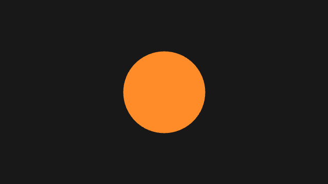
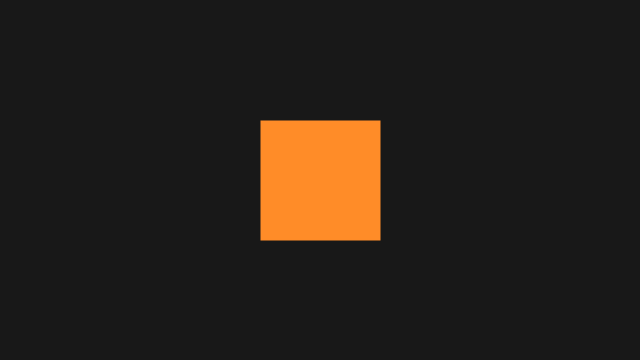
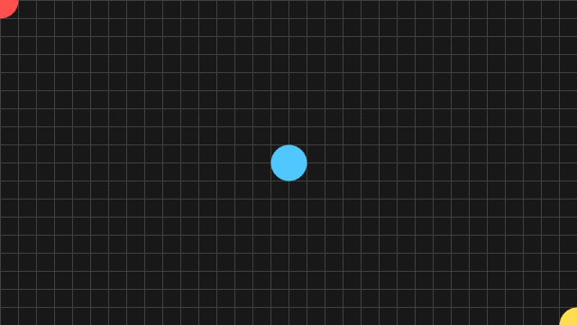
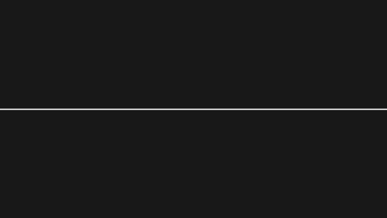

# 第 1 部 入門

この部では、metaphor のスケッチを 1 本動かすところから始めて、スケッチの骨格・座標系・描画の進め方までを覚えます。読み終えると、白紙から自分でスケッチを起こし、思った位置に思った大きさで図形を置けるようになります。

前提とするのは Swift の基本文法（型・クラス・関数・ループ）だけです。グラフィックスプログラミングの経験は要りません。

## 1.1 metaphor とは

metaphor は Swift と Metal で書かれたクリエイティブコーディングのランタイムです。`setup()` と `draw()` の 2 つを書けばウィンドウが開き、そこへ図形や文字や画像を描けます。2D と 3D の描画、GPU での計算、ポストエフェクト、音と映像、OSC / MIDI、機械学習、Syphon 出力までを、ひと続きの API で扱えます。

毎フレーム 1 枚の絵を描き、それを 1 秒に何十回もくり返して動きを作る — この「フレームベース」の考え方が中心にあります。ボタンやビューを組み立てて配置する GUI のプログラミングとは発想が違い、毎回まっさらな紙に描き直すことに近いモデルです。

### 動作環境

| 項目 | 要件 |
|---|---|
| OS | macOS 14.0 以降 |
| ハードウェア | Apple Silicon（M シリーズ） |
| Swift | 5.10 以降（Xcode 15.4 以降） |

Metal を直接使うため、対象は macOS のみです。Windows や Linux、iOS では動きません。

### ドキュメントの地図

metaphor のドキュメントは読者と用途で分かれています。このチュートリアルは**通しで読む**もので、他は必要なときに**引く**ものです。

| ドキュメント | 使いどころ |
|---|---|
| このチュートリアル | 最初から順に読む。各節に完結したコードと実行結果が付く |
| [API リファレンス（DocC）](https://shinyaoguri.github.io/metaphor/reference/documentation/metaphor/) | 型やメソッドのシグネチャを引く |
| [`llms.txt`](https://github.com/shinyaoguri/metaphor/blob/main/llms.txt) | 公開 API の全シグネチャ。AI エージェントのコンテキストへ貼る |
| [Examples](https://github.com/shinyaoguri/metaphor/tree/main/Examples) | 動くサンプル集。[LEARNING_PATH.md](https://github.com/shinyaoguri/metaphor/blob/main/Examples/LEARNING_PATH.md) がどの順に開くかの地図 |
| [processing-migration-guide.md](https://github.com/shinyaoguri/metaphor/blob/main/docs/processing-migration-guide.md) | Processing / p5.js の経験がある場合の対応表（英語） |

Processing や p5.js を書いたことがある場合は、移行ガイドのほうが近道です。このチュートリアルは Processing を知らない読者に向けて書いてあるため、「Processing の X は metaphor では Y」という対応は移行ガイドに任せ、ここでは重複させません。

## 1.2 インストールと最初のスケッチ

CLI を入れると、スケッチの雛形作成から実行までが 1 コマンドずつで済みます。

```bash
brew install shinyaoguri/tap/metaphor
```

新しいスケッチを作り、実行します。

```bash
metaphor new MySketch
cd MySketch
metaphor run
```

`metaphor run` は依存の解決・ビルド・ウィンドウ表示までをまとめて行います。インストールの他の方法や全コマンドは [metaphor-cli](https://github.com/shinyaoguri/metaphor-cli) が正典です。

生成された `App.swift` を、次の内容に置き換えてみます。オレンジの円が 1 つ出れば成功です。



<!-- tutorial-snippet: 01-GettingStarted/02-FirstSketch -->
```swift
import metaphor

@main
final class FirstSketch: Sketch {
    // 起動時の設定。ウィンドウの大きさとタイトルを決める
    var config: SketchConfig {
        SketchConfig(width: 640, height: 360, title: "First Sketch")
    }

    // 毎フレーム呼ばれる。1 回の呼び出しで 1 枚の絵を描く
    func draw() {
        background(24)
        fill(255, 140, 40)
        noStroke()
        circle(width * 0.5, height * 0.5, 160)
    }
}
```

実行: `cd Examples/Tutorial/01-GettingStarted/02-FirstSketch && swift run`
<!-- /tutorial-snippet -->

短いコードですが、metaphor のスケッチに要るものはここに全部あります。

- `import metaphor` — これ 1 行で描画・音・入力などすべてのモジュールが使えます
- `@main` — このクラスがアプリの入口だと Swift に伝えます。スケッチ 1 本につき 1 つです
- `final class ... : Sketch` — `Sketch` プロトコルに準拠した型がスケッチの本体です
- `config` — 起動時の設定。ここではキャンバスの大きさとウィンドウタイトルを決めています
- `draw()` — 毎フレーム呼ばれ、1 回の呼び出しで 1 枚の絵を描きます

`draw()` の中身も 3 行だけです。`background(24)` がキャンバス全体を暗い灰色で塗りつぶし、`fill(255, 140, 40)` がこれから描く図形の色を決め、`circle(width * 0.5, height * 0.5, 160)` が画面の中央に直径 160 の円を描きます。`noStroke()` は輪郭線を描かない指定です。

`width` と `height` はキャンバスの幅と高さです。`config` に書いた数値をもう一度書く代わりにこれを使うと、大きさを変えても中央は中央のままになります。

### 試してみる

- `circle` の 3 番目の引数を変えると、円の大きさはどうなりますか
- `fill(255, 140, 40)` の 3 つの数を入れ替えると、色はどう変わりますか
- `noStroke()` を消すと、円のまわりに何が現れますか

### もっと詳しく

- [`Sketch`](https://shinyaoguri.github.io/metaphor/reference/documentation/metaphorcore/sketch/) — スケッチが準拠するプロトコル
- [`SketchConfig`](https://shinyaoguri.github.io/metaphor/reference/documentation/metaphorcore/sketchconfig/) — `config` で指定できる項目
- [metaphor-cli](https://github.com/shinyaoguri/metaphor-cli) — CLI のインストールと全コマンド

## 1.3 スケッチの骨格



スケッチは `Sketch` プロトコルに準拠した 1 つの型です。役割は 3 つに分かれます。`config` が起動時の設定、`setup()` が最初に一度だけ、`draw()` が毎フレーム呼ばれます。

| メンバー | 呼ばれるタイミング | 何を書くか |
|---|---|---|
| `config` | 起動時に一度だけ読まれる | キャンバスの大きさ、タイトル、フレームレートなど |
| `setup()` | 起動時に一度だけ | 画像の読み込み、初期値の計算、`noLoop()` などの一度きりの指定 |
| `compute()` | 毎フレーム、`draw()` の前 | GPU での計算（第 6 部で扱います） |
| `draw()` | 毎フレーム | 1 枚の絵を描く |
| `mousePressed()` / `keyPressed()` など | 対応する入力があったとき | 入力への反応（第 4 部で扱います） |

`config` 以外はすべて省略できます。省略した分は何もしないだけで、エラーにはなりません。

`draw()` は毎回まっさらな状態から呼ばれるので、フレームをまたいで持ち越したい値は型のプロパティとして持ちます。次のコードの `angle` がそれです。`draw()` の最後で少しずつ増やすことで、四角形が毎フレーム少しずつ回ります。

<!-- tutorial-snippet: 01-GettingStarted/03-SketchSkeleton -->
```swift
import metaphor

@main
final class SketchSkeleton: Sketch {
    // config: 起動時に一度だけ読まれる設定。ウィンドウの大きさとタイトルを決める
    var config: SketchConfig {
        SketchConfig(width: 640, height: 360, title: "Sketch Skeleton")
    }

    // draw() をまたいで持ち越したい値は、プロパティとして持つ
    var angle: Float = 0

    // setup(): 起動時に一度だけ呼ばれる。描き始める前の準備をここに書く
    func setup() {
        noStroke()
        fill(255, 140, 40)
    }

    // draw(): 毎フレーム呼ばれる。1 回の呼び出しで 1 枚の絵を描く
    func draw() {
        background(24)
        push()
        translate(width * 0.5, height * 0.5)
        rotate(angle)
        rect(-60, -60, 120, 120)
        pop()
        angle += 0.01
    }
}
```

実行: `cd Examples/Tutorial/01-GettingStarted/03-SketchSkeleton && swift run`
<!-- /tutorial-snippet -->

`setup()` に書いた `noStroke()` と `fill(...)` が `draw()` にも効いていることに注目します。色や線の太さといったスタイルは「以降の描画すべてに適用される設定」で、変えるまでずっと残ります。毎フレーム指定し直す必要はありません。

一方で `background(24)` は `draw()` の中にあります。これを消すと前のフレームの絵が残り続けるので、軌跡を描きたいときはあえて消す、という使い分けになります。

### 試してみる

- `angle += 0.01` の数を変えると、回転の速さはどうなりますか
- `background(24)` を `draw()` から消すと、何が残りますか
- `fill(255, 140, 40)` を `setup()` から `draw()` へ移すと、見た目は変わりますか

### もっと詳しく

- [`Sketch`](https://shinyaoguri.github.io/metaphor/reference/documentation/metaphorcore/sketch/) — ライフサイクルのメソッド一覧
- [`Basics/Structure/SetupDraw`](https://github.com/shinyaoguri/metaphor/tree/main/Examples/Basics/Structure/SetupDraw) — 同じ題材の最小サンプル

## 1.4 キャンバスと座標系



キャンバスの原点 `(0, 0)` は**左上**です。`x` は右へ、`y` は**下へ**向かって増えます。数学のグラフとは `y` の向きが逆になる点だけ、最初に慣れが要ります。

大きさは `width` と `height` で取れます。どちらも `Float` です。`config` に書いた数値を本文で直接くり返さずこれを使うと、キャンバスの大きさを変えても構図が崩れません。

<!-- tutorial-snippet: 01-GettingStarted/04-CanvasAndCoordinates -->
```swift
import metaphor

@main
final class CanvasAndCoordinates: Sketch {
    var config: SketchConfig {
        SketchConfig(width: 640, height: 360, title: "Canvas and Coordinates")
    }

    func setup() {
        // 動かない絵なので、1 フレームだけ描いて止める
        noLoop()
    }

    func draw() {
        background(24)

        // 20 ピクセルごとの目盛り
        stroke(64)
        strokeWeight(1)
        var x: Float = 0
        while x <= width {
            line(x, 0, x, height)
            x += 20
        }
        var y: Float = 0
        while y <= height {
            line(0, y, width, y)
            y += 20
        }

        noStroke()

        // 原点 (0, 0) は左上。y は下向きに増える
        fill(255, 80, 80)
        circle(0, 0, 40)

        // 中心は (width / 2, height / 2)
        fill(80, 200, 255)
        circle(width * 0.5, height * 0.5, 40)

        // 右下の角が (width, height)
        fill(255, 220, 80)
        circle(width, height, 40)
    }
}
```

実行: `cd Examples/Tutorial/01-GettingStarted/04-CanvasAndCoordinates && swift run`
<!-- /tutorial-snippet -->

3 つの円は左上・中央・右下に置いてあります。左上と右下の円が半分だけしか見えないのは、円の中心がちょうど角にあるからです。

### レンダリング解像度とウィンドウの大きさは別物

`config` の `width` / `height` は**描く絵の解像度**で、ウィンドウの大きさではありません。ウィンドウは `windowScale`（既定は `0.5`）を掛けた大きさで開きます。つまり `SketchConfig(width: 640, height: 360)` は、640 × 360 で描いた絵を 320 × 180 のウィンドウに映します。

この 2 つが分かれているおかげで、画面には小さく出しながら高解像度で書き出す、といったことができます。ウィンドウの縦横比が絵と合わないときは、比率を保ったまま余白（レターボックス）が入ります。絵が引き伸ばされて歪むことはありません。

キャンバスの大きさは `setup()` の中から [`createCanvas(width:height:)`](https://shinyaoguri.github.io/metaphor/reference/documentation/metaphorcore/sketch/createcanvas%28width:height:%29) でも指定できます。

### 試してみる

- `config` の `width` / `height` を変えても、3 つの円は角と中心に居続けますか
- 目盛りの間隔 `20` を変えると、格子はどう変わりますか
- `windowScale: 1.0` を `config` に足すと、ウィンドウの大きさはどうなりますか

### もっと詳しく

- [`SketchConfig`](https://shinyaoguri.github.io/metaphor/reference/documentation/metaphorcore/sketchconfig/) — `windowScale` や `fullScreen` を含む設定の一覧
- [`Basics/Structure/Coordinates`](https://github.com/shinyaoguri/metaphor/tree/main/Examples/Basics/Structure/Coordinates), [`Basics/Structure/WidthHeight`](https://github.com/shinyaoguri/metaphor/tree/main/Examples/Basics/Structure/WidthHeight) — 座標系のサンプル

## 1.5 ライブ編集

数値をひとつ変えるたびにウィンドウを閉じて `metaphor run` を打ち直すのは、作りながら調整する作業には向きません。`metaphor watch` を使うと、ファイルを保存するたびに自動で再ビルドされ、ライブビューアの窓を保ったまま絵が差し替わります。

```bash
metaphor watch
```

起動したらエディタでスケッチを編集し、保存します。ビルドが通れば新しい絵に切り替わり、通らなければ端末にエラーが出て前の絵が残ります。窓の位置や大きさはそのままなので、色や数値を少しずつ動かして目で確かめる作業が続けられます。

再ビルドをまたぐと、スケッチのプロパティは初期値に戻ります。フレーム番号や経過時間まで引き継ぎたいときは `config` に `preserveClock: true` を指定します。

この仕組みは AI エージェントと共有することもできます。エージェントが「いま見えている絵」を観測しながら編集する使い方は第 10 部で扱います。

### もっと詳しく

- [metaphor-cli](https://github.com/shinyaoguri/metaphor-cli) — `watch` の詳しい挙動とオプション
- [`SketchConfig`](https://shinyaoguri.github.io/metaphor/reference/documentation/metaphorcore/sketchconfig/) — `preserveClock`

## 1.6 描画を止める・進める



`draw()` は既定で毎フレーム呼ばれ続けます。1 秒あたりの回数はディスプレイのリフレッシュレートに合わせて 60 回前後です。

止まっている絵を描きたいときや、重い処理を 1 回だけ走らせたいときは、この呼び出しを止められます。

| 関数 | 効果 |
|---|---|
| `noLoop()` | 連続描画を止める。以降 `draw()` は呼ばれない |
| `loop()` | 連続描画を再開する |
| `redraw()` | 止めた状態のまま `draw()` を 1 回だけ呼ぶ |
| `frameRate(_:)` | 1 秒あたりの描画回数を変える |

<!-- tutorial-snippet: 01-GettingStarted/06-DrawControl -->
```swift
import metaphor

@main
final class DrawControl: Sketch {
    var config: SketchConfig {
        SketchConfig(width: 640, height: 360, title: "Draw Control")
    }

    var y: Float = 0
    var isRunning = true

    func setup() {
        // 1 秒あたりの描画回数。既定の 60 より遅くすると、線の動きが目で追える
        frameRate(30)
        y = height * 0.5
    }

    func draw() {
        background(24)
        stroke(255)
        strokeWeight(2)
        line(0, y, width, y)

        y -= 4
        if y < 0 { y = height }
    }

    // クリックで連続描画の停止 / 再開を切り替える
    func mousePressed() {
        isRunning.toggle()
        if isRunning {
            loop()
        } else {
            noLoop()
        }
    }

    // 止めている間は、キーを押すたびに 1 フレームだけ進む
    func keyPressed() {
        if !isRunning {
            redraw()
        }
    }
}
```

実行: `cd Examples/Tutorial/01-GettingStarted/06-DrawControl && swift run`
<!-- /tutorial-snippet -->

`noLoop()` は「1 枚の絵を作る」用途と相性がよく、このチュートリアルでも動かす必要のない節では `setup()` で呼んでいます。1 フレームしか描かないので結果が毎回同じになり、実行結果の画像もそのまま再現できます。

`frameRate(_:)` で指定できるのは上限です。1 フレームの描画が重ければ、指定した回数まで届きません。

### 試してみる

- `frameRate(30)` を `frameRate(5)` にすると、線の動きはどう見えますか
- 止めた状態でキーを押し続けると、何が起きますか
- `setup()` で `noLoop()` を呼ぶと、最初の 1 枚はどうなりますか

### もっと詳しく

- [`noLoop()`](https://shinyaoguri.github.io/metaphor/reference/documentation/metaphorcore/sketch/noloop%28%29), [`loop()`](https://shinyaoguri.github.io/metaphor/reference/documentation/metaphorcore/sketch/loop%28%29), [`redraw()`](https://shinyaoguri.github.io/metaphor/reference/documentation/metaphorcore/sketch/redraw%28%29), [`frameRate(_:)`](https://shinyaoguri.github.io/metaphor/reference/documentation/metaphorcore/sketch/framerate%28_:%29)
- [`Basics/Structure/NoLoop`](https://github.com/shinyaoguri/metaphor/tree/main/Examples/Basics/Structure/NoLoop), [`Basics/Structure/Redraw`](https://github.com/shinyaoguri/metaphor/tree/main/Examples/Basics/Structure/Redraw)

---

次は[第 2 部 2D を描く](https://shinyaoguri.github.io/metaphor/tutorial/drawing-2d/)で、図形・色・線・変換といった 2D の語彙をひととおり揃えます。
