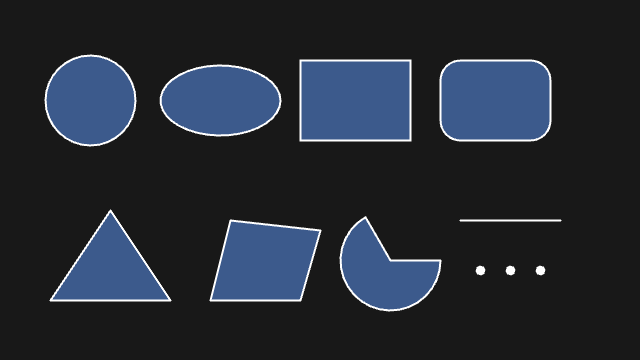
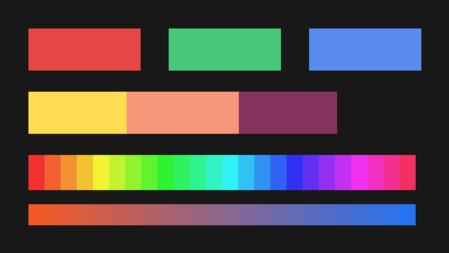
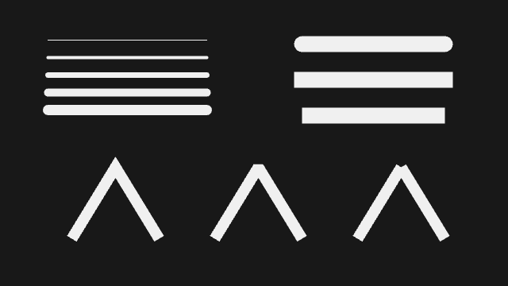
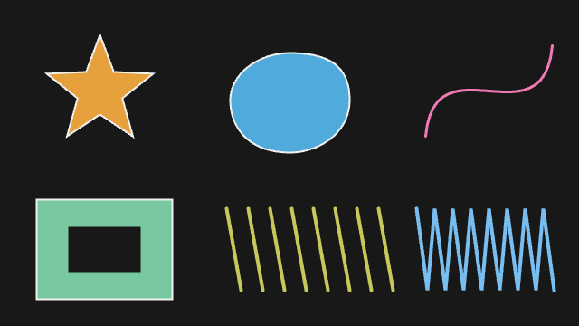
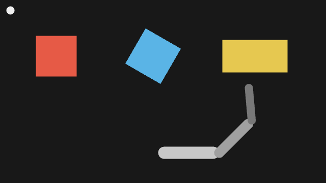
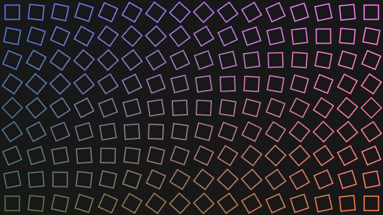
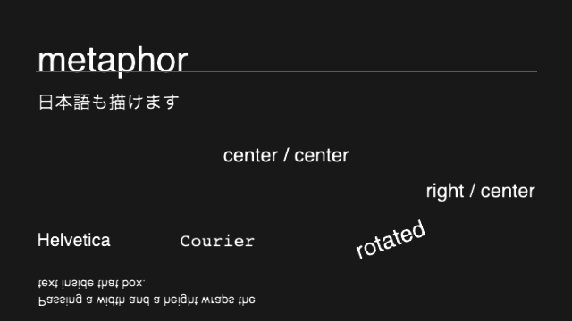
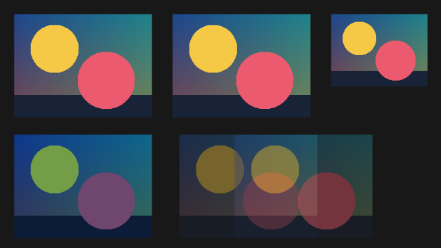
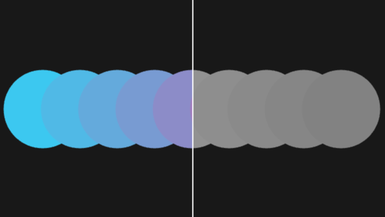
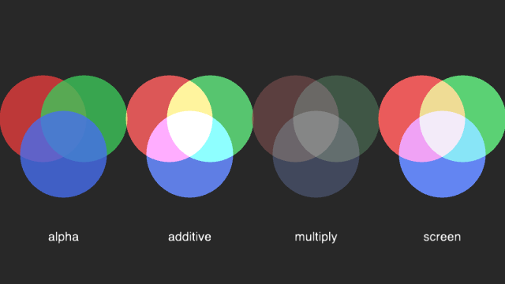

# 第 2 部 2D を描く

この部では 2D 描画の語彙をひととおり揃えます。図形の描き分けから始めて、色、線の表情、自作の形、座標系の変換、くり返しによる模様、テキスト、画像、ピクセル、ブレンドモードまでを順に見ていきます。

読み終えると、頭の中にある構図を「どの関数をどの順に呼べばよいか」に翻訳できるようになります。第 3 部でこれらを時間の関数として動かします。

第 1 部を読んでいることを前提とします。特に「原点は左上、`y` は下向き」「スタイルは変えるまで残る」の 2 つは、この部の全体を通して効いてきます。

## 2.1 図形プリミティブ



まずは組み込みの図形です。呼ぶだけで描けるものが一通り揃っています。

| 関数 | 引数の意味 |
|---|---|
| `circle(x, y, diameter)` | 中心と**直径**（半径ではありません） |
| `ellipse(x, y, w, h)` | 中心と、幅・高さ |
| `rect(x, y, w, h)` | 既定では**左上**の座標と、幅・高さ |
| `square(x, y, size)` | 左上の座標と一辺 |
| `line(x1, y1, x2, y2)` | 2 点を結ぶ線 |
| `triangle(...)` / `quad(...)` | 3 点 / 4 点をそのまま指定 |
| `arc(x, y, w, h, start, stop)` | 中心・大きさ・開始角・終了角 |
| `point(x, y)` | 1 点。太さは `strokeWeight` に従う |

円だけ直径で、矩形は左上、という組み合わせは Processing から受け継いだものです。慣れるまでは表を引くのが確実です。

角度は**ラジアン**で指定します。度数で考えたいときは `radians(30)` のように変換します。1 周は `TWO_PI`、半周は `PI` として使えます。

<!-- tutorial-snippet: 02-Drawing2D/01-ShapePrimitives -->
```swift
import metaphor

@main
final class ShapePrimitives: Sketch {
    var config: SketchConfig {
        SketchConfig(width: 640, height: 360, title: "Shape Primitives")
    }

    func setup() {
        // 動かない絵なので、1 フレームだけ描いて止める
        noLoop()
    }

    func draw() {
        background(24)
        stroke(255)
        strokeWeight(2)
        fill(60, 90, 140)

        // 上段: 中心と直径で描く円、幅と高さで描く楕円
        circle(90, 100, 90)
        ellipse(220, 100, 120, 70)

        // 矩形は既定では左上の座標と幅・高さ。第 5 引数で角を丸められる
        rect(300, 60, 110, 80)
        rect(440, 60, 110, 80, 20)

        // 下段: 頂点を直接指定する図形
        triangle(50, 300, 110, 210, 170, 300)
        quad(210, 300, 230, 220, 320, 230, 300, 300)

        // 弧は中心・大きさ・開始角・終了角（ラジアン）。mode で閉じ方が変わる
        arc(390, 260, 100, 100, 0, radians(240), .pie)

        // 線と点。点は strokeWeight の太さで描かれる
        line(460, 220, 560, 220)
        strokeWeight(10)
        point(480, 270)
        point(510, 270)
        point(540, 270)
    }
}
```

実行: `cd Examples/Tutorial/02-Drawing2D/01-ShapePrimitives && swift run`
<!-- /tutorial-snippet -->

### 座標の解釈を変える

`rect` の `x, y` を左上ではなく中心として扱いたいときは、`rectMode(.center)` を呼びます。楕円には `ellipseMode`、画像には `imageMode` という同じ形の関数があります。

| モード | `x, y` の意味 | `w, h` の意味 |
|---|---|---|
| `.corner` | 左上 | 幅と高さ |
| `.corners` | 左上 | **右下の座標** |
| `.center` | 中心 | 幅と高さ |
| `.radius` | 中心 | 半分の幅と高さ |

これらも他のスタイル指定と同じく、変えるまで以降のすべての呼び出しに効きます。一時的に変えたら戻す、という習慣をつけておくと事故が減ります。

弧の `mode` は塗りと線で閉じ方が変わります。`.pie` は中心を含む扇形、`.chord` は弦で閉じた弓形、省略時は塗りが扇形で線は弧だけ、という非対称な組み合わせになります。

### 試してみる

- `circle` の 3 番目の引数を `rect` の幅と同じ数にすると、大きさはどう見えますか
- `rectMode(.center)` を `draw()` の先頭で呼ぶと、矩形はどこへ動きますか
- `arc` の `.pie` を `.chord` や `.open` に変えると、閉じ方はどう変わりますか

### もっと詳しく

- [`RectMode`](https://shinyaoguri.github.io/metaphor/documentation/metaphorcore/rectmode/), [`EllipseMode`](https://shinyaoguri.github.io/metaphor/documentation/metaphorcore/ellipsemode/), [`ArcMode`](https://shinyaoguri.github.io/metaphor/documentation/metaphorcore/arcmode/)
- [`Basics/Form/ShapePrimitives`](https://github.com/shinyaoguri/metaphor/tree/main/Examples/Basics/Form/ShapePrimitives), [`Basics/Form/PieChart`](https://github.com/shinyaoguri/metaphor/tree/main/Examples/Basics/Form/PieChart)

## 2.2 色



色を指定する関数は 3 つです。`background()` がキャンバス全体、`fill()` が図形の内側、`stroke()` が輪郭線です。`noFill()` と `noStroke()` でそれぞれを描かない指定にできます。

引数の数で解釈が変わります。

```swift
background(24)               // グレースケール（0 が黒、255 が白）
fill(230, 70, 70)            // 赤・緑・青
fill(240, 80, 160, 128)      // 4 番目はアルファ（0 が透明、255 が不透明）
stroke(255, 100)             // 2 つならグレースケールとアルファ
```

<!-- tutorial-snippet: 02-Drawing2D/02-Color -->
```swift
import metaphor

@main
final class Color2D: Sketch {
    var config: SketchConfig {
        SketchConfig(width: 640, height: 360, title: "Color")
    }

    func setup() {
        noLoop()
    }

    func draw() {
        // 引数 1 つならグレースケール。0 が黒、255 が白
        background(24)
        noStroke()

        // 1 段目: RGB の 3 チャンネル。既定の最大値は 255
        fill(230, 70, 70)
        rect(40, 40, 160, 60)
        fill(70, 200, 120)
        rect(240, 40, 160, 60)
        fill(90, 140, 240)
        rect(440, 40, 160, 60)

        // 2 段目: 第 4 引数はアルファ。重ねるほど下の色が透ける
        fill(255, 220, 80)
        rect(40, 130, 300, 60)
        fill(240, 80, 160, 128)
        rect(180, 130, 300, 60)

        // 3 段目: colorMode で解釈を切り替える。ここでは色相 0〜360、彩度・明度 0〜100
        colorMode(.hsb, 360, 100, 100, 100)
        for i in 0..<24 {
            fill(Float(i) * 15, 80, 95)
            rect(40 + Float(i) * 23, 220, 23, 50)
        }
        // 使い終わったら戻す。colorMode は以降の呼び出しすべてに効く
        colorMode(.rgb, 255)

        // 4 段目: Color 型どうしの補間。Color の各成分は colorMode と無関係に 0〜1
        let left = Color(r: 0.95, g: 0.35, b: 0.15)
        let right = Color(r: 0.15, g: 0.45, b: 0.95)
        for j in 0..<24 {
            let t = Float(j) / 23
            fill(lerpColor(left, right, t))
            rect(40 + Float(j) * 23, 290, 23, 30)
        }
    }
}
```

実行: `cd Examples/Tutorial/02-Drawing2D/02-Color && swift run`
<!-- /tutorial-snippet -->

### colorMode で解釈を切り替える

既定では各チャンネルを 0〜255 の RGB として読みますが、`colorMode()` でこの解釈を変えられます。色相を少しずつずらして虹を作るような場面では、HSB（色相・彩度・明度）のほうが素直に書けます。

```swift
colorMode(.hsb, 360, 100, 100, 100)   // 色相 0〜360、彩度・明度・アルファ 0〜100
fill(200, 80, 95)                     // 青緑
colorMode(.rgb, 255)                  // 戻す
```

`colorMode()` も以降のすべての色指定に効きます。戻し忘れると、後から書いた `fill(255, 0, 0)` が思わぬ色になります。

### 数値の色と `Color` 型

metaphor には色の表し方が 2 つあります。ここまで見てきた**数値を並べる形**（`fill(230, 70, 70)`）と、**`Color` 型の値**です。取り違えやすいのは範囲で、`Color` の各成分は `colorMode()` と無関係につねに 0〜1 です。

```swift
let orange = Color(r: 0.95, g: 0.35, b: 0.15)   // 0〜1
fill(orange)
fill(242, 89, 38)                                // 0〜255（既定の colorMode）
```

2 色の間を補間する `lerpColor(_:_:_:)` は `Color` を取り、`Color` を返します。グラデーションを作るときはこちらを使います。

### 試してみる

- `colorMode(.rgb, 255)` へ戻す行を消すと、最後の段の色はどうなりますか
- 3 段目の彩度 `80` を `20` にすると、帯の見え方はどう変わりますか
- `lerpColor` に渡す 2 色を入れ替えると、グラデーションの向きはどうなりますか

### もっと詳しく

- [`Color`](https://shinyaoguri.github.io/metaphor/documentation/metaphorcore/color/), [`ColorSpace`](https://shinyaoguri.github.io/metaphor/documentation/metaphorcore/colorspace/), [`ColorModeConfig`](https://shinyaoguri.github.io/metaphor/documentation/metaphorcore/colormodeconfig/)
- [`Basics/Color/Hue`](https://github.com/shinyaoguri/metaphor/tree/main/Examples/Basics/Color/Hue), [`Basics/Color/LinearGradient`](https://github.com/shinyaoguri/metaphor/tree/main/Examples/Basics/Color/LinearGradient)

## 2.3 線の表情



線には太さのほかに、端をどう処理するか（キャップ）と角をどうつなぐか（ジョイン）という設定があります。細い線では違いが見えませんが、太くすると表情がはっきり変わります。

| 関数 | 選べる値 |
|---|---|
| `strokeWeight(_:)` | 太さ（ピクセル） |
| `strokeCap(_:)` | `.round`（既定） / `.square` / `.butt` |
| `strokeJoin(_:)` | `.miter`（既定） / `.bevel` / `.round` |

`.square` と `.butt` の違いは、線を指定した端点より半径分だけ伸ばすかどうかです。`.butt` はぴったり端点で切れます。線をタイル状に並べて隙間を作りたくないときは `.square`、正確な長さが要るときは `.butt` を選びます。

<!-- tutorial-snippet: 02-Drawing2D/03-Stroke -->
```swift
import metaphor

@main
final class Stroke: Sketch {
    var config: SketchConfig {
        SketchConfig(width: 640, height: 360, title: "Stroke")
    }

    func setup() {
        noLoop()
    }

    func draw() {
        background(24)
        noFill()
        stroke(240)

        // 太さ。strokeWeight は以降のすべての線・輪郭に効く
        for i in 0..<5 {
            strokeWeight(Float(i) * 3 + 1)
            line(60, 50 + Float(i) * 22, 260, 50 + Float(i) * 22)
        }

        // 端点の処理。太い線ほど差が見える
        strokeWeight(20)
        strokeCap(.round)
        line(380, 55, 560, 55)
        strokeCap(.square)
        line(380, 100, 560, 100)
        strokeCap(.butt)
        line(380, 145, 560, 145)

        // 角の処理。折れ線を beginShape で描いて比べる
        strokeWeight(14)
        strokeCap(.butt)
        let joins: [StrokeJoin] = [.miter, .bevel, .round]
        for (index, join) in joins.enumerated() {
            strokeJoin(join)
            let x = 90 + Float(index) * 180
            beginShape()
            vertex(x, 300)
            vertex(x + 55, 210)
            vertex(x + 110, 300)
            endShape()
        }
    }
}
```

実行: `cd Examples/Tutorial/02-Drawing2D/03-Stroke && swift run`
<!-- /tutorial-snippet -->

角の処理は、`line()` を 2 本並べただけでは効きません。ひとつながりの折れ線として描く必要があるので、次の節で扱う `beginShape()` を使っています。

### 試してみる

- `strokeWeight(20)` を `strokeWeight(4)` にすると、3 つのキャップの違いは見えますか
- `.miter` の折れ線の角度を鋭くしていくと、角の尖り方はどうなりますか
- `noFill()` を消すと、折れ線はどう変わりますか

### もっと詳しく

- [`StrokeCap`](https://shinyaoguri.github.io/metaphor/documentation/metaphorcore/strokecap/), [`StrokeJoin`](https://shinyaoguri.github.io/metaphor/documentation/metaphorcore/strokejoin/)
- [`Basics/Form/PointsLines`](https://github.com/shinyaoguri/metaphor/tree/main/Examples/Basics/Form/PointsLines), [`Topics/Drawing/ContinuousLines`](https://github.com/shinyaoguri/metaphor/tree/main/Examples/Topics/Drawing/ContinuousLines)

## 2.4 自分で形を作る



組み込みの図形に無い形は、頂点を並べて作ります。`beginShape()` と `endShape()` で挟み、その間に `vertex(x, y)` を並べます。

```swift
beginShape()
vertex(100, 50)
vertex(150, 130)
vertex(50, 130)
endShape(.close)     // .close で最後と最初をつなぐ。省略すると開いたまま
```

直線ではなく曲線でつなぎたいときは `bezierVertex(...)` を使います。「直前の頂点から、2 つの制御点を経て、指定の点まで」曲線を伸ばす関数なので、`vertex()` で始点を打ってから続けます。

```swift
beginShape()
vertex(320, 58)                                  // 始点
bezierVertex(370, 58, 386, 78, 386, 110)         // 制御点 2 つ + 到達点
bezierVertex(386, 148, 350, 168, 320, 168)
endShape(.close)
```

シェイプの一部ではなく 1 本の曲線だけを引くなら `bezier(...)` が手軽です。両端の点と 2 つの制御点を渡します。

穴のあいた形は `beginContour()` / `endContour()` で作ります。外周と**逆回り**に頂点を打つのが約束です。同じ向きに打つと穴が開きません。

<!-- tutorial-snippet: 02-Drawing2D/04-CustomShapes -->
```swift
import metaphor

@main
final class CustomShapes: Sketch {
    var config: SketchConfig {
        SketchConfig(width: 640, height: 360, title: "Custom Shapes")
    }

    func setup() {
        noLoop()
    }

    func draw() {
        background(24)
        strokeWeight(2)

        // 1. 頂点を並べて閉じる。外側と内側の角を交互に打つと星になる
        stroke(240)
        fill(230, 160, 60)
        beginShape()
        for i in 0..<10 {
            let radius: Float = (i % 2 == 0) ? 62 : 26
            let angle = Float(i) / 10 * TWO_PI - HALF_PI
            vertex(110 + cos(angle) * radius, 100 + sin(angle) * radius)
        }
        endShape(.close)

        // 2. bezierVertex は「直前の頂点から、2 つの制御点を経て、指定の点まで」
        //    曲線を伸ばす。つなげていくと曲線だけで輪郭を作れる
        fill(80, 170, 220)
        beginShape()
        vertex(320, 58)
        bezierVertex(370, 58, 386, 78, 386, 110)
        bezierVertex(386, 148, 350, 168, 320, 168)
        bezierVertex(276, 168, 254, 142, 254, 110)
        bezierVertex(254, 82, 284, 58, 320, 58)
        endShape(.close)

        // 3. bezier は 2 つの端点と 2 つの制御点で 1 本の曲線を引く
        noFill()
        stroke(240, 120, 180)
        strokeWeight(3)
        bezier(470, 150, 480, 40, 600, 160, 610, 50)

        // 4. beginContour で穴をあける。外周と逆回りに頂点を打つのが約束
        fill(120, 200, 160)
        stroke(240)
        strokeWeight(2)
        beginShape()
        vertex(40, 220)
        vertex(190, 220)
        vertex(190, 330)
        vertex(40, 330)
        beginContour()
        vertex(75, 250)
        vertex(75, 300)
        vertex(155, 300)
        vertex(155, 250)
        endContour()
        endShape(.close)

        // 5. beginShape はモードを取る。同じ頂点列でも解釈が変わる
        //    .lines は 2 頂点ずつを独立した線分として読む
        stroke(200, 200, 90)
        strokeWeight(4)
        noFill()
        beginShape(.lines)
        for k in 0..<8 {
            let x = 250 + Float(k) * 24
            vertex(x, 230)
            vertex(x + 16, 320)
        }
        endShape()

        // 同じ頂点列を .polygon（既定）で読むと、ひとつながりの折れ線になる
        stroke(120, 190, 240)
        beginShape()
        for k in 0..<8 {
            let x = 460 + Float(k) * 20
            vertex(x, 230)
            vertex(x + 12, 320)
        }
        endShape()
    }
}
```

実行: `cd Examples/Tutorial/02-Drawing2D/04-CustomShapes && swift run`
<!-- /tutorial-snippet -->

### 同じ頂点列を別の意味で読む

`beginShape()` は描き方のモードを取ります。頂点列は同じでも、解釈が変わります。

| モード | 頂点の読み方 |
|---|---|
| `.polygon`（既定） | ひとつながりの多角形 |
| `.points` | 各頂点を独立した点として |
| `.lines` | 2 つずつ組にして線分として |
| `.triangles` | 3 つずつ組にして三角形として |
| `.triangleStrip` | 直前の 2 頂点と組にして帯状に |
| `.triangleFan` | 最初の頂点を扇の要にして |

上のコードの下段は、同じ打ち方の頂点列を `.lines` と `.polygon` で描き分けたものです。左は独立した斜線が並び、右はひとつながりのジグザグになります。

`.triangleStrip` は帯やリボン、`.triangleFan` は円盤状の形を少ない頂点数で作れます。

### いまできないこと

頂点そのものを通る滑らかな曲線を引く `curveVertex(...)`（Catmull-Rom スプライン）は、現状では**指定した点を通りません**。展開式の係数が二重に効いてしまい、形が拡大して位置もずれます（[#503](https://github.com/shinyaoguri/metaphor/issues/503)）。曲線が要る場面では、上のように `bezierVertex(...)` で組み立てます。

### 試してみる

- 星の内側の半径 `26` を `56` に近づけると、形はどうなりますか
- `bezierVertex` の制御点を到達点に近づけると、曲線はどうなりますか
- 穴の頂点の順序を逆にすると、穴は開いたままですか

### もっと詳しく

- [`ShapeMode`](https://shinyaoguri.github.io/metaphor/documentation/metaphorcore/shapemode/), [`CloseMode`](https://shinyaoguri.github.io/metaphor/documentation/metaphorcore/closemode/)
- [`Basics/Form/Star`](https://github.com/shinyaoguri/metaphor/tree/main/Examples/Basics/Form/Star), [`Topics/Create Shapes/BeginEndContour`](https://github.com/shinyaoguri/metaphor/tree/main/Examples/Topics/Create%20Shapes/BeginEndContour)

## 2.5 変換と push / pop



図形の座標を計算し直す代わりに、**座標系のほうを動かして**描く方法があります。

| 関数 | 効果 |
|---|---|
| `translate(x, y)` | これから描くものの原点を動かす |
| `rotate(angle)` | 原点まわりに回す（ラジアン） |
| `scale(s)` / `scale(sx, sy)` | 原点を中心に拡大縮小する |

回転と拡大縮小はつねに**原点まわり**に効きます。画面の中央で回したい図形は、まず `translate(width * 0.5, height * 0.5)` で原点を中央へ移してから `rotate()` を呼び、図形自体は原点まわりの座標（`rect(-40, -40, 80, 80)` のように負の値から始まる形）で描きます。

変換は積み重なります。何もしないと、いちど回した座標系はその後の描画すべてに効き続けます。これを区切るのが `push()` と `pop()` です。`push()` が現在の座標系とスタイルを保存し、`pop()` がそれを元に戻します。

```swift
push()                  // ここから先の変更は pop() で消える
translate(300, 110)
rotate(radians(30))
rect(-40, -40, 80, 80)
pop()                   // 座標系もスタイルも push() の時点へ戻る
```

<!-- tutorial-snippet: 02-Drawing2D/05-Transform -->
```swift
import metaphor

@main
final class Transform: Sketch {
    var config: SketchConfig {
        SketchConfig(width: 640, height: 360, title: "Transform")
    }

    func setup() {
        noLoop()
    }

    func draw() {
        background(24)
        noStroke()

        // translate は「これから描くものの原点」を動かす。図形の座標は動かさない
        push()
        translate(110, 110)
        fill(230, 90, 70)
        rect(-40, -40, 80, 80)
        pop()

        // rotate は原点まわりに回す。回したい点へ translate してから rotate する
        push()
        translate(300, 110)
        rotate(radians(30))
        fill(90, 180, 230)
        rect(-40, -40, 80, 80)
        pop()

        // scale は原点からの拡大縮小。線の太さも一緒に拡大される
        push()
        translate(500, 110)
        scale(1.6, 0.8)
        fill(230, 200, 80)
        rect(-40, -40, 80, 80)
        pop()

        // 変換は積み重なる。push / pop の入れ子で「親に対する子の位置」を作れる
        push()
        translate(width * 0.5, 300)

        // 根もと
        fill(200)
        rect(-10, -12, 120, 24, 12)

        // 第 1 関節: 根もとの先端へ移動して回す
        push()
        translate(110, 0)
        rotate(radians(-45))
        fill(160)
        rect(-10, -10, 100, 20, 10)

        // 第 2 関節: さらにその先端へ。親の回転を引き継ぐ
        push()
        translate(90, 0)
        rotate(radians(-50))
        fill(120)
        rect(-8, -8, 80, 16, 8)
        pop()

        pop()
        pop()

        // pop を忘れると以降の描画すべてがずれる。ここは元の座標系に戻っている
        fill(240)
        circle(20, 20, 16)
    }
}
```

実行: `cd Examples/Tutorial/02-Drawing2D/05-Transform && swift run`
<!-- /tutorial-snippet -->

入れ子にできるのがこの仕組みの利点です。上のコードの後半は、根もと・第 1 関節・第 2 関節と `push()` を重ねてロボットアームを作っています。それぞれの関節は「親の先端から見た位置と角度」だけを知っていればよく、画面上の絶対座標を計算する必要がありません。

`push()` と `pop()` の数は必ず揃えます。合わないと、以降の描画すべてがずれるか、スタックが尽きます。

### 試してみる

- 2 つ目の `push()` / `pop()` の組を消すと、アームの先はどう動きますか
- `rotate()` と `translate()` の順序を入れ替えると、四角形はどこへ行きますか
- `scale(1.6, 0.8)` の後に円を描くと、円はどんな形になりますか

### もっと詳しく

- [`Sketch`](https://shinyaoguri.github.io/metaphor/documentation/metaphorcore/sketch/) — `translate` / `rotate` / `scale` / `push` / `pop`
- [`Basics/Transform/RotatePushPop`](https://github.com/shinyaoguri/metaphor/tree/main/Examples/Basics/Transform/RotatePushPop), [`Basics/Transform/Arm`](https://github.com/shinyaoguri/metaphor/tree/main/Examples/Basics/Transform/Arm)

## 2.6 くり返しで模様を作る



ここまでの道具は、ループと組み合わせたときに一番効きます。同じ図形を規則的にずらして並べるだけで、手では描けない密度の絵になります。

グリッドを作るときは、入れ子のループでマス目をたどり、マスの中心を求めてから `push()` / `pop()` で囲むのが基本形です。

```swift
for row in 0..<rows {
    for col in 0..<columns {
        let cx = (Float(col) + 0.5) * cellWidth
        let cy = (Float(row) + 0.5) * cellHeight
        push()
        translate(cx, cy)
        // ここでは原点がマスの中心
        pop()
    }
}
```

<!-- tutorial-snippet: 02-Drawing2D/06-Repetition -->
```swift
import metaphor

@main
final class Repetition: Sketch {
    var config: SketchConfig {
        SketchConfig(width: 640, height: 360, title: "Repetition")
    }

    // グリッドの列数・行数。ここだけ変えれば密度が変わる
    let columns = 16
    let rows = 9

    func setup() {
        noLoop()
    }

    func draw() {
        background(24)
        noFill()
        strokeWeight(2)

        let cellWidth = width / Float(columns)
        let cellHeight = height / Float(rows)

        // 入れ子のループでマス目をたどる。col が横、row が縦
        for row in 0..<rows {
            for col in 0..<columns {
                // マスの中心。座標計算はここ 1 か所にまとめる
                let cx = (Float(col) + 0.5) * cellWidth
                let cy = (Float(row) + 0.5) * cellHeight

                // 位置を 0〜1 に正規化してから、色と角度に配る
                let u = Float(col) / Float(columns - 1)
                let v = Float(row) / Float(rows - 1)

                stroke(80 + u * 175, 120, 240 - v * 160)

                push()
                translate(cx, cy)
                rotate((u + v) * PI * 0.5)
                rect(-cellWidth * 0.3, -cellHeight * 0.3, cellWidth * 0.6, cellHeight * 0.6)
                pop()
            }
        }
    }
}
```

実行: `cd Examples/Tutorial/02-Drawing2D/06-Repetition && swift run`
<!-- /tutorial-snippet -->

模様に変化をつける鍵は、**位置を 0〜1 に正規化してから配ること**です。上のコードの `u` と `v` がそれで、そこから色と回転角を作っています。この形にしておくと、列数や行数を変えても模様の全体像は保たれます。

`columns` と `rows` をプロパティとして外に出してあるのも同じ理由です。密度を変える操作が 1 か所で済み、他の数値を触らずに試せます。

### 試してみる

- `columns` と `rows` を 2 倍にすると、模様の印象はどう変わりますか
- 回転角の式 `(u + v) * PI * 0.5` を `u * PI` にすると、模様はどう変わりますか
- `rect` を `circle` に替えると、格子の見え方はどうなりますか

### もっと詳しく

- [`Basics/Control/Iteration`](https://github.com/shinyaoguri/metaphor/tree/main/Examples/Basics/Control/Iteration), [`Basics/Control/EmbeddedIteration`](https://github.com/shinyaoguri/metaphor/tree/main/Examples/Basics/Control/EmbeddedIteration)
- [`Topics/Drawing/Pattern`](https://github.com/shinyaoguri/metaphor/tree/main/Examples/Topics/Drawing/Pattern) — もう少し複雑な模様

## 2.7 テキスト



文字は `text(_:_:_:)` で描きます。色は `fill()`、大きさは `textSize(_:)` です。図形と同じ道具立てで扱えます。

既定では `x, y` は**ベースライン**（文字の下端を通る線）の左端です。図形のように「左上」ではない点に注意します。`textAlign(_:_:)` で基準を変えられます。

```swift
textAlign(.center, .center)      // 水平・垂直とも中央
text("metaphor", width * 0.5, height * 0.5)
```

水平は `.left` / `.center` / `.right`、垂直は `.top` / `.center` / `.baseline` / `.bottom` です。これも以降のすべての `text()` に効きます。

日本語もそのまま描けます。フォントは `textFont(_:)` にファミリー名を渡して切り替えます。

<!-- tutorial-snippet: 02-Drawing2D/07-Text -->
```swift
import metaphor

@main
final class Text2D: Sketch {
    var config: SketchConfig {
        SketchConfig(width: 640, height: 360, title: "Text")
    }

    func setup() {
        noLoop()
    }

    func draw() {
        background(24)
        noStroke()
        fill(240)

        // 既定では x, y はベースライン（文字の下端を通る線）の左端
        textSize(40)
        text("metaphor", 40, 80)

        // 基準線を引いて確かめる
        stroke(90)
        strokeWeight(1)
        line(40, 80, 600, 80)
        noStroke()

        // 日本語もそのまま描ける
        fill(200)
        textSize(20)
        text("日本語も描けます", 40, 120)

        // textAlign は水平・垂直の 2 つ。中心に揃えると座標が図形と同じ感覚で扱える
        textSize(22)
        textAlign(.center, .center)
        fill(230, 160, 60)
        text("center / center", width * 0.5, 175)

        textAlign(.right, .center)
        fill(90, 180, 230)
        text("right / center", width - 40, 215)

        // 揃えは以降のすべての text() に効く。戻し忘れに注意する
        textAlign(.left, .baseline)

        // フォントはファミリー名で指定する。インストール済みのフォントから選ばれる
        fill(200)
        textFont("Helvetica")
        textSize(20)
        text("Helvetica", 40, 275)
        textFont("Courier")
        text("Courier", 200, 275)

        // 文字も図形と同じく変換の影響を受ける
        textFont("Helvetica")
        push()
        translate(400, 290)
        rotate(radians(-20))
        fill(120, 200, 160)
        textSize(26)
        text("rotated", 0, 0)
        pop()

        // 幅と高さを渡すと、その矩形の中で折り返す
        fill(150)
        textSize(14)
        text("Passing a width and a height wraps the text inside that box.", 40, 305, 260, 44)
    }
}
```

実行: `cd Examples/Tutorial/02-Drawing2D/07-Text && swift run`
<!-- /tutorial-snippet -->

文字も図形と同じく変換の影響を受けます。`translate()` と `rotate()` で囲めば傾けて置けます。

### いまできないこと

フォントは `textFont(_:)` に**ファミリー名**を渡して、インストール済みのものから選ぶ形だけです。次のことはまだできません。

- フォントファイルを読み込んで使う（`.ttf` / `.otf` の直接指定）
- 文字の輪郭を頂点列として取り出す（`textToPoints` 相当）
- パスに沿って文字を並べる

いずれも [#292](https://github.com/shinyaoguri/metaphor/issues/292) で扱う予定の領域です。字形そのものを素材にしたい場合は、いまのところ図形として自分で組み立てることになります。

矩形を渡して折り返す `text(_:_:_:_:_:)` もあるのですが、描画結果が上下反転・鏡像になります（[#504](https://github.com/shinyaoguri/metaphor/issues/504)）。長い文章を流し込む用途には、いまのところ行ごとに `text(_:_:_:)` を呼ぶほうが確実です。

### 試してみる

- `textAlign(.left, .baseline)` へ戻す行を消すと、後の文字はどこへ動きますか
- `textSize(40)` の文字にベースラインの線を引くと、線はどこを通りますか
- `textFont("Courier")` の後に `textFont(...)` を書かずに文字を描くと、書体はどうなりますか

### もっと詳しく

- [`TextAlignH`](https://shinyaoguri.github.io/metaphor/documentation/metaphorcore/textalignh/), [`TextAlignV`](https://shinyaoguri.github.io/metaphor/documentation/metaphorcore/textalignv/)
- [`Basics/Typography/Words`](https://github.com/shinyaoguri/metaphor/tree/main/Examples/Basics/Typography/Words), [`Basics/Typography/TextRotation`](https://github.com/shinyaoguri/metaphor/tree/main/Examples/Basics/Typography/TextRotation)

## 2.8 画像



画像はファイルから読み込んで `MImage` として持ち、`image(_:_:_:)` で描きます。読み込みは重い処理なので `setup()` で一度だけ行い、`draw()` では描くだけにします。

```swift
var picture: MImage?

func setup() {
    guard let path = Bundle.module.path(forResource: "sample", ofType: "png", inDirectory: "Resources") else { return }
    picture = try? loadImage(path)
}
```

パスの解決に `Bundle.module` を使っているのは、画像をパッケージのリソースとして同梱しているからです。`Package.swift` の該当ターゲットに `resources: [.copy("Resources")]` を足すと、`Resources/` 以下がそのまま実行時に読める場所へ配置されます。

`image()` は引数の数で描き方が変わります。2 つなら元の大きさのまま、4 つなら指定した幅・高さに合わせて拡大縮小します。`imageMode(_:)` で `x, y` の意味を左上から中心へ変えられるのは、`rectMode` と同じ仕組みです。

`tint(...)` は画像に色を掛けます。白（255）が「そのまま」で、そこから引く形で色が付きます。2 引数の形（`tint(255, 110)`）はグレースケールとアルファなので、画像を半透明にして重ねるときに使えます。`noTint()` で解除します。

<!-- tutorial-snippet: 02-Drawing2D/08-Images -->
```swift
import Foundation
import metaphor

@main
final class Images: Sketch {
    var config: SketchConfig {
        SketchConfig(width: 640, height: 360, title: "Images")
    }

    // 読み込んだ画像は保持しておく。draw() のたびに読み直さない
    var picture: MImage?

    func setup() {
        noLoop()

        // 画像はパッケージのリソースとして同梱している。パスを解決してから読む
        guard
            let path = Bundle.module.path(forResource: "sample", ofType: "png", inDirectory: "Resources")
        else { return }
        picture = try? loadImage(path)
    }

    func draw() {
        background(24)

        guard let picture else {
            // 読み込みに失敗しても落とさず、画面に理由を出す
            fill(240)
            textSize(18)
            text("画像を読み込めませんでした", 40, 40)
            return
        }

        // 既定では x, y は左上。3 番目・4 番目の引数で表示サイズを変えられる
        image(picture, 20, 20, 200, 150)

        // imageMode(.center) にすると x, y が画像の中心になる
        imageMode(.center)
        image(picture, 350, 95, 200, 150)
        imageMode(.corner)

        // tint は画像に色を掛ける。白 255 が「そのまま」
        tint(120, 200, 255)
        image(picture, 20, 195, 200, 150)

        // 2 引数の tint はグレースケールとアルファ。重ねると下が透ける
        tint(255, 110)
        image(picture, 260, 195, 200, 150)
        image(picture, 340, 195, 200, 150)

        // 使い終わったら戻す。tint は以降のすべての image() に効く
        noTint()
        image(picture, 480, 20, 140, 105)
    }
}
```

実行: `cd Examples/Tutorial/02-Drawing2D/08-Images && swift run`
<!-- /tutorial-snippet -->

読み込みは失敗しうる処理です。上のコードでは `guard` で受けて、失敗しても落とさずに画面へ理由を出しています。

### 試してみる

- `tint(120, 200, 255)` の 3 つの数を 255 に近づけると、色の付き方はどうなりますか
- `imageMode(.corner)` へ戻す行を消すと、最後の画像はどこへ動きますか
- `image()` の幅・高さを元の縦横比と違う値にすると、絵はどう歪みますか

### もっと詳しく

- [`MImage`](https://shinyaoguri.github.io/metaphor/documentation/metaphorcore/mimage/), [`ImageMode`](https://shinyaoguri.github.io/metaphor/documentation/metaphorcore/imagemode/)
- [`Basics/Image/LoadDisplayImage`](https://github.com/shinyaoguri/metaphor/tree/main/Examples/Basics/Image/LoadDisplayImage), [`Basics/Image/Transparency`](https://github.com/shinyaoguri/metaphor/tree/main/Examples/Basics/Image/Transparency)

## 2.9 ピクセルを直接触る



描いた結果を 1 画素ずつ読んだり書いたりできます。`loadPixels()` がその時点のキャンバスを CPU 側の配列へ読み戻し、`pixels` を書き換えたあと `updatePixels()` で画面へ戻します。

`pixels` は 1 次元の配列で、`(x, y)` からの添字は `y * 幅 + x` です。1 要素は BGRA を詰めた `UInt32` なので、成分を取り出すにはビット演算を使います。

```swift
let packed = pixels[index]
let r = Float((packed >> 16) & 0xFF)
let g = Float((packed >> 8) & 0xFF)
let b = Float(packed & 0xFF)
pixels[index] = color(r, g, b)      // 書き戻すときは color() で詰め直す
```

<!-- tutorial-snippet: 02-Drawing2D/09-Pixels -->
```swift
import metaphor

@main
final class Pixels: Sketch {
    var config: SketchConfig {
        SketchConfig(width: 640, height: 360, title: "Pixels")
    }

    func setup() {
        noLoop()
    }

    func draw() {
        // まず普通に描く
        background(24)
        noStroke()
        for i in 0..<9 {
            fill(60 + Float(i) * 20, 200 - Float(i) * 15, 240 - Float(i) * 10)
            circle(70 + Float(i) * 62, height * 0.5, 130)
        }

        // ここまでの描画結果を CPU 側の配列へ読み戻す
        loadPixels()

        // pixels は 1 次元。x, y からの添字は y * 幅 + x
        let w = Int(width)
        let h = Int(height)
        for y in 0..<h {
            for x in w / 2..<w {
                let index = y * w + x
                let packed = pixels[index]

                // 1 画素は BGRA パックの UInt32。取り出してから加工する
                let r = Float((packed >> 16) & 0xFF)
                let g = Float((packed >> 8) & 0xFF)
                let b = Float(packed & 0xFF)

                // 右半分だけ輝度に落とす（人間の目の感度に合わせた重み付け）
                let luma = 0.299 * r + 0.587 * g + 0.114 * b
                pixels[index] = color(luma, luma, luma)
            }
        }

        // 書き換えた配列を画面へ戻す。これを忘れると何も変わらない
        updatePixels()

        // updatePixels() のあとは通常の描画に戻れる
        stroke(255)
        strokeWeight(2)
        line(width * 0.5, 0, width * 0.5, height)
    }
}
```

実行: `cd Examples/Tutorial/02-Drawing2D/09-Pixels && swift run`
<!-- /tutorial-snippet -->

`loadPixels()` は `draw()` の途中でも呼べます。そこまでに発行した描画が反映された状態が読めるので、「普通に描いてから、その結果を加工する」という順序で書けます。`updatePixels()` のあとは通常の描画に戻れます。

### 代償を知っておく

この経路は便利ですが安くはありません。

- `loadPixels()` は GPU の完了を待つためメインスレッドを止めます
- 読み戻し用のバッファが常駐します。1280 × 720 で 100 MB 台に達する規模で、フレームバッファ自体の何十倍かの常駐メモリが増えます（[#267](https://github.com/shinyaoguri/metaphor/issues/267)）

毎フレーム全画素を触る処理は、フレームレートに直接効いてきます。同じ効果がポストエフェクト（第 6 部）や GPU カーネルで書けるなら、そちらのほうが桁違いに速く済みます。`loadPixels()` が向くのは、画素単位のアルゴリズムを試したいときや、1 枚だけ加工すればよいときです。

なお `loadPixels()` を一度も呼ばないスケッチには、このコストは一切かかりません。

### 試してみる

- 輝度の重み `0.299 / 0.587 / 0.114` をすべて `0.333` にすると、灰色の出方はどう変わりますか
- 加工する範囲を右半分から全体に広げると、描画にかかる時間はどうなりますか
- `updatePixels()` を消すと、画面はどうなりますか

### もっと詳しく

- [`loadPixels()`](https://shinyaoguri.github.io/metaphor/documentation/metaphorcore/sketch/loadpixels%28%29), [`updatePixels()`](https://shinyaoguri.github.io/metaphor/documentation/metaphorcore/sketch/updatepixels%28%29)
- [`Topics/Image Processing/BrightnessPixels`](https://github.com/shinyaoguri/metaphor/tree/main/Examples/Topics/Image%20Processing/BrightnessPixels), [`Topics/Image Processing/Blur`](https://github.com/shinyaoguri/metaphor/tree/main/Examples/Topics/Image%20Processing/Blur)

## 2.10 ブレンドモード



図形を重ねたとき、下にある色とどう混ぜるかを決めるのがブレンドモードです。既定は `.alpha` で、アルファの分だけ下が透ける「普通の重ね方」です。

| モード | 混ざり方 | 向いている用途 |
|---|---|---|
| `.alpha` | アルファで補間（既定） | 通常の重ね描き |
| `.additive` | 足し算。重なるほど明るくなる | 光、パーティクル、グロー |
| `.multiply` | 掛け算。重なるほど暗くなる | 影、着色、汚し |
| `.screen` | 反転して掛けて反転。明るく飛びにくい | 柔らかい発光 |
| `.difference` / `.exclusion` | 差分 | 反転や特殊効果 |
| `.lightest` / `.darkest` | 明るい方 / 暗い方を残す | 合成、マスク |

<!-- tutorial-snippet: 02-Drawing2D/10-BlendMode -->
```swift
import metaphor

@main
final class BlendModes: Sketch {
    var config: SketchConfig {
        SketchConfig(width: 640, height: 360, title: "Blend Modes")
    }

    // 見比べる 4 つ。既定は .alpha
    let modes: [(BlendMode, String)] = [
        (.alpha, "alpha"),
        (.additive, "additive"),
        (.multiply, "multiply"),
        (.screen, "screen"),
    ]

    func setup() {
        noLoop()
    }

    func draw() {
        background(40)
        noStroke()

        for (index, entry) in modes.enumerated() {
            let (mode, label) = entry
            let cx = (Float(index) + 0.5) * width / Float(modes.count)

            // blendMode は以降の描画すべてに効く。区画ごとに指定し直す
            blendMode(mode)
            fill(230, 60, 60, 200)
            circle(cx - 26, 150, 110)
            fill(60, 200, 90, 200)
            circle(cx + 26, 150, 110)
            fill(70, 110, 240, 200)
            circle(cx, 195, 110)

            // ラベルは素直に重ねたいので、既定へ戻してから描く
            blendMode(.alpha)
            fill(230)
            textSize(16)
            textAlign(.center, .center)
            text(label, cx, 300)
        }
    }
}
```

実行: `cd Examples/Tutorial/02-Drawing2D/10-BlendMode && swift run`
<!-- /tutorial-snippet -->

`blendMode()` も他のスタイルと同じく、変えるまで以降のすべての描画に効きます。上のコードでラベルを描く前に `.alpha` へ戻しているのはそのためです。

`.additive` は背景が暗いほど効果が出ます。明るい背景の上では、足した結果がすぐ飽和して白く潰れてしまいます。逆に `.multiply` は明るい背景の上で使うと素直に働きます。

### 試してみる

- `background(40)` を `background(220)` にすると、4 つの見え方はどう変わりますか
- 円の色のアルファ `200` を `80` にすると、どのモードで差が大きいですか
- 3 つの円を同じ色にすると、`.additive` と `.screen` の違いは見えますか

### もっと詳しく

- [`BlendMode`](https://shinyaoguri.github.io/metaphor/documentation/metaphorcore/blendmode/)
- [`Topics/Image Processing/Blending`](https://github.com/shinyaoguri/metaphor/tree/main/Examples/Topics/Image%20Processing/Blending)

---

ここまでで、静止した 1 枚の絵を組み立てる道具が揃いました。次は時間を軸にして、これらを動かします。
