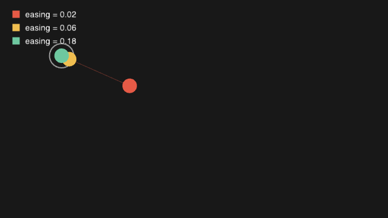
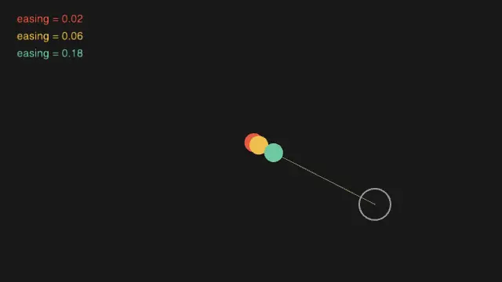

# 第 3 部 動かす

この部では、第 2 部で描いた絵を**時間の関数**にします。`draw()` が毎フレーム呼ばれることを利用して、位置や色をフレームごとに少しずつ変えていきます。

> **執筆中です。** いまは 3.3 だけが書かれています（[#508](https://github.com/shinyaoguri/metaphor/issues/508)）。

## 3.3 イージング





目標の位置へ図形を動かすとき、いちばん素朴な書き方は「目標の座標をそのまま代入する」ことです。これだと図形は瞬間移動します。

代わりに、**残っている距離の一定割合だけ毎フレーム進む**ようにすると、動きに慣性が生まれます。

```swift
x = lerp(x, targetX, 0.06)   // いまの x から目標へ 6% だけ近づく
```

`lerp(a, b, t)` は `a` と `b` の間を `t`（0..1）で補間した値を返します。`t` を毎フレーム同じ値にしても、`a` のほうが毎フレーム目標へ近づいていくので、**進む量はだんだん小さくなります**。これがイージング（easing）です。目標に近いほどゆっくりになる、という減速が、追加の状態を持たずに手に入ります。

係数の大きさが追従の速さになります。上の実行結果では 3 つの点が同じ目標を追っていて、`0.02` はもたつき、`0.18` はほとんど貼り付いて動きます。`1.0` にすると瞬間移動、`0` にすると動きません。

動きの証跡（アニメーション）は静止画では確かめられないので、この節の画像は連続キャプチャから作っています。撮影のたびに絵が変わらないよう、スケッチ側では乱数の種を `randomSeed(11)` で固定し、目標を切り替えるタイミングも経過時間ではなく `frameCount` で決めています。

<!-- tutorial-snippet: 03-Motion/03-Easing -->
```swift
import metaphor

@main
final class Easing: Sketch {
    var config: SketchConfig {
        SketchConfig(width: 640, height: 360, title: "Easing")
    }

    // 追従の速さ。0 に近いほどゆっくり、1 なら瞬間移動
    let easings: [Float] = [0.02, 0.06, 0.18]
    let colors: [(Float, Float, Float)] = [
        (230, 90, 70),
        (240, 190, 80),
        (110, 200, 160),
    ]

    // 追いかける側の現在位置（easings と同じ並び）
    var xs: [Float] = []
    var ys: [Float] = []

    // 3 つが共通で追う目標
    var targetX: Float = 0
    var targetY: Float = 0

    func setup() {
        // 実行するたびに同じ動きになるよう、乱数の種を固定する
        randomSeed(11)
        xs = easings.map { _ in width * 0.5 }
        ys = easings.map { _ in height * 0.5 }
        pickTarget()
    }

    func draw() {
        background(24)

        // 75 フレームごとに目標を選び直す。時刻ではなくフレーム数で決めて
        // いるので、何度実行しても同じタイミングで飛ぶ
        if frameCount % 75 == 0 {
            pickTarget()
        }

        // 目標の位置
        noFill()
        stroke(150)
        strokeWeight(2)
        circle(targetX, targetY, 40)

        for i in easings.indices {
            // イージングの本体。目標へ一気に動かさず、残りの距離の一定割合
            // だけ毎フレーム進む。距離が縮むほど進む量も減るので、自然に減速する
            xs[i] = lerp(xs[i], targetX, easings[i])
            ys[i] = lerp(ys[i], targetY, easings[i])

            let (r, g, b) = colors[i]

            // 目標との差。この線の長さが次のフレームの移動量を決める
            stroke(r, g, b, 90)
            strokeWeight(1)
            line(xs[i], ys[i], targetX, targetY)

            // 追いかける側
            noStroke()
            fill(r, g, b)
            circle(xs[i], ys[i], 24)
        }

        // どの色がどの係数かを凡例で示す。文字はいま fill 色を反映しない
        // （metaphor の既知の不具合 #516）ので、色は四角で示す
        textSize(14)
        for i in easings.indices {
            let (r, g, b) = colors[i]
            let baseline = 28 + Float(i) * 22
            fill(r, g, b)
            rect(20, baseline - 11, 12, 12)
            text("easing = \(easings[i])", 40, baseline)
        }
    }

    private func pickTarget() {
        targetX = random(80, width - 80)
        targetY = random(80, height - 80)
    }
}
```

実行: `cd Examples/Tutorial/03-Motion/03-Easing && swift run`
<!-- /tutorial-snippet -->

### 試してみる

- `easings` の値を `[0.5, 0.9, 1.0]` にすると、3 つの点の違いはどうなりますか
- `lerp(xs[i], targetX, easings[i])` の `easings[i]` を `easings[i] * 2` にすると、行き過ぎ（オーバーシュート）は起きますか
- 目標を切り替える間隔（`frameCount % 75`）を短くすると、遅い点は目標に追いつけますか

### もっと詳しく

- [`lerp`](https://shinyaoguri.github.io/metaphor/documentation/metaphorcore/) — 2 つの値の間を線形補間する
- [`Basics/Input/Easing`](https://github.com/shinyaoguri/metaphor/tree/main/Examples/Basics/Input/Easing), [`Topics/Interaction/Follow1`](https://github.com/shinyaoguri/metaphor/tree/main/Examples/Topics/Interaction/Follow1)
