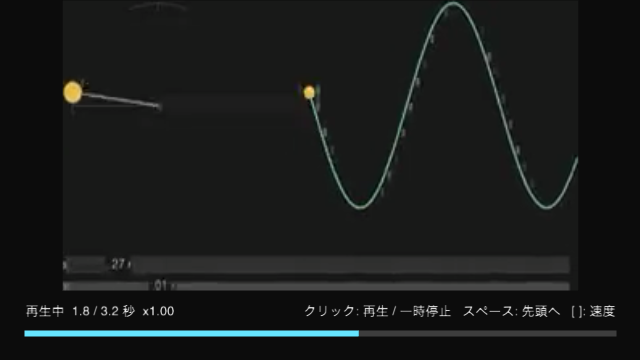

# 第 7 部 メディア

ここまでのスケッチが使ってきた材料は、すべてスケッチの内側にありました。フレーム番号、乱数、ノイズ、マウスの座標 — どれもコードが決めた値です。

この部では**外から来る信号**を絵につなぎます。マイクが拾う音、カメラが映す光、動画ファイルのフレーム、そして映像から取り出した「そこに顔がある」という意味。作品が置かれる場所や、その前に立つ人に反応する作品は、ここから始まります。

## この部の前提

第 2 部の図形・色と 2.8 の `image()`、第 3 部 3.2 の `map()` / `constrain()` と 3.3 のイージングを使います。第 1 部 1.3 の `setup()` と `draw()` の役割分担も前提です。3D と GPU の知識は要りません。

## この部だけ、実行結果の画像がありません

他の部では各節の頭に実行結果を貼ってきましたが、この部は 7.4 を除いて画像がありません。**絵が実行環境で決まってしまう**からです。マイクが無音なら何も動かず、カメラの映像は撮った場所しか写さず、顔検出はカメラの前に誰がいるかで変わります。撮ったところで読者の画面とは一致しません。

代わりに各節の冒頭で、**動かすと何が起きるか**を文章で書きます。手を動かして確かめる部として読んでください。

## 7.1 音を入力する

マイクに向かって音を出すと、画面中央の円がふくらみます。静かにすれば縮みます。円は 2 つあり、塗りつぶされた円が追従した値、細い輪郭の円が生の値です。声を出した瞬間に輪郭だけが跳ね、塗りが少し遅れてついてきます。下のメーターには `volume` の数値が出ます。

マイクを開けなかったときは、円の代わりに理由が文字で出ます。

### 作って、始める

音の入力は `createAudioInput()` で作ります。**作っただけでは解析は始まりません**。`start()` を呼んで初めてマイクが開きます。

```swift
let input = createAudioInput()
try input.start()
```

`start()` は失敗しうるので `throws` です。マイクが 1 台も無い、権限が拒否されている、オーディオエンジンが起動できない — どれも実行してみるまで分かりません。失敗を握りつぶさず、画面に理由を出すようにしておくと、あとで自分が助かります。

これは第 5 部までの API と手触りが違うところです。`loadImage()` は読み込んだ時点で使えましたが、音の入力は「作る」と「始める」が別の操作です。

### 毎フレーム update() を呼ぶ

`AudioAnalyzer` が持っている値は、`update()` を呼んだときにだけ更新されます。`draw()` の先頭で 1 回呼びます。

```swift
func draw() {
    audio.update()          // ここで volume / spectrum / isBeat が入れ替わる
    let v = audio.volume
    ...
}
```

呼び忘れると、値は最初のまま止まります。エラーにはなりません — 絵が動かないだけです。音を使ったスケッチが「なぜか反応しない」ときは、まずここを見ます。

### volume は思ったより小さい

`volume` は RMS（二乗平均平方根）で、0.0 から 1.0 の範囲です。ただし**ふつうに話しかけても 0.1 前後にしかなりません**。1.0 に近づくのは、マイクに息を吹きかけるような極端な音量のときだけです。

そのまま図形の大きさに使うと、ほとんど変化が見えません。何倍かしてから範囲に収めます。

```swift
let loudness = constrain(audio.volume * 6, 0, 1)
```

倍率は環境しだいです。マイクの感度も部屋の静かさも人によって違うので、**手元で数値を見ながら決める値**だと考えてください。このスケッチが `volume` を画面に出しているのはそのためです。

### 生の値は跳ねる

音量はフレームごとに大きく上下します。そのまま円の直径にすると絵がちらつくので、第 3 部 3.3 のイージングで追わせます。

```swift
level = lerp(level, loudness, 0.25)
```

このスケッチは追従後の円と生の値の輪郭を重ねて描いています。どれくらい平滑化されているかが目で見えるようにするためです。第 4 部のマウス追従と同じ手が、そのまま音にも効きます。

### 初回はマイクの権限を聞かれる

マイクを使うスケッチを初めて実行すると、macOS が権限のダイアログを出します。ここで押し間違えると、次からは黙って失敗します（`start()` が投げます）。

ダイアログが「MySketch がマイクへのアクセスを求めています」ではなく**ターミナルの名前**で出ることに戸惑うかもしれません。`swift run` で作ったバイナリは署名された `.app` ではないため、macOS が権限の主体をターミナル側だと判断するからです。仕組みと、拒否したあとの復旧手順は [docs/permissions.md](https://github.com/shinyaoguri/metaphor/blob/main/docs/permissions.md) にまとめてあります。

音に反応するスケッチをゼロから始めるなら、CLI のテンプレートも使えます。

```bash
metaphor new MySketch --template audio-reactive
```

<!-- tutorial-snippet: 07-Media/01-AudioInput -->
```swift
import metaphor

@main
final class AudioInput: Sketch {
    var config: SketchConfig {
        SketchConfig(width: 640, height: 360, title: "Audio Input")
    }

    // マイクを開けたときだけ入る。開けなかった理由は message に残す
    var audio: AudioAnalyzer?
    var message = ""

    // 生の volume は 1 フレームごとに跳ねるので、表示用に追従させた値を別に持つ
    var level: Float = 0

    func setup() {
        let input = createAudioInput()
        do {
            // start() を呼ぶまで解析は始まらない。初回はここで権限ダイアログが出る
            try input.start()
            audio = input
        } catch {
            message = "マイクを開けませんでした: \(error.localizedDescription)"
        }
    }

    func draw() {
        background(18)

        guard let audio else {
            noStroke()
            fill(240)
            textSize(16)
            textAlign(.left, .top)
            text(message, 24, 24)
            text("docs/permissions.md に復旧の手順があります", 24, 52)
            return
        }

        // draw() の先頭で 1 回呼ぶ。これで volume / spectrum / isBeat が更新される
        audio.update()

        // volume は RMS なので、ふつうに話しても 0.1 前後にしかならない。
        // 6 倍してから 0...1 に収め、絵に使える範囲へ広げる
        let loudness = constrain(audio.volume * 6, 0, 1)
        // 第 3 部 3.3 のイージング。跳ねる値をそのまま見せると絵が落ち着かない
        level = lerp(level, loudness, 0.25)

        noStroke()
        fill(Color(r: 0.25, g: 0.8, b: 1, a: 0.9))
        circle(width / 2, height / 2 - 20, map(level, 0, 1, 40, 280))

        // 追従前の生の値も細い線で重ねる。イージングが何をしているかが見える
        stroke(Color(gray: 1, alpha: 0.5))
        strokeWeight(2)
        noFill()
        circle(width / 2, height / 2 - 20, map(loudness, 0, 1, 40, 280))

        drawMeter(loudness)
    }

    /// 画面下のレベルメーター。数値でも見えるようにしておく
    private func drawMeter(_ loudness: Float) {
        noStroke()
        fill(Color(gray: 1, alpha: 0.15))
        rect(24, height - 48, width - 48, 12)

        fill(Color(r: 0.25, g: 0.8, b: 1))
        rect(24, height - 48, (width - 48) * level, 12)

        fill(Color(gray: 0.85))
        textSize(13)
        textAlign(.left, .top)
        text("volume \(String(format: "%.3f", audio?.volume ?? 0))", 24, height - 28)
    }
}
```

実行: `cd Examples/Tutorial/07-Media/01-AudioInput && swift run`
<!-- /tutorial-snippet -->

### 試してみる

- `audio.volume * 6` の 6 を 2 や 20 に変えると、手元の環境ではどのくらいが使いやすいですか
- `lerp` の 0.25 を 0.05 や 0.8 にすると、2 つの円の関係はどう変わりますか
- `audio.update()` の行を消すと、絵はどうなりますか

### ふりかえり

- [ ] `createAudioInput()` で作ったあと `start()` を呼ぶまで解析が始まらないと分かった
- [ ] `update()` を `draw()` の先頭で呼ぶ必要があると分かった
- [ ] `volume` は RMS で、実用には拡大してから使うと分かった
- [ ] マイクの権限がターミナルに対して聞かれる理由が分かった

### もっと詳しく

- [`AudioAnalyzer`](https://shinyaoguri.github.io/metaphor/reference/documentation/metaphoraudio/audioanalyzer), [`volume`](https://shinyaoguri.github.io/metaphor/reference/documentation/metaphoraudio/audioanalyzer/volume), [`start()`](https://shinyaoguri.github.io/metaphor/reference/documentation/metaphoraudio/audioanalyzer/start%28%29), [`update()`](https://shinyaoguri.github.io/metaphor/reference/documentation/metaphoraudio/audioanalyzer/update%28%29)
- [マイク・カメラの権限（TCC）](https://github.com/shinyaoguri/metaphor/blob/main/docs/permissions.md) — ダイアログの主体、拒否したあとの復旧、Continuity Camera の制約
- 音声ファイルを再生しながら解析するなら [`SoundFile`](https://shinyaoguri.github.io/metaphor/reference/documentation/metaphoraudio/soundfile)。マイクの代わりに同じ `spectrum` が取れます

## 7.2 音を分析する

音を鳴らすと、画面の下から 64 本の縦棒が伸びます。低い音は左、高い音は右です。ドラムのような音が入ると背景が一瞬明るくなります。画面の下には低音・中音・高音のエネルギーが数値で出ます。

音楽を再生しながら見ると、棒の左側がリズムに合わせて跳ね、声を出すと真ん中あたりが動きます。

### スペクトルは配列

`volume` が「いま全体でどれくらい鳴っているか」の 1 つの数だったのに対し、`spectrum` は**周波数ごとの強さを並べた配列**です。左が低い音、右が高い音で、それぞれ 0.0 から 1.0 に正規化されています。

配列の長さは `createAudioInput(fftSize:)` で決まり、`fftSize` の半分になります。

```swift
let input = createAudioInput(fftSize: 2048)   // spectrum は 1024 要素
```

`fftSize` を大きくすると周波数の分解能が上がります（隣り合う音を区別できる）。代わりに 1 回の分析に使う時間が長くなるので、時間の分解能は下がります（速い変化に鈍くなる）。この 2 つは同時には得られません。既定の 1024 は、絵を動かす用途ではたいてい過不足のない値です。

### 全部は描かない

1024 本の棒を 640 ピクセルに並べても読めません。それに、**上半分の帯域はふだんの音ではほとんど動きません**。このスケッチは下 1/4 だけを取り出し、64 本にまとめて画面いっぱいに引き伸ばしています。

```swift
let usable = max(bars, spectrum.count / 4)
```

まとめ方には平均と最大がありますが、ここでは最大を取っています。平均だと鋭い山がならされて消えるためです。

### 周波数で切りたいときは bandEnergy

「低音がどれくらい鳴っているか」を知りたいとき、配列の何番目から何番目が低音なのかを自分で計算するのは面倒です。`bandEnergy(lowFreq:highFreq:)` は**ヘルツで指定できます**。

```swift
let low  = audio.bandEnergy(lowFreq: 20, highFreq: 250)
let mid  = audio.bandEnergy(lowFreq: 250, highFreq: 2000)
let high = audio.bandEnergy(lowFreq: 2000, highFreq: 8000)
```

キックドラムに反応させたいなら低音、声なら中音、シンバルやノイズなら高音を見ます。配列の添字（`band(_:)`）より、こちらのほうが意図がコードに残ります。

### ビートは「立った瞬間」しか分からない

`isBeat` は、直前の `update()` でビートを検出したかどうかです。**次の `update()` で必ず倒れます**。そのままだと 1 フレームしか光らず、目にはほとんど見えません。

```swift
if audio.isBeat { flash = 1 }        // 立った瞬間に 1 を入れて
flash = max(0, flash - 0.08)         // あとは自分で減らす
background(Color(gray: 0.07 + flash * 0.25))
```

検出の感度は `beatThreshold` で変えられます。値を大きくすると鈍くなり（大きな音にしか反応しない）、小さくすると敏感になります。`smoothing` は棒の動きのなめらかさで、既定の 0.8 は絵として落ち着きすぎることがあるため、このスケッチでは 0.6 にしています。

<!-- tutorial-snippet: 07-Media/02-Spectrum -->
```swift
import metaphor

@main
final class Spectrum: Sketch {
    var config: SketchConfig {
        SketchConfig(width: 640, height: 360, title: "Spectrum")
    }

    var audio: AudioAnalyzer?
    var message = ""

    // 画面に描くバーの本数。FFT の分解能そのものではなく、見せたい粗さで決める
    let bars = 64

    // ビートを検出した瞬間から減っていく値。0 になるまで背景を明るくする
    var flash: Float = 0

    func setup() {
        let input = createAudioInput(fftSize: 2048)
        // 既定の 0.8 だとバーがなめらかすぎるので、少し反応を速くする
        input.smoothing = 0.6
        do {
            try input.start()
            audio = input
        } catch {
            message = "マイクを開けませんでした: \(error.localizedDescription)"
        }
    }

    func draw() {
        guard let audio else {
            background(18)
            noStroke()
            fill(240)
            textSize(16)
            textAlign(.left, .top)
            text(message, 24, 24)
            return
        }

        audio.update()

        // isBeat は update() のたびに立て直される。見えるように残光へ変換する
        if audio.isBeat { flash = 1 }
        flash = max(0, flash - 0.08)
        background(Color(gray: 0.07 + flash * 0.25))

        drawSpectrum(audio.spectrum)
        drawBands(audio)
    }

    /// スペクトルを縦棒で描く
    private func drawSpectrum(_ spectrum: [Float]) {
        guard !spectrum.isEmpty else { return }

        // spectrum は 0Hz から順に並ぶ。上のほうの帯域はふだんの音ではほとんど
        // 動かないので、下 1/4 だけを画面いっぱいに引き伸ばす
        let usable = max(bars, spectrum.count / 4)
        let barWidth = width / Float(bars)

        noStroke()
        for i in 0..<bars {
            let from = i * usable / bars
            let to = max(from + 1, (i + 1) * usable / bars)
            // 1 本のバーが受け持つビンの最大値。平均だと山が埋もれる
            var peak: Float = 0
            for j in from..<min(to, spectrum.count) {
                peak = max(peak, spectrum[j])
            }

            let barHeight = constrain(peak, 0, 1) * (height - 80)
            let hue = map(Float(i), 0, Float(bars), 0.55, 0.95)
            fill(Color(hue: hue, saturation: 0.7, brightness: 0.95))
            rect(Float(i) * barWidth + 1, height - 40 - barHeight, barWidth - 2, barHeight)
        }
    }

    /// 低音・中音・高音のエネルギーを数値で出す
    private func drawBands(_ audio: AudioAnalyzer) {
        // bandEnergy は周波数で指定できる。バーの本数と違い、音楽的な帯域で切れる
        let low = audio.bandEnergy(lowFreq: 20, highFreq: 250)
        let mid = audio.bandEnergy(lowFreq: 250, highFreq: 2000)
        let high = audio.bandEnergy(lowFreq: 2000, highFreq: 8000)

        noStroke()
        fill(Color(gray: 0.9))
        textSize(13)
        textAlign(.left, .top)
        text(String(format: "low %.3f   mid %.3f   high %.3f", low, mid, high), 16, height - 28)
        textAlign(.right, .top)
        text(audio.isBeat ? "BEAT" : " ", width - 16, height - 28)
    }
}
```

実行: `cd Examples/Tutorial/07-Media/02-Spectrum && swift run`
<!-- /tutorial-snippet -->

### 試してみる

- `bars` を 16 や 256 にすると、同じ音の見え方はどう変わりますか
- `spectrum.count / 4` を `/ 1` にすると、右半分の棒はどうなりますか
- `smoothing` を 0.95 と 0.1 で比べると、どちらが作品に使いやすいですか
- `beatThreshold` を 1.1 と 3.0 で比べると、背景の光り方はどう変わりますか

### ふりかえり

- [ ] `spectrum` が周波数ごとの強さを並べた配列だと分かった
- [ ] `fftSize` を上げると周波数の分解能と引き換えに時間の分解能が下がると分かった
- [ ] 帯域をヘルツで指定するなら `bandEnergy(lowFreq:highFreq:)` だと分かった
- [ ] `isBeat` は 1 フレームで倒れるので、残光は自分で作ると分かった

### もっと詳しく

- [`spectrum`](https://shinyaoguri.github.io/metaphor/reference/documentation/metaphoraudio/audioanalyzer/spectrum), [`band(_:)`](https://shinyaoguri.github.io/metaphor/reference/documentation/metaphoraudio/audioanalyzer/band%28_:%29), [`bandEnergy(lowFreq:highFreq:)`](https://shinyaoguri.github.io/metaphor/reference/documentation/metaphoraudio/audioanalyzer/bandenergy%28lowfreq:highfreq:%29)
- [`isBeat`](https://shinyaoguri.github.io/metaphor/reference/documentation/metaphoraudio/audioanalyzer/isbeat), [`beatThreshold`](https://shinyaoguri.github.io/metaphor/reference/documentation/metaphoraudio/audioanalyzer/beatthreshold), [`smoothing`](https://shinyaoguri.github.io/metaphor/reference/documentation/metaphoraudio/audioanalyzer/smoothing)
- [`waveform`](https://shinyaoguri.github.io/metaphor/reference/documentation/metaphoraudio/audioanalyzer/waveform) は分析前の波形です。オシロスコープのような絵を描くならこちらを使います

## 7.3 カメラ入力

実行すると、接続されているカメラの映像が画面いっぱいに映ります。左上には接続中のカメラの一覧が出て、いま映しているものに `>` が付きます。数字キーで切り替えられます。カメラを挿し直したら `R` キーで一覧を取り直します。

カメラが 1 台も無ければ「カメラが見つかりません」と出ます。

### 列挙してから開く

接続されているカメラは `listCaptureDevices()` で列挙できます。返ってくる `CaptureDeviceInfo` は名前・識別子・種類を持つので、そのまま一覧の表示に使えます。

```swift
let devices = listCaptureDevices()
let capture = createCapture(width: 1280, height: 720, device: devices[0])
```

引数なしの `createCapture()` は、OS が既定にしているカメラを開きます。まず既定で動かし、切り替えが要るときに列挙する、という順で書けます。

**`createCapture()` は作った時点でキャプチャを始めます**。7.1 の `createAudioInput()` が `start()` を要求したのと非対称です。この不統一は既知のもので、[ADR-0005](https://github.com/shinyaoguri/metaphor/blob/main/docs/adr/0005-sketch-api-consistency.md) に経緯が残っています。

### 要求した解像度で開くとは限らない

`width` / `height` は**要求**であって、カメラがその解像度を持っていなければ近いものが選ばれます。実際に開けた解像度は `actualWidth` / `actualHeight` に入ります。

```swift
let cameraWidth = Float(capture.actualWidth ?? capture.width)
```

映像を歪めずに画面へ収めるときは、要求値ではなくこちらを使います。要求値で計算すると、カメラによってだけ縦横比が狂う、という気づきにくい不具合になります。

### 描くのは image()

カメラのフレームは、第 2 部 2.8 で画像を描いたのと同じ `image()` に渡せます。読み込んだ画像か、カメラか、動画かの違いを、描く側は意識しません。

```swift
image(capture, x, y, w, h)
```

### 途中で抜かれることがある

USB カメラは実行中に抜かれます。`onDisconnect` を設定しておくと、そのときに呼ばれます。長時間動かす展示では、ここで一覧を取り直して別のカメラへ移る、という組み方ができます。

なお **iPhone を Continuity Camera として使うには `.app` として署名する必要があります**。`swift run` のバイナリでは一覧に出てきません。内蔵カメラと USB カメラはどちらでも使えます。理由は [docs/permissions.md](https://github.com/shinyaoguri/metaphor/blob/main/docs/permissions.md) にあります。

<!-- tutorial-snippet: 07-Media/03-Camera -->
```swift
import metaphor

@main
final class Camera: Sketch {
    var config: SketchConfig {
        SketchConfig(width: 640, height: 360, title: "Camera")
    }

    // 接続中のカメラ一覧。R キーで取り直す
    var devices: [CaptureDeviceInfo] = []
    var capture: CaptureDevice?

    func setup() {
        devices = listCaptureDevices()
        // 引数なしの createCapture() は OS の既定のカメラを開く。
        // createAudioInput() と違い、start() は要らない（作った時点で始まる）
        capture = createCapture(width: 1280, height: 720)
    }

    func draw() {
        background(12)

        if let capture, capture.isAvailable {
            // 実際に開けた解像度は要求と違うことがある。歪めずに収める
            let cameraWidth = Float(capture.actualWidth ?? capture.width)
            let cameraHeight = Float(capture.actualHeight ?? capture.height)
            let scale = min(width / cameraWidth, height / cameraHeight)
            let w = cameraWidth * scale
            let h = cameraHeight * scale
            // 画像と同じ image()。CaptureDevice をそのまま渡せる
            image(capture, (width - w) / 2, (height - h) / 2, w, h)
        } else {
            noStroke()
            fill(Color(gray: 0.6))
            textSize(16)
            textAlign(.center, .center)
            let reason = capture == nil ? "カメラが見つかりません" : "カメラの映像を待っています"
            text(reason, width / 2, height / 2)
        }

        drawDeviceList()
    }

    func keyPressed() {
        guard let key else { return }
        if key == "r" {
            // 接続・切断はスケッチの実行中に起きる。一覧は撮り直せるようにしておく
            devices = listCaptureDevices()
            return
        }
        // 1〜9 で切り替える。開き直す前に、いま開いているカメラを止める
        if let digit = key.wholeNumberValue, digit >= 1, digit <= devices.count {
            capture?.stop()
            capture = createCapture(width: 1280, height: 720, device: devices[digit - 1])
        }
    }

    /// 接続中のカメラと、いま映しているものを重ねて出す
    private func drawDeviceList() {
        noStroke()
        textSize(13)
        textAlign(.left, .top)

        fill(Color(gray: 1, alpha: 0.9))
        text("1-\(min(devices.count, 9)): 切り替え   R: 一覧を取り直す", 16, 16)

        var y: Float = 40
        for (index, device) in devices.enumerated() {
            let isCurrent = capture?.deviceInfo?.id == device.id
            fill(isCurrent ? Color(r: 0.3, g: 1, b: 0.6) : Color(gray: 0.75))
            text("\(isCurrent ? ">" : " ") \(index + 1): \(device.name)", 16, y)
            y += 20
        }
        if devices.isEmpty {
            fill(Color(gray: 0.6))
            text("(カメラなし)", 16, y)
        }
    }
}
```

実行: `cd Examples/Tutorial/07-Media/03-Camera && swift run`
<!-- /tutorial-snippet -->

### 試してみる

- `createCapture(width: 320, height: 240)` に変えると、`actualWidth` は何になりますか
- 映像の上に半透明の図形を重ねると、どう見えますか（第 2 部 2.10 のブレンドモードと組み合わせます）
- カメラを抜き差しして、`R` キーの前後で一覧がどう変わるか見てください

### ふりかえり

- [ ] `listCaptureDevices()` で接続中のカメラを列挙できると分かった
- [ ] `createCapture()` は作った時点で始まる（`start()` が要らない）と分かった
- [ ] 要求した解像度と実際の解像度が違いうると分かった
- [ ] カメラのフレームを画像と同じ `image()` で描けると分かった

### もっと詳しく

- [`listCaptureDevices()`](https://shinyaoguri.github.io/metaphor/reference/documentation/metaphorcore/sketch/listcapturedevices%28%29), [`createCapture(width:height:position:)`](https://shinyaoguri.github.io/metaphor/reference/documentation/metaphorcore/sketch/createcapture%28width:height:position:%29)
- [`CaptureDevice`](https://shinyaoguri.github.io/metaphor/reference/documentation/metaphorcore/capturedevice), [`CaptureDeviceInfo`](https://shinyaoguri.github.io/metaphor/reference/documentation/metaphorcore/capturedeviceinfo)
- 切り替えと切断をもう少し作り込んだ例: [`Examples/Basics/Video/CameraSwitching`](https://github.com/shinyaoguri/metaphor/tree/main/Examples/Basics/Video/CameraSwitching)

## 7.4 動画再生



同梱の動画がくり返し再生され、下に再生位置のバーと経過時間が出ます。クリックで一時停止と再開、スペースキーで先頭へ、`[` と `]` で再生速度が変わります。

映っているのは第 3 部 3.4「三角関数で動かす」の実行結果を動画にしたものです。**metaphor で描いた絵を metaphor で再生している**わけで、第 9 部で書き出しを覚えると、この往復を自分で作れるようになります。

### 読み込んで、再生を始める

```swift
let player = try loadVideo(path)
player.loop()
```

`loop()` は「くり返しを有効にして再生を始める」ところまでやります。1 回だけ再生するなら `play()` です。

動画はパッケージのリソースとして同梱しているので、パスは `Bundle.module` で解決します。第 2 部 2.8 で画像を読んだときと同じ形です。

### update() と isAvailable

音と同じく、`draw()` の先頭で `update()` を呼びます。これで `texture` が現在の再生位置のフレームになります。

そのうえで `isAvailable` を見ます。**最初のフレームがデコードされるまでは false** で、そこを見ずに描くと起動直後の一瞬だけ絵が出ません。ファイルから読む以上、必ず遅れがあります。

```swift
video.update()
guard video.isAvailable else { return }   // まだ最初のフレームが来ていない
image(video, x, y, w, h)
```

### 位置と速度

| 何をするか | 書き方 |
|---|---|
| いまの位置を知る | `video.position`（秒） |
| その位置へ飛ぶ | `video.position = 1.5`（フレーム単位で正確） |
| 全体の長さ | `video.duration`（秒） |
| 速度を変える | `video.rate = 2.0`（0.25〜4.0） |
| 止める / 続ける | `video.pause()` / `video.play()` |

`rate` の範囲外の値は自分で丸めます。このスケッチが `min` / `max` で挟んでいるのはそのためです。

### 拡大すればぼやける

同梱している動画は 320×180 です。640×360 のキャンバスに広げれば、当然ぼやけます。**動画の解像度と表示サイズは別物**で、`image()` は足りない画素を作ってはくれません。作品で使うなら、表示する大きさに見合う解像度の素材を用意します。

<!-- tutorial-snippet: 07-Media/04-VideoPlayback -->
```swift
import Foundation
import metaphor

@main
final class VideoPlayback: Sketch {
    var config: SketchConfig {
        SketchConfig(width: 640, height: 360, title: "Video Playback")
    }

    // 読み込んだ動画は保持しておく。draw() のたびに読み直さない
    var video: VideoPlayer?
    var message = ""

    func setup() {
        // 動画はパッケージのリソースとして同梱している（作り方は README.md）
        guard
            let path = Bundle.module.path(forResource: "loop", ofType: "mp4", inDirectory: "Resources")
        else {
            message = "動画が見つかりませんでした"
            return
        }
        do {
            let player = try loadVideo(path)
            // loop() は「繰り返しを有効にして再生を始める」。play() だと 1 回で止まる
            player.loop()
            video = player
        } catch {
            message = "動画を読み込めませんでした: \(error.localizedDescription)"
        }
    }

    func draw() {
        background(12)

        guard let video else {
            noStroke()
            fill(240)
            textSize(16)
            textAlign(.left, .top)
            text(message, 24, 24)
            return
        }

        // draw() の先頭で 1 回呼ぶ。これで texture が現在位置のフレームになる
        video.update()

        // 最初のフレームがデコードされるまでは false。ここを見ずに描くと一瞬黒くなる
        guard video.isAvailable else {
            noStroke()
            fill(Color(gray: 0.6))
            textSize(16)
            textAlign(.center, .center)
            text("読み込み中", width / 2, height / 2)
            return
        }

        // 画像と同じ image()。VideoPlayer をそのまま渡せる。
        // 下 70 ピクセルは再生位置の帯に空けておき、残りへ歪めずに収める
        let stage = height - 70
        let scale = min(width / video.width, stage / video.height)
        let w = video.width * scale
        let h = video.height * scale
        image(video, (width - w) / 2, (stage - h) / 2, w, h)

        drawProgress(video)
    }

    func mousePressed() {
        guard let video else { return }
        // isPlaying は再生中かどうか。押すたびに止める / 続ける
        if video.isPlaying {
            video.pause()
        } else {
            video.play()
        }
    }

    func keyPressed() {
        guard let video, let key else { return }
        switch key {
        case " ":
            // position は秒。代入するとその位置へ飛ぶ（フレーム単位で正確）
            video.position = 0
        case "]":
            // rate は 0.25〜4.0。範囲外は自分で丸める
            video.rate = min(4, video.rate + 0.25)
        case "[":
            video.rate = max(0.25, video.rate - 0.25)
        default:
            break
        }
    }

    /// 再生位置のバーと状態を重ねる
    private func drawProgress(_ video: VideoPlayer) {
        let progress = video.duration > 0 ? Float(video.position / video.duration) : 0

        noStroke()
        fill(Color(gray: 1, alpha: 0.2))
        rect(24, height - 30, width - 48, 6)
        fill(Color(r: 0.4, g: 0.9, b: 1))
        rect(24, height - 30, (width - 48) * progress, 6)

        fill(Color(gray: 0.9))
        textSize(13)
        textAlign(.left, .top)
        let state = video.isPlaying ? "再生中" : "停止中"
        text(
            String(format: "%@  %.1f / %.1f 秒  x%.2f", state, video.position, video.duration, video.rate),
            24, height - 56
        )
        textAlign(.right, .top)
        text("クリック: 再生 / 一時停止   スペース: 先頭へ   [ ]: 速度", width - 24, height - 56)
    }
}
```

実行: `cd Examples/Tutorial/07-Media/04-VideoPlayback && swift run`
<!-- /tutorial-snippet -->

### 試してみる

- `player.loop()` を `player.play()` に変えると、終わったあとはどうなりますか
- `video.rate` を 0.25 にすると、絵の動きと再生位置のバーはどう変わりますか
- `guard video.isAvailable` の行を消して起動すると、最初の数フレームはどう見えますか
- 自分の動画ファイルのパスを `loadVideo()` に直接渡して差し替えてみてください

### ふりかえり

- [ ] `loadVideo()` で読み、`loop()` か `play()` で再生を始めると分かった
- [ ] `update()` を呼ばないとフレームが進まないと分かった
- [ ] `isAvailable` が最初のフレームを待つためのものだと分かった
- [ ] `position` への代入がシーク（その位置へ飛ぶこと）だと分かった

### もっと詳しく

- [`VideoPlayer`](https://shinyaoguri.github.io/metaphor/reference/documentation/metaphorvideo/videoplayer) — `position` / `rate` / `duration` / `isLooping` の一覧
- ドラッグ＆ドロップでファイルを受け取る例: [`Examples/Basics/Video/VideoPlayback`](https://github.com/shinyaoguri/metaphor/tree/main/Examples/Basics/Video/VideoPlayback)
- 同梱動画の作り方は [`Examples/Tutorial/07-Media/04-VideoPlayback/README.md`](https://github.com/shinyaoguri/metaphor/blob/main/Examples/Tutorial/07-Media/04-VideoPlayback/README.md) にあります

## 7.5 機械学習

カメラの映像に顔が映ると、その周りに緑の枠が描かれます。左上に検出した人数が出ます。複数の人が映れば、枠も増えます。

### metaphor は橋渡しをする

顔を見つけているのは metaphor ではなく、macOS の **Vision** フレームワークです。metaphor がするのは、**カメラのフレーム（Metal のテクスチャ）を Vision が読める形に変える**ことだけです。その変換器が `MLTextureConverter` です。

```swift
converter = createMLTextureConverter()
...
if let pixelBuffer = converter.pixelBuffer(from: texture) {
    let request = VNDetectFaceRectanglesRequest()
    try? VNImageRequestHandler(cvPixelBuffer: pixelBuffer, orientation: .up).perform([request])
    faces = request.results?.map { $0.boundingBox } ?? []
}
```

この形が分かれば、顔検出以外にも同じ手が使えます。Vision には矩形検出・文字認識・人物分割などがあり、Core ML のモデルを読み込めば分類やスタイル変換も同じ経路に乗ります。metaphor 側の書き方は変わりません。

### 座標系が違う

Vision が返す `boundingBox` は **左下が原点で、0.0 から 1.0 に正規化**されています。metaphor は左上が原点でピクセル単位です。そのまま描くと上下が逆になります。

```swift
let x = Float(face.origin.x) * width
let y = (1 - Float(face.origin.y + face.height)) * height
```

`1 -` で上下をひっくり返し、幅と高さを掛けてピクセルに直します。他のフレームワークの結果を重ねるときは、まず座標系の向きと原点を確かめます。

### 毎フレーム走らせると重い

このスケッチは毎フレーム検出しています。顔の矩形検出は軽いので 60fps でも動きますが、**重いモデルほどそうはいきません**。数フレームに 1 回だけ走らせて結果を使い回す、別スレッドで走らせて届いたときに差し替える、といった工夫が要ります。作品に組み込む前に、フレームレートを見ながら間隔を決めてください。

### モデルが要るもの

Core ML のモデルファイルを別途用意する例（画像分類・スタイル変換）は、チュートリアルからは外してあります。ダウンロードと配置の手順が本筋から離れるためです。動くコードは Examples にあります。

<!-- tutorial-snippet: 07-Media/05-FaceDetection -->
```swift
import Vision
import metaphor

@main
final class FaceDetection: Sketch {
    var config: SketchConfig {
        SketchConfig(width: 640, height: 360, title: "Face Detection")
    }

    var capture: CaptureDevice?
    // Metal のテクスチャを Vision が読める形（CVPixelBuffer）へ渡すための変換器
    var converter: MLTextureConverter!

    // 直前の検出結果。Vision の座標系（左下原点・0...1 の正規化）のまま持つ
    var faces: [CGRect] = []

    func setup() {
        capture = createCapture(width: 1280, height: 720)
        converter = createMLTextureConverter()
    }

    func draw() {
        background(12)

        guard let capture, capture.isAvailable, let texture = capture.texture else {
            noStroke()
            fill(Color(gray: 0.6))
            textSize(16)
            textAlign(.center, .center)
            text("カメラの映像を待っています", width / 2, height / 2)
            return
        }

        image(capture, 0, 0, width, height)

        // カメラのフレームを Vision に渡して顔を探す
        if let pixelBuffer = converter.pixelBuffer(from: texture) {
            detect(in: pixelBuffer)
        }

        drawFaces()
    }

    /// 顔の矩形を求める。metaphor の外側（Apple の Vision）の仕事
    private func detect(in pixelBuffer: CVPixelBuffer) {
        let request = VNDetectFaceRectanglesRequest()
        let handler = VNImageRequestHandler(cvPixelBuffer: pixelBuffer, orientation: .up)
        try? handler.perform([request])
        faces = request.results?.map { $0.boundingBox } ?? []
    }

    /// 検出結果を画面の座標へ直して重ねる
    private func drawFaces() {
        noFill()
        stroke(Color(r: 0.3, g: 1, b: 0.5))
        strokeWeight(3)
        for face in faces {
            // Vision は左下原点。metaphor は左上原点なので y を反転する
            let x = Float(face.origin.x) * width
            let y = (1 - Float(face.origin.y + face.height)) * height
            rect(x, y, Float(face.width) * width, Float(face.height) * height)
        }

        noStroke()
        fill(Color(gray: 0.9))
        textSize(14)
        textAlign(.left, .top)
        text("検出: \(faces.count) 人", 16, 16)
    }
}
```

実行: `cd Examples/Tutorial/07-Media/05-FaceDetection && swift run`
<!-- /tutorial-snippet -->

### 試してみる

- `VNDetectFaceRectanglesRequest` を `VNDetectFaceLandmarksRequest` に変えると、何が取れますか
- 検出を 5 フレームに 1 回にすると、絵とフレームレートはどう変わりますか
- 枠の代わりに、顔の位置へ図形や画像を重ねてみてください

### ふりかえり

- [ ] 推論そのものは Vision / Core ML の仕事で、metaphor は橋渡しだと分かった
- [ ] `MLTextureConverter` がテクスチャを `CVPixelBuffer` に変えるものだと分かった
- [ ] Vision の座標系が左下原点・正規化で、変換が要ると分かった
- [ ] 重いモデルは毎フレーム走らせない、という判断が要ると分かった

### もっと詳しく

- [`MLTextureConverter`](https://shinyaoguri.github.io/metaphor/reference/documentation/metaphorml/mltextureconverter) — `CGImage` や `MLMultiArray` との変換もここにあります
- 人物分割・画像分類・スタイル変換の例: [`Examples/ML`](https://github.com/shinyaoguri/metaphor/tree/main/Examples/ML)
- 探しているものが Examples にあるか引くときは [docs/ai/examples-index.md](https://github.com/shinyaoguri/metaphor/blob/main/docs/ai/examples-index.md)

## この部のまとめ

外から来る信号を扱う道具は出そろいました。共通するのは 3 つです。

1. **作ってから始める**ものがある（`createAudioInput()` は `start()` が要る）
2. **`draw()` の先頭で `update()` を呼ぶ**（音も動画も、呼ばないと値が止まる）
3. **すぐには使えない**（`isAvailable` や、権限のダイアログを待つ時間がある）

次の第 8 部では、信号を受け取る側から**送り出す側**へ回ります。OSC で他のアプリとつなぎ、Syphon で映像を流し、`@Param` で調整値を外へ出します。
