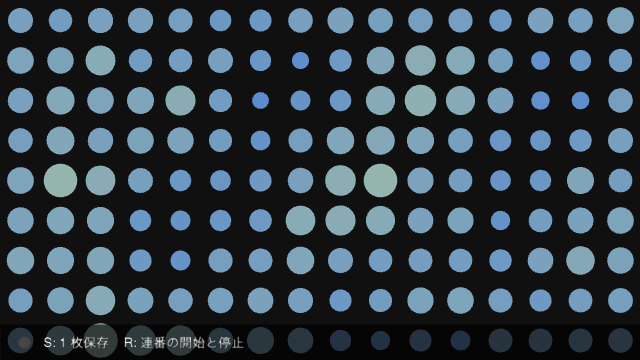
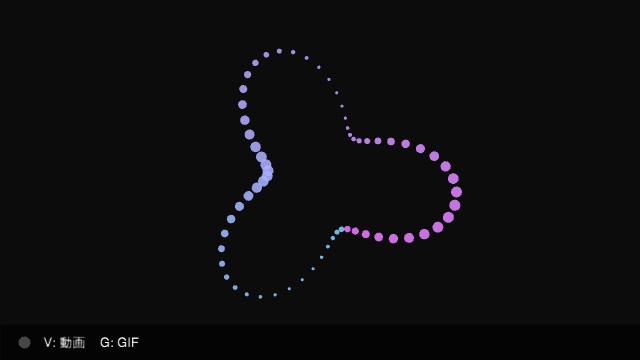
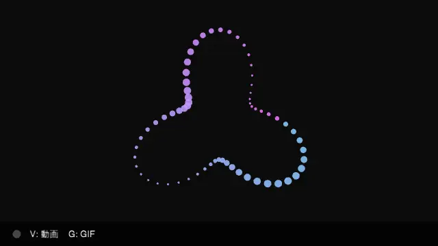
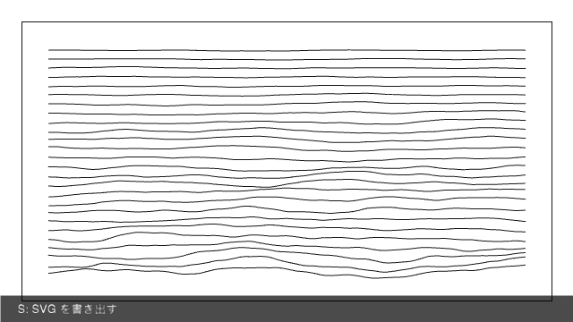
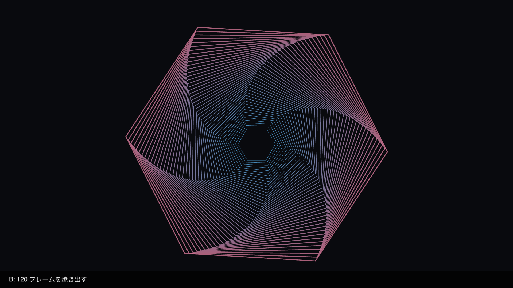
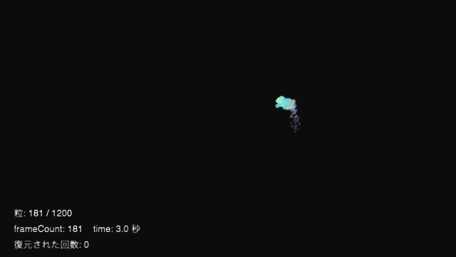

# 第 9 部 作品にする

ここまでのスケッチは、実行している間だけ存在していました。窓を閉じれば絵は消え、他の人に見せるには画面を見せるしかありません。

この部では、その絵を**ファイルとして外へ出します**。1 枚の画像、動画、GIF、そしてペンプロッタで引けるベクタ。さらに「同じ絵をもう一度出す」ための焼き出し方と、展示のように長く動かし続けるための備えを扱います。第 8 部が「動いているスケッチを外とつなぐ」話だったのに対して、この部は**スケッチが終わったあとに残るもの**の話です。

## この部の前提

第 1 部 1.6 の `noLoop()` / `redraw()`、第 2 部の図形・色・`text()`、第 3 部 3.5〜3.6 の乱数とノイズ（特に種の固定）、第 4 部 4.2 のキーボード入力を使います。書き出しの知識は要りません。

## 9.1 静止画で書き出す



ノイズで大きさの変わる円が並び、ゆっくり呼吸しています。**S** を押すとその瞬間の 1 枚が `output/artwork.png` に、**R** を押すと止めるまでの全フレームが `output/frames/` に連番で書き出されます。画面の下の帯には、いま何をしたかが出ます。

### 書き出しは「予約」

```swift
save("output/artwork.png")
```

この 1 行はファイルを書きません。**予約するだけ**です。実際に書かれるのは、いま描いているフレームを描き終えたあと、ポストプロセスまで通った最終的な絵からです。

そのおかげで、`draw()` の途中で呼んでも `keyPressed()` から呼んでも、出てくる画像は同じ「1 フレーム分の完成した絵」になります。逆に言うと、**そのフレームに描いたものはすべて写ります**。この節のスケッチでは画面の下の案内バーも画像に入ります。作品として出すなら記録中は描かない、という手当てが要ります（9.4 でやります）。

書き出される大きさは**窓の大きさではなくレンダリング解像度**です。`config` で 1920×1080 を指定して窓を半分の大きさで開いていても、出てくる画像は 1920×1080 です。

### 保存先の 3 つの書き方

| 書き方 | どこに出るか |
|---|---|
| `save("output/artwork.png")` | 指定したパス。相対パスはスケッチを起動したディレクトリから解決される |
| `save()` | デスクトップに `metaphor_20260813_094500.png` |
| `saveFrame()` / `saveFrame("cut.png")` | **必ずデスクトップ**。引数なしなら `screen-0042.png`（数字はフレーム番号） |

`save()` と `saveFrame()` は「いま気になった絵をとりあえず残す」ためのものです。作品として出すファイルは、パスを明示する `save(_:)` を使います。

### 連番で撮る

動きのある絵を「あとで好きなコマを選ぶ」つもりで残すなら、フレームを連番の PNG にします。

```swift
beginFrameRecord(directory: "output/frames", pattern: "frame_%04d.png")
// …記録したいだけフレームが進む…
endFrameRecord()
```

ディレクトリは無ければ作られます。`pattern` には**整数の書式指定子をちょうど 1 個**含めます（`%04d` なら `frame_0000.png` から）。書式が不正なときは警告が出て既定のパターンに戻るだけで、記録は止まりません。

書き出しは裏側で非同期に行われ、書き込みが追いつかないときは自動的に待ちが入ります。1 枚も落とさない代わりに、記録中はスケッチが少し重くなります。

連番 PNG は**劣化しません**。あとから動画にまとめることも、1 枚だけ選んで印刷することもできます。そのぶん枚数ぶんの容量を食うので、長回しには向きません（60fps で 10 秒なら 600 枚です）。

<!-- tutorial-snippet: 09-Artwork/01-SaveImage -->
```swift
import metaphor

@main
final class SaveImageSketch: Sketch {
    var config: SketchConfig {
        SketchConfig(width: 640, height: 360, title: "SaveImage")
    }

    // 相対パスはスケッチを起動したディレクトリから解決される。
    // swift run ならパッケージ直下なので、output/ がその隣にできる
    let stillPath = "output/artwork.png"
    let sequenceDirectory = "output/frames"

    var isRecordingSequence = false
    var recordedFrames = 0
    var status = "S: 1 枚保存    R: 連番の開始と停止"

    func setup() {
        // 同じ模様が毎回出るように種を固定する（再現性の話は 9.4 で）
        noiseSeed(9)
    }

    func draw() {
        background(16)
        drawGrid()

        if isRecordingSequence {
            // 記録中は 1 フレームにつき 1 枚が書き出される
            recordedFrames += 1
            status = "録画中 \(recordedFrames) 枚 → \(sequenceDirectory)    R: 停止"
        }

        drawStatusBar()
    }

    func keyPressed() {
        if key == "s" || key == "S" {
            // 予約するだけ。ファイルが書かれるのはこのフレームを描き終えたあと
            save(stillPath)
            status = "\(stillPath) に保存しました"
        } else if key == "r" || key == "R" {
            toggleSequence()
        }
    }

    private func toggleSequence() {
        if isRecordingSequence {
            endFrameRecord()
            isRecordingSequence = false
            status = "\(sequenceDirectory) に \(recordedFrames) 枚 書き出しました"
        } else {
            recordedFrames = 0
            // ディレクトリは無ければ作られる。パターンの %04d が連番になる
            beginFrameRecord(directory: sequenceDirectory, pattern: "frame_%04d.png")
            isRecordingSequence = true
        }
    }

    /// 保存したくなる絵。時刻ではなくフレーム番号で動かしているので、
    /// 何回目の実行でも 100 フレーム目は同じ絵になる
    private func drawGrid() {
        noStroke()
        let columns = 16
        let rows = 9
        let cellWidth = width / Float(columns)
        let cellHeight = height / Float(rows)
        let phase = Float(frameCount) * 0.006

        for column in 0..<columns {
            for row in 0..<rows {
                let n = noise(Float(column) * 0.28, Float(row) * 0.28, phase)
                fill(50 + n * 140, 110 + n * 100, 230 - n * 80)
                circle(
                    cellWidth * (Float(column) + 0.5),
                    cellHeight * (Float(row) + 0.5),
                    map(n, 0, 1, 4, cellWidth * 1.15)
                )
            }
        }
    }

    /// いま何が起きているかを画面に出す。書き出しは静かに終わるので、
    /// これが無いと成功したのか分からない
    private func drawStatusBar() {
        noStroke()
        fill(0, 0, 0, 170)
        rect(0, height - 36, width, 36)

        if isRecordingSequence {
            fill(230, 70, 70)
        } else {
            fill(70)
        }
        circle(24, height - 18, 12)

        fill(235)
        textSize(13)
        textAlign(.left, .center)
        text(status, 42, height - 18)
    }
}
```

実行: `cd Examples/Tutorial/09-Artwork/01-SaveImage && swift run`
<!-- /tutorial-snippet -->

### 試してみる

- `save()` を `draw()` の先頭で呼ぶとどうなりますか（案内バーは写りますか）
- `pattern` を `"cut_%d.png"` に変えると、ファイル名はどう変わりますか
- `config` の `width` / `height` を 2 倍にして、窓の大きさと書き出される画像の大きさを比べてください
- 連番を撮ったまま `R` を押さずに終了すると、ファイルはどこまで残っていますか

### ふりかえり

- [ ] `save(_:)` はファイルを書くのではなく、フレームの終わりの書き出しを予約すると分かった
- [ ] 書き出される大きさが窓ではなくレンダリング解像度で決まると分かった
- [ ] 引数なしの `save()` / `saveFrame()` はデスクトップ行きの手軽な道具だと分かった
- [ ] `beginFrameRecord` / `endFrameRecord` で連番 PNG を撮れるようになった
- [ ] そのフレームに描いたものはすべて画像に写ると分かった

### もっと詳しく

- [`save(_:)`](https://shinyaoguri.github.io/metaphor/reference/documentation/metaphorcore/sketch/save%28_:%29), [`save()`](https://shinyaoguri.github.io/metaphor/reference/documentation/metaphorcore/sketch/save%28%29), [`saveFrame(_:)`](https://shinyaoguri.github.io/metaphor/reference/documentation/metaphorcore/sketch/saveframe%28_:%29)
- [`beginFrameRecord(directory:pattern:)`](https://shinyaoguri.github.io/metaphor/reference/documentation/metaphorcore/sketch/beginframerecord%28directory:pattern:%29), [`endFrameRecord()`](https://shinyaoguri.github.io/metaphor/reference/documentation/metaphorcore/sketch/endframerecord%28%29)
- 元になった例: [`Examples/Topics/File IO/SaveOneImage`](https://github.com/shinyaoguri/metaphor/tree/main/Examples/Topics/File%20IO/SaveOneImage)

## 9.2 動画・GIF で書き出す





輪になった粒が回りながら伸び縮みします。**V** で動画（`output/motion.mp4`）、**G** で GIF（`output/motion.gif`）の録画が始まり、もう一度同じキーで止まります。録画中は左下のランプが赤くなり、何フレーム録ったかが出ます。

### 動画

```swift
beginVideoRecord(
    "output/motion.mp4",
    config: VideoExportConfig(codec: .h264, format: .mp4, fps: 60, bitrate: 20_000_000)
)
```

`VideoExportConfig` で決めるのはコーデック・コンテナ・フレームレート・ビットレートの 4 つです。省略すると H.264 / MP4 / 60fps / 10 Mbps になります。パスを省略するとデスクトップに日時つきの名前で出ます。

止めるときが少し特殊です。

```swift
endVideoRecord {
    print("動画を書き出しました")
}
```

`endVideoRecord` は**すぐ返ります**。エンコーダーが残りを書き終えてファイルが完成するのはそのあとで、完了はクロージャで知らされます。録画を止めた直後にファイルを開こうとしても、まだ再生できないことがあります。**プロセスを終わらせるのは完了を受け取ってから**です。

`config` の `fps` は出来上がる動画の時間軸を決めます。スケッチが 60fps で動いているのに `fps: 30` で書くと、動画は 2 倍の速さで進みます。ふつうはスケッチの `config.fps` と揃えます。

### GIF

```swift
beginGIFRecord(fps: 15)
// …記録したいだけフレームが進む…
try endGIFRecord("output/motion.gif")
```

`endGIFRecord` は `throws` です。1 枚も録れていない、書き込めない、といった理由で失敗しうるので、`try` で受けて画面に理由を出しておきます。

**GIF はフレームを間引きません。** `fps: 15` が決めるのは*再生*の速さ（1 コマあたりの表示時間）だけで、記録されるのは描いたフレームすべてです。60fps で回っているスケッチをそのまま録ると、1 秒の動きが 4 秒の GIF になります。

対策は簡単で、録るあいだだけスケッチのフレームレートを合わせます。

```swift
frameRate(15)          // 録画の直前
beginGIFRecord(fps: 15)
```

この節のスケッチはそうしています。実際に 3 秒ずつ録ると、動画は 176 コマで 2.93 秒、GIF は 47 コマで 3.29 秒になりました。

### どちらで出すか

| | 動画（mp4） | GIF | 連番 PNG（9.1） |
|---|---|---|---|
| 画質 | 圧縮あり。ビットレートで調整 | 256 色に減色される | 劣化なし |
| 容量 | 小さい | 大きくなりやすい | いちばん大きい |
| 向く場所 | 上映・SNS・記録 | ドキュメント・チャット | 印刷・後処理・作品の焼き出し |

GitHub の Markdown や DocC に貼る短い動きなら GIF が手軽です。長い動きや高い画質が要るなら動画、あとで編集するなら連番です。

<!-- tutorial-snippet: 09-Artwork/02-RecordMotion -->
```swift
import metaphor

@main
final class RecordMotionSketch: Sketch {
    var config: SketchConfig {
        SketchConfig(width: 640, height: 360, title: "RecordMotion", fps: 60)
    }

    let videoPath = "output/motion.mp4"
    let gifPath = "output/motion.gif"
    // GIF を録るあいだだけ落とすフレームレート。GIF 側の fps と必ず揃える
    let gifFrameRate = 15

    var isRecordingVideo = false
    var isRecordingGIF = false
    var recordedFrames = 0
    var status = "V: 動画    G: GIF"

    func draw() {
        background(12)
        drawRing()

        if isRecordingVideo || isRecordingGIF {
            recordedFrames += 1
            let kind = isRecordingVideo ? "動画" : "GIF"
            status = "\(kind)を録画中 \(recordedFrames) フレーム"
        }

        drawStatusBar()
    }

    func keyPressed() {
        if key == "v" || key == "V" {
            toggleVideo()
        } else if key == "g" || key == "G" {
            toggleGIF()
        }
    }

    private func toggleVideo() {
        if isRecordingVideo {
            isRecordingVideo = false
            // 完了は待たずに返る。ファイルが再生できるようになるのはコールバックのあと
            let path = videoPath
            endVideoRecord {
                print("動画を書き出しました: \(path)")
            }
            status = "\(videoPath) を書き出し中…"
        } else if isRecordingGIF {
            status = "GIF の録画中は動画を録れません（G で止めてから）"
        } else {
            recordedFrames = 0
            beginVideoRecord(
                videoPath,
                config: VideoExportConfig(codec: .h264, format: .mp4, fps: 60, bitrate: 20_000_000)
            )
            isRecordingVideo = true
        }
    }

    private func toggleGIF() {
        if isRecordingGIF {
            isRecordingGIF = false
            frameRate(config.fps)
            do {
                // 書き出しに失敗しうる（1 枚も録れていない・書き込めない）ので throws
                try endGIFRecord(gifPath)
                status = "\(gifPath) に \(recordedFrames) フレーム 書き出しました"
            } catch {
                status = "GIF を書き出せませんでした: \(error.localizedDescription)"
            }
        } else if isRecordingVideo {
            status = "動画の録画中は GIF を録れません（V で止めてから）"
        } else {
            recordedFrames = 0
            // GIF は描いたフレームをすべて 1 コマにする。60fps のまま録ると
            // 1 秒の動きが 4 秒の GIF になるので、録るあいだだけ足並みを揃える
            frameRate(gifFrameRate)
            beginGIFRecord(fps: gifFrameRate)
            isRecordingGIF = true
        }
    }

    /// 録画の題材。フレーム番号で動かすので、何回録っても同じ動きになる
    private func drawRing() {
        noStroke()
        let count = 64
        let phase = Float(frameCount) * 0.012

        for index in 0..<count {
            let k = Float(index) / Float(count)
            let angle = k * TWO_PI + phase
            let radius = 95 + sin(k * TWO_PI * 3 + phase * 4) * 42
            let x = width / 2 + cos(angle) * radius
            let y = height / 2 + sin(angle) * radius
            fill(130 + k * 110, 205 - k * 90, 255, 225)
            circle(x, y, 7 + sin(k * TWO_PI * 2 + phase * 3) * 4)
        }
    }

    private func drawStatusBar() {
        noStroke()
        fill(0, 0, 0, 170)
        rect(0, height - 36, width, 36)

        if isRecordingVideo || isRecordingGIF {
            fill(230, 70, 70)
        } else {
            fill(70)
        }
        circle(24, height - 18, 12)

        fill(235)
        textSize(13)
        textAlign(.left, .center)
        text(status, 42, height - 18)
    }
}
```

実行: `cd Examples/Tutorial/09-Artwork/02-RecordMotion && swift run`
<!-- /tutorial-snippet -->

### 試してみる

- `frameRate(15)` の行を消して GIF を録ると、出来上がりの長さはどう変わりますか
- `VideoExportConfig` の `bitrate` を `2_000_000` に落とすと、ファイルの大きさと見た目はどうなりますか
- `endVideoRecord` のクロージャの中で `print` する代わりに、画面の文字を書き換えるにはどうしますか
- 動画と GIF を同時に録ろうとすると、このスケッチはどう振る舞いますか

### ふりかえり

- [ ] `beginVideoRecord` / `endVideoRecord` で動画を録れるようになった
- [ ] `endVideoRecord` はすぐ返り、完成はコールバックで知らされると分かった
- [ ] `beginGIFRecord` の `fps` は再生の速さだけを決め、フレームは間引かれないと分かった
- [ ] `endGIFRecord` が失敗しうる（`throws`）ことを扱えるようになった
- [ ] 動画・GIF・連番 PNG の使い分けが説明できる

### もっと詳しく

- [`beginVideoRecord(_:config:)`](https://shinyaoguri.github.io/metaphor/reference/documentation/metaphorcore/sketch/beginvideorecord%28_:config:%29), [`endVideoRecord(completion:)`](https://shinyaoguri.github.io/metaphor/reference/documentation/metaphorcore/sketch/endvideorecord%28completion:%29), [`VideoExportConfig`](https://shinyaoguri.github.io/metaphor/reference/documentation/metaphorcore/videoexportconfig/)
- [`beginGIFRecord(fps:)`](https://shinyaoguri.github.io/metaphor/reference/documentation/metaphorcore/sketch/begingifrecord%28fps:%29), [`endGIFRecord(_:)`](https://shinyaoguri.github.io/metaphor/reference/documentation/metaphorcore/sketch/endgifrecord%28_:%29), [`GIFExporter`](https://shinyaoguri.github.io/metaphor/reference/documentation/metaphorcore/gifexporter/)

## 9.3 ベクタで書き出す



ノイズで揺れた 26 本の線が並びます。**S** を押すと、いま画面に出ているのと同じ線が `output/plot.svg` に書き出されます。ラスター画像と違って、SVG は**線が線のまま**入っているので、拡大しても粗くならず、ペンプロッタやカッティングマシンにそのまま渡せます。

### 記録する範囲を決める

```swift
beginSVGRecord("output/plot.svg")
background(255)
// …記録したい描画…
endSVGRecord()
```

このふたつに挟まれた 2D の描画呼び出しが、画面へのラスタライズと**同時に** SVG へも記録されます。別の絵を組み立て直しているのではなく、同じ `circle()` や `beginShape()` の呼び出しを二手に流しているだけなので、**見たままが出ます**。

出力は決定論的です。同じ描画呼び出しの列からは、いつでも同じバイト列の SVG が出ます。

### 記録に入らないもの

SVG は「形と線」の形式なので、そこに直せないものは**警告を出して飛ばされます**（機能ごとに 1 回だけ警告が出ます）。

| 記録に入らないもの | 代わりにどうするか |
|---|---|
| `text()` | 文字は線に落とせない。プロッタで書くなら自分で線として描く |
| `image()` | ラスター画像は SVG の外側。書き出したあとで貼り合わせる |
| `linearGradient()` / `radialGradient()` | 色を段階に分けた塗りで近似する |
| `circles()` のような一括描画 | 1 個ずつの `circle()` で描く |
| 3D の描画 | 記録されるのは 2D だけ |

だから、画面のための案内バーは**記録の外**に置きます。

```swift
if exportRequested { beginSVGRecord(svgPath) }
background(255)
drawPlot()                 // ← ここだけが SVG になる
if exportRequested { endSVGRecord() }
drawStatusBar()            // ← 画面だけ。text() の警告も出ない
```

### プロッタ向けに描くということ

ペンで引ける絵は、画面で見る絵とは少し作法が違います。

- **塗らない**。`noFill()` を最初に呼びます。塗りつぶしはペンでは「同じ場所を何度も往復する」ことになります
- **線の太さはペンで決まる**。`strokeWeight` は画面の見た目です。出力先ではペン先の太さがそのまま線幅になります
- **重なりは消えない**。画面では上から塗って隠せますが、ペンは下の線も引いてしまいます

この節のスケッチは、閉じない曲線を 26 本並べているだけです。`endShape()` を `.close` なしで呼んでいるので、1 本が 1 ストロークになります。

### 動かさない絵は止めておく

線画は動きません。`setup()` で `noLoop()` を呼び、キーが押されたときだけ `redraw()` で 1 枚描き直します。描き直しの中で記録の開始と終了が起きるので、書き出されるのは**いま見えているのと同じ絵**です。

<!-- tutorial-snippet: 09-Artwork/03-VectorExport -->
```swift
import metaphor

@main
final class VectorExportSketch: Sketch {
    var config: SketchConfig {
        SketchConfig(width: 640, height: 360, title: "VectorExport")
    }

    let svgPath = "output/plot.svg"

    var exportRequested = false
    var status = "S: SVG を書き出す"

    func setup() {
        noiseSeed(3)
        // 線画は動かさない。1 フレームだけ描いて止まる
        noLoop()
    }

    func draw() {
        // 記録するのは「絵そのもの」だけ。ここから endSVGRecord() までの描画は、
        // 画面へのラスタライズと同時に SVG へも記録される
        if exportRequested {
            beginSVGRecord(svgPath)
        }

        background(255)
        drawPlot()

        if exportRequested {
            endSVGRecord()
            exportRequested = false
            status = "\(svgPath) に書き出しました"
        }

        // 画面のための案内。記録の外に置いてあるので SVG には入らない
        drawStatusBar()
    }

    func keyPressed() {
        if key == "s" || key == "S" {
            exportRequested = true
            // noLoop() 中なので、書き出したいフレームを自分で 1 枚描かせる
            redraw()
        }
    }

    /// ペンプロッタで引ける線だけの絵。塗りを使わず、
    /// 1 本が 1 ストロークになる開いた曲線で作る
    private func drawPlot() {
        noFill()
        stroke(20)
        strokeWeight(1)

        rect(24, 24, width - 48, height - 48)

        let lines = 26
        let steps = 56
        for row in 0..<lines {
            let baseY = map(Float(row), 0, Float(lines - 1), 56, height - 56)
            // 下の行ほど大きく揺れる
            let amount = map(Float(row), 0, Float(lines - 1), 3, 26)
            beginShape()
            for step in 0...steps {
                let x = map(Float(step), 0, Float(steps), 44, width - 44)
                let displacement = (noise(x * 0.006, baseY * 0.02) - 0.5) * amount * 2
                curveVertex(x, baseY + displacement)
            }
            endShape()
        }
    }

    private func drawStatusBar() {
        noStroke()
        fill(0, 0, 0, 180)
        rect(0, height - 30, width, 30)
        fill(240)
        textSize(13)
        textAlign(.left, .center)
        text(status, 18, height - 15)
    }
}
```

実行: `cd Examples/Tutorial/09-Artwork/03-VectorExport && swift run`
<!-- /tutorial-snippet -->

### 試してみる

- `drawStatusBar()` を `endSVGRecord()` の前に移すと、コンソールに何が出ますか
- 書き出した `plot.svg` をブラウザで開き、画面と見比べてください
- `noiseSeed(3)` の数字を変えて、別の作品を書き出してみてください
- `endShape()` を `endShape(.close)` に変えると、線はどう変わりますか

### ふりかえり

- [ ] `beginSVGRecord` / `endSVGRecord` に挟まれた 2D の描画が SVG になると分かった
- [ ] 画面と SVG が同じ描画呼び出しから作られるので一致すると分かった
- [ ] 文字・画像・グラデーション・3D は記録に入らないと分かった
- [ ] 画面のためだけの描画を記録の外に置けるようになった
- [ ] プロッタ向けの線画では塗りを使わないと分かった

### もっと詳しく

- [`beginSVGRecord(_:)`](https://shinyaoguri.github.io/metaphor/reference/documentation/metaphorcore/sketch/beginsvgrecord%28_:%29), [`endSVGRecord()`](https://shinyaoguri.github.io/metaphor/reference/documentation/metaphorcore/sketch/endsvgrecord%28%29)
- [`beginShape(_:)`](https://shinyaoguri.github.io/metaphor/reference/documentation/metaphorcore/sketch/beginshape%28_:%29), [`curveVertex(_:_:)`](https://shinyaoguri.github.io/metaphor/reference/documentation/metaphorcore/sketch/curvevertex%28_:_:%29), [`endShape(_:)`](https://shinyaoguri.github.io/metaphor/reference/documentation/metaphorcore/sketch/endshape%28_:%29)
- 別の題材の例: [`Examples/Samples/SVGExport`](https://github.com/shinyaoguri/metaphor/tree/main/Examples/Samples/SVGExport)

## 9.4 きれいに焼き出す



六角形のリングが 44 枚、少しずつ違う速さで回ります。**B** を押すと 120 フレームが `output/render/` に連番で書き出されます。窓は小さく開いていますが、出てくる画像は 1920×1080 です。

この節でやりたいのは「録画」ではなく**焼き出し**です。録画は目の前で起きたことをそのまま記録しますが、焼き出しは**何度でも同じ結果を作れる**ことを目指します。作品を出し直したい、解像度を上げたい、1 か所だけ直して焼き直したい — そのたびに違う絵が出てくるなら、作品として扱えません。

### 固定するものは 3 つ

| 固定するもの | 書き方 | 固定しないと |
|---|---|---|
| 乱数の種 | `randomSeed(2024)` / `noiseSeed(2024)` | 焼くたびに別の作品になる |
| 何フレーム目か | 絵を `frameCount` のような整数だけで決める | 実行の速さで絵が変わる |
| 時計 | `beginOfflineRender(fps: 60)` | 重いフレームがあると動きが飛ぶ |

`beginOfflineRender(fps:)` を呼ぶと、`time` は「フレーム番号 ÷ fps」に、`deltaTime` は「1 ÷ fps」に固定されます。**実時間から切り離される**わけです。1 枚のレンダリングに何秒かかっても、出来上がりの中では常に 1/60 秒しか進みません。`endOfflineRender()` で元に戻ります。

この節のスケッチは、絵を決める値を `artFrame` という整数ひとつに集めています。焼き出しを始めるときにこれを 0 に戻すので、**いつ B を押しても同じ 120 フレームが出ます**。実際に 2 回焼いて 120 枚すべてを比べたところ、バイト単位で一致しました。

### 解像度と窓を分ける

```swift
SketchConfig(width: 1920, height: 1080, windowScale: 0.4)
```

`width` / `height` は**描く大きさ**、`windowScale` は**窓の大きさ**です。作業中は小さい窓で見ながら、書き出されるのは 1920×1080 になります。4K で焼きたければ `width: 3840, height: 2160` にするだけで、コードの他の部分は変わりません（座標も `width` / `height` を基準に書いてあれば、そのまま拡大されます）。

### 画面のための描画を混ぜない

```swift
if !isBaking {
    drawStatusBar()
}
```

9.1 で見たとおり、そのフレームに描いたものはすべて書き出されます。焼き出し中は案内も HUD も描かない、と決めておけば、作品だけが残ります。

### 連番から動画にする

焼き出した連番は劣化していません。動画にするのは最後の一手です。

```bash
ffmpeg -framerate 60 -i output/render/frame_%04d.png -c:v libx264 -pix_fmt yuv420p -crf 16 output/render.mp4
```

`-crf` は小さいほど高画質（大きいファイル）です。動画のフレームレートは、焼いたときの `beginOfflineRender(fps:)` と揃えます。

9.2 の `beginVideoRecord` で直接録らずに連番を経由するのは、**エンコーダーが間に合わないとフレームが落ちる**からです。焼き出しでは 1 枚も落としたくないので、まず PNG にして、あとから好きなだけ時間をかけて圧縮します。

### 再現できないもの

すべてが決定論的になるわけではありません。GPU パーティクル（6.2）のように**時刻と `deltaTime` から乱数を作る仕組み**は、原理的に同じ絵を再現できません。焼き直すたびに細部が変わります。そういう題材は「同じ絵か」ではなく「同じ性質の絵か」で見ます。

<!-- tutorial-snippet: 09-Artwork/04-DeterministicRender -->
```swift
import metaphor

@main
final class DeterministicRenderSketch: Sketch {
    var config: SketchConfig {
        // 描く大きさは 1920×1080 のまま、窓だけ小さく開く。
        // 焼き出す解像度と、作業中に見る大きさは別のもの
        SketchConfig(width: 1920, height: 1080, title: "DeterministicRender", windowScale: 0.4)
    }

    let outputDirectory = "output/render"
    let bakeFrames = 120

    /// 絵を決めるただ一つの数。時刻ではなくこれで動かすから、同じ番号なら同じ絵になる
    var artFrame = 0
    var isBaking = false
    var status = ""

    func setup() {
        // 種を固定する。これを忘れると、焼き直すたびに違う作品が出てくる
        randomSeed(2024)
        noiseSeed(2024)
        status = "B: \(bakeFrames) フレームを焼き出す"
    }

    func draw() {
        // 予定の枚数に届いたら、この絵を描く前に記録を閉じる。
        // 閉じたあとのフレームは書き出されない
        if isBaking && artFrame >= bakeFrames {
            finishBake()
        }

        drawArt(frame: artFrame)
        artFrame += 1

        // 焼き出し中は案内を描かない。画面のための描画を作品に混ぜない
        if !isBaking {
            drawStatusBar()
        }
    }

    func keyPressed() {
        if (key == "b" || key == "B") && !isBaking {
            startBake()
        }
    }

    private func startBake() {
        // 0 フレーム目から焼く。途中から始めると同じ動きにならない
        artFrame = 0
        isBaking = true
        // 実時間から切り離す。time は frameCount / fps、deltaTime は 1/fps に固定され、
        // 1 枚に何秒かかっても出来上がりの時間軸は変わらない
        beginOfflineRender(fps: 60)
        beginFrameRecord(directory: outputDirectory, pattern: "frame_%04d.png")
        status = "焼き出し中…"
    }

    private func finishBake() {
        endFrameRecord()
        endOfflineRender()
        isBaking = false
        status = "\(outputDirectory) に \(bakeFrames) 枚 書き出しました"
        print("ffmpeg -framerate 60 -i \(outputDirectory)/frame_%04d.png -c:v libx264 -pix_fmt yuv420p -crf 16 output/render.mp4")
    }

    /// フレーム番号だけを入力にして絵を決める。引数以外に外の状態を見ない
    private func drawArt(frame: Int) {
        background(9, 10, 14)

        let phase = Float(frame) * 0.008
        push()
        translate(width / 2, height / 2)
        noFill()

        for ring in 0..<44 {
            let k = Float(ring) / 44
            push()
            rotate(phase * (1 + k * 2.2) + k * TWO_PI * 0.18)
            stroke(90 + k * 150, 190 - k * 60, 255 - k * 90, 180)
            strokeWeight(1 + k * 2.5)
            // noise も種で決まる。noiseSeed を変えれば別の作品になる
            let wobble = (noise(k * 5, phase) - 0.5) * 90
            polygon(sides: 6, radius: 70 + k * 430, wobble: wobble)
            pop()
        }

        pop()
    }

    private func polygon(sides: Int, radius: Float, wobble: Float) {
        beginShape()
        for index in 0..<sides {
            let angle = Float(index) / Float(sides) * TWO_PI
            let r = radius + sin(angle * 3) * wobble
            vertex(cos(angle) * r, sin(angle) * r)
        }
        endShape(.close)
    }

    private func drawStatusBar() {
        noStroke()
        fill(0, 0, 0, 180)
        rect(0, height - 64, width, 64)
        fill(235)
        textSize(24)
        textAlign(.left, .center)
        text(status, 32, height - 32)
    }
}
```

実行: `cd Examples/Tutorial/09-Artwork/04-DeterministicRender && swift run`
<!-- /tutorial-snippet -->

### 試してみる

- `beginOfflineRender(fps: 60)` を消して焼き、2 回の結果を比べてください
- `artFrame = 0` を消すと、焼き出しの結果はどう変わりますか
- `width` / `height` を 3840×2160 にして焼き、1 枚あたりの容量を見てください
- `bakeFrames` を 600 にして、10 秒ぶんを焼いてみてください

### ふりかえり

- [ ] 焼き出しでは種・フレーム番号・時計の 3 つを固定すると分かった
- [ ] `beginOfflineRender(fps:)` が `time` と `deltaTime` を実時間から切り離すと分かった
- [ ] レンダリング解像度と窓の大きさが別物だと分かった
- [ ] 焼き出し中は画面のための描画を混ぜないようにできた
- [ ] 連番 PNG から `ffmpeg` で動画にまとめられるようになった

### もっと詳しく

- [`beginOfflineRender(fps:)`](https://shinyaoguri.github.io/metaphor/reference/documentation/metaphorcore/sketch/beginofflinerender%28fps:%29), [`endOfflineRender()`](https://shinyaoguri.github.io/metaphor/reference/documentation/metaphorcore/sketch/endofflinerender%28%29), [`isOfflineRendering`](https://shinyaoguri.github.io/metaphor/reference/documentation/metaphorcore/sketch/isofflinerendering)
- [`SketchConfig`](https://shinyaoguri.github.io/metaphor/reference/documentation/metaphorcore/sketchconfig/) — `width` / `height` / `windowScale` / `fps`
- 決定論レンダリングの設計判断: [ADR-0002](https://github.com/shinyaoguri/metaphor/blob/main/docs/adr/0002-deterministic-render-pipeline.md)

## 9.5 長く動かす



粒がゆっくり積み上がっていきます。右上には FPS・1 フレームにかかった時間・GPU の時間が出ていて、左下には粒の数、`frameCount` と `time`、そして「復元された回数」が出ます。

展示やライブでは、スケッチを何時間も動かし続けます。そこで効いてくるのは、絵の作り方ではなく**動かし続けるための備え**です。

### 直してもリセットされないようにする

`metaphor watch` は保存のたびに再ビルドしてスケッチを起動し直します。何も手当てをしなければ、積み上げた粒も時計も毎回ゼロに戻ります。これを防ぐのが 2 つの仕組みです。

```swift
func saveState() -> Data? {
    encodeState(SavedState(grains: grains, reloads: reloads))
}

func restoreState(_ data: Data) {
    guard let state: SavedState = decodeState(data) else { return }
    grains = state.grains
    reloads = state.reloads + 1
}
```

`Codable` な構造体をひとつ用意して、持ち越したいものをそこに入れます。`encodeState` / `decodeState` は JSON への変換を引き受けます。**デコードに失敗したら `nil` が返るだけ**です — 編集の途中で構造体の形が変わったときは、クラッシュせず初期状態から始まります。

時計は設定ひとつで持ち越せます。

```swift
SketchConfig(width: 640, height: 360, preserveClock: true)
```

`frameCount` と `time` が前のプロセスの続きになります。コードは 1 行も要りません。

状態は `.metaphor/state/state.json` を通って運ばれます。`metaphor watch` はリビルドの直前にこれを書かせ、起動し直したプロセスへ渡します。手で試すこともできます。

```bash
echo '{"id":"save-1"}' > .metaphor/state/save-request.json
```

`METAPHOR_STATE=1` を付けて起動していれば、このファイルが置かれた次のフレームで `saveState()` が呼ばれ、`state.json` が書かれます。

### 増え続けるものを置かない

```swift
let maxGrains = 1200

if grains.count > maxGrains {
    grains.removeFirst(grains.count - maxGrains)
}
```

数分動かすぶんには気付きませんが、数時間となると話が変わります。配列に足し続ける、画像を読み込み続ける、といった作りは、いつか止まります。**入れものには上限を決めます**。上限は状態の保存にも効きます（保存されるのは常にこの大きさです）。

### いま重いかどうかを見る

```swift
enablePerformanceHUD()
```

右上に FPS・フレーム時間・GPU 時間が出ます。数字が読めれば、重くなったときに「CPU 側で描き過ぎているのか、GPU が詰まっているのか」を切り分けられます。`disablePerformanceHUD()` で消せます。

HUD も**描いたものの一部**なので、書き出す絵にも写ります。焼き出しの前には切ります（9.4）。

### 背面でも止まらない

macOS には、前面に出ていないアプリの動作を落として電力を節約する仕組み（App Nap）があります。metaphor は既定でこれを抑止するので、他のアプリを前に出しても 60fps のまま動き続けます。設定で変えられます。

```swift
SketchConfig(width: 640, height: 360, preventAppNap: false)
```

長く動かすときは、ディスプレイのスリープとスクリーンセーバも切っておきます（システム設定側の話です）。

<!-- tutorial-snippet: 09-Artwork/05-LongRun -->
```swift
import metaphor

@main
final class LongRunSketch: Sketch {
    /// 積み上がっていくもの。`Codable` にしておけば、そのまま state に載せられる
    struct Grain: Codable {
        var x: Float
        var y: Float
        var tone: Float
    }

    /// リロードをまたいで持ち越したいもの一式
    struct SavedState: Codable {
        var grains: [Grain]
        var reloads: Int
    }

    var config: SketchConfig {
        // frameCount と time もリロードをまたいで続ける
        SketchConfig(width: 640, height: 360, title: "LongRun", preserveClock: true)
    }

    /// 上限を決めておく。長く動かすものに「増え続ける入れもの」を置かない
    let maxGrains = 1200

    var grains: [Grain] = []
    /// 何回復元されたか。状態が本当に運ばれた証拠になる
    var reloads = 0

    // MARK: - 状態フック

    func saveState() -> Data? {
        encodeState(SavedState(grains: grains, reloads: reloads))
    }

    func restoreState(_ data: Data) {
        // 編集の途中で形が変わって decode に失敗したら、初期状態のまま続ける
        guard let state: SavedState = decodeState(data) else { return }
        grains = state.grains
        reloads = state.reloads + 1
    }

    // MARK: - スケッチ

    func setup() {
        randomSeed(5)
        // 右上に FPS・フレーム時間・GPU 時間が出る
        enablePerformanceHUD()
    }

    func draw() {
        background(12)
        addGrain()
        drawGrains()
        drawStatus()
    }

    /// 毎フレーム 1 粒だけ積む。上限に達したら古いものから捨てる
    private func addGrain() {
        let angle = noise(time * 0.05) * TWO_PI * 2
        let radius = 40 + noise(time * 0.13, 5) * 110
        grains.append(
            Grain(
                x: width / 2 + cos(angle) * radius + random(-6, 6),
                y: height / 2 + sin(angle) * radius * 0.7 + random(-6, 6),
                tone: random(1)
            )
        )
        if grains.count > maxGrains {
            grains.removeFirst(grains.count - maxGrains)
        }
    }

    private func drawGrains() {
        noStroke()
        for (index, grain) in grains.enumerated() {
            // 新しい粒ほど明るい
            let age = Float(index) / Float(max(grains.count, 1))
            fill(80 + grain.tone * 150, 140 + age * 90, 230 - grain.tone * 70, 40 + age * 200)
            circle(grain.x, grain.y, 3 + age * 3)
        }
    }

    private func drawStatus() {
        fill(235)
        textSize(13)
        textAlign(.left, .center)
        text("粒: \(grains.count) / \(maxGrains)", 18, height - 62)
        text("frameCount: \(frameCount)    time: \(String(format: "%.1f", time)) 秒", 18, height - 40)
        text("復元された回数: \(reloads)", 18, height - 18)
    }
}
```

実行: `cd Examples/Tutorial/09-Artwork/05-LongRun && swift run`
<!-- /tutorial-snippet -->

### 試してみる

- このディレクトリで `metaphor watch` を実行し、粒が溜まってから色を書き換えて保存してください。粒と時計は続きますか
- `preserveClock: true` を消すと、リロード後の `time` はどうなりますか
- `SavedState` に新しいフィールドを足して保存し、その状態のまま古い形に戻すと何が起きますか
- `maxGrains` を 20000 にして、HUD の数字がどう変わるか見てください

### ふりかえり

- [ ] `saveState()` / `restoreState(_:)` でリロードをまたいで状態を持ち越せるようになった
- [ ] `preserveClock` が `frameCount` と `time` を持ち越すと分かった
- [ ] デコードに失敗しても初期状態で続くという既定の振る舞いを説明できる
- [ ] 長く動かすものには入れものの上限を決めると分かった
- [ ] `enablePerformanceHUD()` で FPS・フレーム時間・GPU 時間を見られるようになった

### もっと詳しく

- [`saveState()`](https://shinyaoguri.github.io/metaphor/reference/documentation/metaphorcore/sketch/savestate%28%29), [`restoreState(_:)`](https://shinyaoguri.github.io/metaphor/reference/documentation/metaphorcore/sketch/restorestate%28_:%29), [`encodeState(_:)`](https://shinyaoguri.github.io/metaphor/reference/documentation/metaphorcore/sketch/encodestate%28_:%29), [`decodeState(_:as:)`](https://shinyaoguri.github.io/metaphor/reference/documentation/metaphorcore/sketch/decodestate%28_:as:%29)
- [`enablePerformanceHUD()`](https://shinyaoguri.github.io/metaphor/reference/documentation/metaphorcore/sketch/enableperformancehud%28%29), [`disablePerformanceHUD()`](https://shinyaoguri.github.io/metaphor/reference/documentation/metaphorcore/sketch/disableperformancehud%28%29)
- [`SketchConfig`](https://shinyaoguri.github.io/metaphor/reference/documentation/metaphorcore/sketchconfig/) — `preserveClock` / `preventAppNap`
- 状態ファイルの契約（`state.json` / `save-request.json`）: [CONTRACT.md](https://github.com/shinyaoguri/metaphor/blob/main/CONTRACT.md)
- 別の題材の例: [`Examples/Samples/StatePreservation`](https://github.com/shinyaoguri/metaphor/tree/main/Examples/Samples/StatePreservation)

## この部のまとめ

スケッチの絵が、画面の外へ出られるようになりました。

1. **残す** — `save(_:)` の 1 枚、連番 PNG、動画、GIF、そして SVG
2. **同じものをもう一度出す** — 種・フレーム番号・時計を固定して焼き出す
3. **動かし続ける** — 状態を持ち越し、入れものに上限を決め、HUD で様子を見る

共通しているのは、**書き出しは静かに終わる**ということです。成功しても画面は変わりません。だからこの部のスケッチはどれも、何が起きたかを自分で画面に出しています。作品を出す作りにするときは、この「自分に報告させる」ひと手間を最初に入れておくと、あとで慌てずに済みます。

次の第 10 部では、ここまで作ってきたスケッチを AI と一緒に作る方法を扱います。焼き出しで手に入れた「同じ絵がもう一度出る」性質が、そこでもう一度効いてきます。
