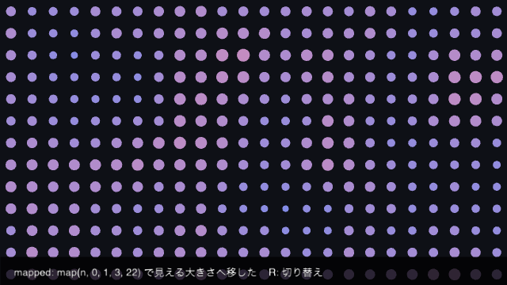
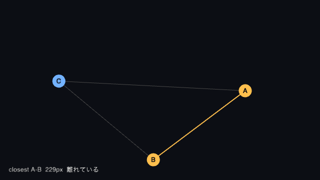
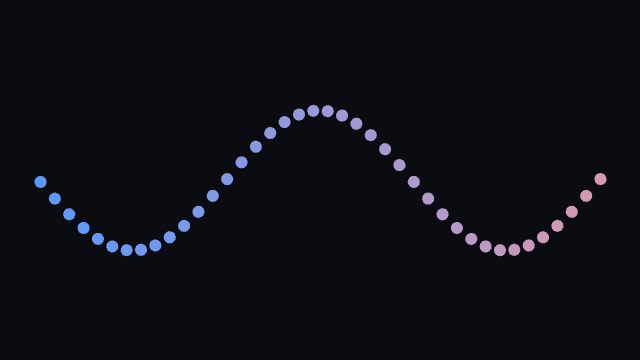

# 第 10 部 AI と作る

ここまでの 9 つの部では、書いたのも、動かしたのも、絵を見て良し悪しを決めたのも人でした。この部では、その真ん中にある「動かして見る」を AI エージェントにも渡します。

グラフィックスのコードには、**コンパイルが通ることと絵が正しいことがまったく別**という性質があります。型は合っていて、値も期待どおりで、それでも画面には何も出ていない、ということが起こります。だから AI にコードを書かせるだけでは足りません。AI が自分で動かし、出てきた絵と数値を見て、直せる必要があります。

metaphor はそのために、**自分自身を観測できるように**作られています。この部では、観測の口をスケッチ側で開き（10.1 / 10.2）、AI クライアントとつなぎ（10.3）、人と AI が同じスケッチを見る形にして（10.4）、AI に metaphor の作法を渡すところまで（10.5）を扱います。

## この部の前提

第 1 部 1.5 の `metaphor watch`、第 3 部 3.2 の `map()` と 3.6 のノイズ、第 8 部 8.4 の `@Param` を使います。AI についての予備知識は要りません。10.3 以降は AI クライアント（Claude Code など）が手元に入っていることを前提にします。

## 10.1 観測ループという考え方



格子状に並んだ点が、ノイズで大きさを変えながらゆっくり波打ちます。**R** を押すと、同じコードのまま「`noise()` の値をそのまま直径に使う」版に切り替わり、画面はほとんど空になります。

### 通るコードと、正しい絵

`noise()` が返すのは 0 から 1 の値です。これを直径にそのまま渡したコードは、Swift の型としては何も間違っていません。

```swift
let n = noise(Float(column) * 0.18, Float(row) * 0.18, phase)
circle(x, y, n)   // 直径 0.4 ピクセルの円が並ぶ
```

コンパイルは通り、警告も出ず、クラッシュもしません。`n` を `print()` すれば、期待どおりの 0.4 や 0.7 が流れます。それでも画面には何も出ていません。**この間違いは絵を見るまで分かりません**。

第 3 部 3.2 の `map()` を挟むと直ります。

```swift
let diameter = map(n, 0, 1, 3, 22)
```

### 「見る」を数値にする

人はこの違いを一目で見分けますが、AI に見てもらうには、絵そのものと、絵を要約した数値の両方が要ります。metaphor が撮る 1 枚には、画像に加えて次のような統計が付きます（この節のスケッチを両方の状態で撮った実測です）。

| | `contentFraction` | `contentBounds` |
|---|---|---|
| `map()` を挟んだ絵 | 0.16 | 画面のほぼ全体 |
| `noise()` の値をそのまま使った絵 | 0.009 | 画面下の帯だけ |

`contentFraction` は「背景と違う色をしているところがどれくらいあるか」、`contentBounds` は「そこが収まる矩形」です。絵を格子状に間引いて調べ、四隅から推定した背景色と十分に違うサンプルを中身と数えます。

後者の絵では、中身と判定されたのが画面下のキャプションの帯だけになりました。点はもう、間引いた格子に引っかからないほど小さいのです。**絵が出来ていない**ことが、画像を開かなくても数値から分かります。

こうした統計は、10.2 で扱う 1 枚の観測に自動的に付いてきます。スケッチ側で用意するものはありません。

### 観測ループ

やることは、人がここまでやってきたことと同じです。

```text
   書く ──→ 動かす ──→ 見る ──→ 直す ──┐
     ▲                                │
     └────────────────────────────────┘
```

違うのは、この輪を回すのが人だけではなくなることです。輪を AI にも渡すために、metaphor は 3 つの口を持っています。

| 口 | 何ができるか | どこで扱うか |
|---|---|---|
| **観測** | 実行中のスケッチの絵と内部状態を取り出す | 10.2 |
| **操作** | 入力を送る、`@Param` の値を書き換える | 8.4 / 10.3 |
| **文脈** | metaphor の API と作法を読ませる | 10.5 |

3 つともライブラリ側の機能です。これらを AI クライアントから使える形にまとめているのが `metaphor` コマンドで、10.3 で扱います。

### 直せる形にしておく

観測ループを回しやすいスケッチには、共通する性質があります。

- **同じ絵がもう一度出ること**。第 9 部 9.4 でやった「種を固定する」「時刻ではなくフレーム番号で動かす」がそのまま効きます。撮るたびに絵が変われば、直した結果なのか揺れなのかが判定できません
- **絵から読めない値を外に出しておくこと**。これが 10.2 です
- **調整したい数値がコードに埋まっていないこと**。`@Param` で宣言してあれば、再ビルドせずに振れます（8.4）

<!-- tutorial-snippet: 10-AI/01-ObservationLoop -->
```swift
import metaphor

@main
final class ObservationLoopSketch: Sketch {
    var config: SketchConfig {
        SketchConfig(width: 640, height: 360, title: "ObservationLoop")
    }

    /// R を押すと noise() の値をそのまま直径に使う。
    /// コンパイルも通り、値も正しいのに、画面はほとんど空になる
    var useRawNoise = false

    func setup() {
        // 種を固定する。同じ絵を何度でも観測できるようにするため
        noiseSeed(7)
    }

    func draw() {
        background(14, 16, 22)
        drawDots()
        drawCaption()
    }

    func keyPressed() {
        if key == "r" || key == "R" {
            useRawNoise.toggle()
        }
    }

    private func drawDots() {
        noStroke()
        let columns = 24
        let rows = 13
        let phase = Float(frameCount) * 0.01

        for row in 0..<rows {
            for column in 0..<columns {
                let x = (Float(column) + 0.5) * (width / Float(columns))
                let y = (Float(row) + 0.5) * (height / Float(rows))

                // noise() が返すのは 0〜1。この範囲のまま直径にすると 1 ピクセルにも満たない
                let n = noise(Float(column) * 0.18, Float(row) * 0.18, phase)
                let diameter = useRawNoise ? n : map(n, 0, 1, 3, 22)

                fill(Color(r: 0.35 + n * 0.6, g: 0.55, b: 1.0 - n * 0.35))
                circle(x, y, diameter)
            }
        }
    }

    private func drawCaption() {
        noStroke()
        fill(0, 0, 0, 190)
        rect(0, height - 36, width, 36)

        let label = useRawNoise
            ? "raw: noise() の値をそのまま直径に使っている"
            : "mapped: map(n, 0, 1, 3, 22) で見える大きさへ移した"
        fill(235)
        textSize(13)
        text("\(label)    R: 切り替え", 16, height - 13)
    }
}
```

実行: `cd Examples/Tutorial/10-AI/01-ObservationLoop && swift run`
<!-- /tutorial-snippet -->

### 試してみる

- `map(n, 0, 1, 3, 22)` の下限を 0 にすると、格子の一部が消えます。どの点から消えますか
- `noiseSeed(7)` の数字を変えて、模様がどう変わるか見てください。同じ数字なら何度実行しても同じ模様が出ます
- `phase` の係数 `0.01` を 0 にすると絵は止まります。止めた絵は、何フレーム目に撮っても同じですか

### ふりかえり

- [ ] コンパイルが通ることと絵が正しいことは別だと分かった
- [ ] `noise()` の 0〜1 を見える大きさへ移すのに `map()` が要ると分かった
- [ ] 絵の中身の量を `contentFraction` / `contentBounds` のような数値で見られると分かった
- [ ] 観測ループ（書く → 動かす → 見る → 直す）に AI を入れるには、観測・操作・文脈の 3 つが要ると分かった

### もっと詳しく

- [`map(_:_:_:_:_:)`](https://shinyaoguri.github.io/metaphor/reference/documentation/metaphorcore/sketch/map%28_:_:_:_:_:%29) / [`noise(_:_:_:)`](https://shinyaoguri.github.io/metaphor/reference/documentation/metaphorcore/sketch/noise%28_:_:_:%29)
- 統計（`stats`）の定義: [CONTRACT.md](https://github.com/shinyaoguri/metaphor/blob/main/CONTRACT.md)
- 同じ絵を再現する話: 第 9 部 9.4「きれいに焼き出す」

## 10.2 内部状態を申告する



3 つの点がそれぞれの軌道を回り、いちばん近い 2 点だけが色と線で強調されます。画面からは「A と B が近そうだ」までは読めますが、**それが何ピクセルなのか、しきい値を超えたのか**は読めません。この節では、その値をスケッチの外へ申告します。

### 申告は 1 行

```swift
probe("closest.distance", distance)
```

`probe(_:_:)` は、名前と値を渡すだけの関数です。渡せるのは `Int` / `Float` / `Double` / `String` / `Bool` と `Vec2` / `Vec3` / `Vec4` で、`draw()` の中から何度でも呼べます。

呼んだ値は画面には出ません。**観測が要求されたフレームだけ**、絵と一緒に書き出されます。

### 呼びっぱなしにしてよい

`probe(_:_:)` は、観測プラグインが登録されていないとき**何も記録せずに戻ります**。プラグインを探し回ることもしないので、毎フレーム何十回呼んでも通常実行の速度は変わりません（重い計算を引数に書けばその計算だけは走ります。渡すのは手元にある値にとどめます）。

これは意図された契約です。デバッグのときだけ足して消す運用にすると、いざ観測したいときに何も出てきません。**作りながら残していきます**。

### 観測を有効にする

観測プラグインは、環境変数で自動的に登録されます。

```bash
METAPHOR_PROBE=1 swift run
```

`metaphor watch` と 10.3 の MCP サーバは、これを自分で設定して子スケッチを起動します。手で指定するのは、この節のように単体で確かめたいときだけです。

`SketchConfig` に明示的に書く形もあります。

```swift
SketchConfig(
    width: 640, height: 360,
    plugins: [PluginFactory { MetaphorProbePlugin() }]
)
```

### 何が書き出されるか

観測が要求されると、スケッチのディレクトリの下に絵と値が並んで書かれます。

```text
.metaphor/probe/current/frame.png    その瞬間の絵
.metaphor/probe/current/frame.json   その瞬間の値
```

`frame.json` の中身は次のようなものです（この節のスケッチの実測です）。

```json
{
  "schemaVersion": 4,
  "frame": 167,
  "time": 2.77,
  "size": { "width": 640, "height": 360 },
  "custom": {
    "dots.count": 3,
    "closest.pair": "B-C",
    "closest.distance": 177.97862243652344,
    "closest.midpoint": [327.90018, 105.988884],
    "isTouching": false
  },
  "customTypes": {
    "dots.count": "int",
    "closest.pair": "string",
    "closest.distance": "double",
    "closest.midpoint": "vec2",
    "isTouching": "bool"
  },
  "stats": {
    "contentFraction": 0.0166,
    "contentBounds": { "x": 0.03125, "y": 0.25, "width": 0.65625, "height": 0.71875 },
    "meanLuminance": 0.0626
  },
  "performance": {
    "fps": 60, "targetFPS": 60,
    "frameTimeMs": { "mean": 16.7, "max": 16.7 },
    "memoryMB": 281, "cpuPercent": 8.7, "thermalState": "nominal"
  },
  "warnings": []
}
```

申告した値は `custom` に入ります。同じ名前が `customTypes` にも並ぶのは、JSON では `Vec2` と「2 要素の配列」を区別できないからです。読む側は型を推測せずに済みます。

`stats` と `performance` はスケッチ側で何もしなくても付きます。前者は 10.1 で見た絵の要約、後者は実測の速度・メモリ・CPU・熱状態です。**重いかどうかを絵から推測する必要はありません**。

### 何を申告するか

全部を申告する必要はありません。目安は 3 つです。

- **絵から読めない値**。距離、しきい値との関係、内部のカウンタ
- **判定の根拠**。「触れている」と描いたなら、その判定に使った数値も
- **いまどの状態か**。フェーズ名や選択中のモードを文字列で

逆に、絵を見れば分かるもの（円が何色か、どこにあるか）を並べても、読む側の手間が増えるだけです。

名前は `closest.distance` のようにドットで区切ると、増えたときに読みやすくなります。決まりではありませんが、揃えておくと差分を追いやすくなります。

<!-- tutorial-snippet: 10-AI/02-ProbeState -->
```swift
import metaphor

@main
final class ProbeStateSketch: Sketch {
    var config: SketchConfig {
        SketchConfig(width: 640, height: 360, title: "ProbeState")
    }

    /// 3 つの点。軌道の大きさと速さだけが違う
    let orbits: [(radiusX: Float, radiusY: Float, speed: Float, offset: Float)] = [
        (170, 110, 0.9, 0),
        (120, 140, -1.4, 1.7),
        (210, 70, 0.55, 3.4),
    ]
    let names = ["A", "B", "C"]

    /// この距離より近ければ「触れている」とみなす
    let touchDistance: Float = 90

    func draw() {
        background(12, 14, 20)

        // 位置はフレーム番号だけで決まる。同じフレームなら何度でも同じ絵になる
        let positions = orbits.map { position(for: $0) }
        let (pair, distance) = closestPair(positions)

        drawConnections(positions, closest: pair)
        drawDots(positions, closest: pair, distance: distance)

        // 絵から読めるのは「近そうかどうか」まで。値そのものは申告しないと伝わらない。
        // プラグインが登録されていないとき、この呼び出しは完全な no-op
        probe("dots.count", positions.count)
        probe("closest.pair", "\(names[pair.0])-\(names[pair.1])")
        probe("closest.distance", Double(distance))
        probe("closest.midpoint", (positions[pair.0] + positions[pair.1]) * 0.5)
        probe("isTouching", distance < touchDistance)
    }

    private func position(for orbit: (radiusX: Float, radiusY: Float, speed: Float, offset: Float)) -> Vec2 {
        let angle = Float(frameCount) * 0.01 * orbit.speed + orbit.offset
        return Vec2(
            width / 2 + cos(angle) * orbit.radiusX,
            height / 2 + sin(angle) * orbit.radiusY
        )
    }

    /// いちばん近い 2 点と、その距離
    private func closestPair(_ positions: [Vec2]) -> (pair: (Int, Int), distance: Float) {
        var best = (pair: (0, 1), distance: Float.greatestFiniteMagnitude)
        for i in 0..<positions.count {
            for j in (i + 1)..<positions.count {
                let d = positions[i].dist(to: positions[j])
                if d < best.distance {
                    best = (pair: (i, j), distance: d)
                }
            }
        }
        return best
    }

    private func drawConnections(_ positions: [Vec2], closest: (Int, Int)) {
        for i in 0..<positions.count {
            for j in (i + 1)..<positions.count {
                let isClosest = (i, j) == closest
                stroke(isClosest ? Color(r: 1, g: 0.75, b: 0.3) : Color(gray: 0.28))
                strokeWeight(isClosest ? 2 : 1)
                line(positions[i].x, positions[i].y, positions[j].x, positions[j].y)
            }
        }
    }

    private func drawDots(_ positions: [Vec2], closest: (Int, Int), distance: Float) {
        noStroke()
        for (index, p) in positions.enumerated() {
            let isClosest = index == closest.0 || index == closest.1
            fill(isClosest ? Color(r: 1, g: 0.75, b: 0.3) : Color(r: 0.45, g: 0.7, b: 1))
            circle(p.x, p.y, 26)

            fill(12, 14, 20)
            textSize(13)
            textAlign(.center, .center)
            text(names[index], p.x, p.y)
        }

        fill(210)
        textSize(13)
        textAlign(.left, .baseline)
        let state = distance < touchDistance ? "触れている" : "離れている"
        text("closest \(names[closest.0])-\(names[closest.1])  \(Int(distance))px  \(state)", 16, height - 18)
    }
}
```

実行: `cd Examples/Tutorial/10-AI/02-ProbeState && swift run`
<!-- /tutorial-snippet -->

### 試してみる

- `METAPHOR_PROBE=1 swift run` で起動し、別のターミナルから次を実行してください。`.metaphor/probe/current/` に絵と値が出ます

  ```bash
  echo '{"id":"snap-1","label":"baseline"}' > .metaphor/probe/request.json
  ```

- 同じ内容をもう一度書いても、新しい絵は出てきません。`id` を変えると出ます。なぜでしょうか
- `touchDistance` を 250 にして観測すると、`isTouching` はどう変わりますか
- `probe("names", names)` のように配列を渡すとコンパイルが通りません。渡せる型の一覧に戻って、どう書き換えるか考えてください

### ふりかえり

- [ ] `probe(_:_:)` で絵に写らない値を外へ出せるようになった
- [ ] 観測プラグインが無いとき `probe(_:_:)` は完全な no-op だと分かった
- [ ] `METAPHOR_PROBE=1` で観測が有効になると分かった
- [ ] `frame.json` の `custom` / `customTypes` / `stats` / `performance` がそれぞれ何かを説明できる
- [ ] 申告するのは「絵から読めない値」だと分かった

### もっと詳しく

- [`Sketch`](https://shinyaoguri.github.io/metaphor/reference/documentation/metaphorcore/sketch) — `probe(_:_:)` の全オーバーロード
- [`MetaphorProbePlugin`](https://shinyaoguri.github.io/metaphor/reference/documentation/metaphorcore/metaphorprobeplugin) — 登録のしかたと性能の契約
- `frame.json` のスキーマと全フィールド: [CONTRACT.md](https://github.com/shinyaoguri/metaphor/blob/main/CONTRACT.md)
- 別の題材の例: [`Examples/Samples/ProbeSnapshot`](https://github.com/shinyaoguri/metaphor/tree/main/Examples/Samples/ProbeSnapshot)

## 10.3 MCP でつなぐ



点が横に並んで波打ちます。このスケッチには GUI パネルがありませんが、点の数・速さ・振幅・形は**外から変えられます**。10.2 の申告と 8.4 の `@Param` を両方持たせた、AI に渡すための形です。

### 登録は最初の 1 回だけ

MCP（Model Context Protocol）は、AI クライアントと道具をつなぐための規約です。`metaphor` コマンドはこの規約に沿ったサーバを持っていて、スケッチのディレクトリで 1 回登録すれば、あとは AI クライアントが必要なときに裏で起動します。

```bash
claude mcp add metaphor -- metaphor mcp .
```

リポジトリで共有するなら、スケッチ直下に `.mcp.json` を置く形もあります。

```json
{
  "mcpServers": {
    "metaphor": { "type": "stdio", "command": "metaphor", "args": ["mcp", "."] }
  }
}
```

**`metaphor mcp` を自分でターミナルから打つことはありません**。`metaphor run` や `metaphor watch` とは役割が違い、起動と終了は AI クライアントが受け持ちます。

### AI が使える道具

登録すると、AI は次の道具を持ちます。

| 道具 | 何をするか |
|---|---|
| `snapshot` | いまのフレームを 1 枚撮り、絵と `frame.json`（10.2）を返す |
| `capture_sequence` | 連続したフレームを撮り、一覧の絵とフレームごとの記録を返す |
| `input` | マウス・キー入力を送る |
| `params` | `@Param` で宣言された値の一覧（型・現在値・範囲・選択肢）を返す |
| `set_param` | 値を書き換える。再ビルドは要らない |
| `build_status` | 直近のビルドが通ったか、エラーは何かを返す |
| `api_reference` | metaphor の API ドキュメントを返す（10.5） |

道具の名前を覚える必要はありません。AI クライアントに目的を伝えれば、必要なものが選ばれます。

> 「円がゆっくり波打つようにして。`snapshot` で確認しながら調整して。」

### 撮る道具と、動かす道具

1 枚か連続かは、確かめたいものによって変わります。**止まった絵の構図**なら `snapshot`、**動きやリズム**なら `capture_sequence` です。1 枚では動いているかどうかが判定できず、連続で撮ると 1 枚あたりの情報は減ります。

値を探すときは `set_param` が効きます。ソースを書き換えて再ビルドすると数秒かかりますが、`@Param` の値はファイルを 1 往復するだけで、次のフレームには反映されます。「振幅を 20 から 140 まで振って、いちばん良いところを探して」という依頼が現実的な速さで回るのはこのためです。

このスケッチが `gui.params()` を呼んでいないことに注目してください。**パネルを出さなくても、宣言した値は外から見え、書き換えられます**。人が触るためのパネルと、外から触るための口は別のものです。

### 知っておくと詰まらないこと

- **最初の 1 枚は遅い**。ビルドとスケッチの起動を待つので数秒かかります。2 枚目以降は速くなります
- **`noLoop()` で止まっているスケッチは応答しません**。観測の要求はフレームの中で処理されるためです。止めて焼き出す作りにするなら、観測したい間は動かしておきます
- **入力は送りっぱなしです**。再ビルド中でスケッチが居ない瞬間に送られた入力は捨てられます
- **絵が変わらないときは、まず `build_status`**。直っていないのか、ビルドが落ちていて古いスケッチが動き続けているのかを最初に切り分けます

<!-- tutorial-snippet: 10-AI/03-AgentTools -->
```swift
import metaphor

@main
final class AgentToolsSketch: Sketch {
    // 外から触れる面。GUI を出していなくても、宣言した時点で外部から読み書きできる
    @Param(min: 8, max: 96) var count: Int = 40
    @Param(min: 0, max: 3) var speed: Float = 1
    @Param(min: 0, max: 160) var amplitude: Float = 70
    @Param(choices: ["dots", "bars"]) var style: String = "dots"

    var config: SketchConfig {
        SketchConfig(width: 640, height: 360, title: "AgentTools")
    }

    func draw() {
        background(10, 12, 18)

        let phase = Float(frameCount) * 0.02 * speed
        var peak: Float = 0

        noStroke()
        for i in 0..<count {
            let t = Float(i) / Float(max(count - 1, 1))
            let x = 40 + t * (width - 80)
            let offset = sin(phase + t * TWO_PI * 1.5) * amplitude
            let y = height / 2 + offset
            peak = max(peak, abs(offset))

            fill(Color(r: 0.35 + t * 0.5, g: 0.6, b: 1 - t * 0.3))
            if style == "bars" {
                rect(x - 4, min(y, height / 2), 8, abs(offset))
            } else {
                circle(x, y, 12)
            }
        }

        // 絵に写らない値を申告する。AI はこれを snapshot の応答で読む
        probe("wave.count", count)
        probe("wave.peak", peak)
        probe("wave.style", style)
    }
}
```

実行: `cd Examples/Tutorial/10-AI/03-AgentTools && swift run`
<!-- /tutorial-snippet -->

### 試してみる

- このディレクトリで `claude mcp add metaphor -- metaphor mcp .` を実行し、AI クライアントに「いま見えている絵を確認して」と頼んでください
- 「点の数を 96 にして、絵がどう変わったか見せて」と頼むと、`set_param` と `snapshot` が続けて使われます
- `probe("wave.peak", peak)` を消してから同じ依頼をすると、AI の答えはどう変わりますか
- `@Param(min: 8, max: 96)` の上限を超える値を書き込むよう頼むと、どうなりますか

### ふりかえり

- [ ] MCP サーバの登録は最初の 1 回だけだと分かった
- [ ] `metaphor mcp` を自分で起動しないと分かった
- [ ] 1 枚（`snapshot`）と連続（`capture_sequence`）の使い分けが分かった
- [ ] 数値の調整は再ビルドより `set_param` が速いと分かった
- [ ] GUI パネルを出さなくても `@Param` の値は外から触れると分かった

### もっと詳しく

- [metaphor-cli の「AI と協調する」](https://github.com/shinyaoguri/metaphor-cli#ai-と協調する) — 登録・道具・全体の流れの正典
- [`Param`](https://shinyaoguri.github.io/metaphor/reference/documentation/metaphorcore/param) — 宣言のしかた（8.4）
- 設計の背景: [docs/design/ai-mcp-server.md](https://github.com/shinyaoguri/metaphor/blob/main/docs/design/ai-mcp-server.md)

## 10.4 人と AI で同じスケッチを見る

この節にはスケッチがありません。扱うのは**動かし方**です。ここまでのどの節のスケッチでも同じように試せます。

10.3 の形では、AI が自分でスケッチを起動して観測していました。画面には何も出ないので、人は AI の報告を通してしか絵を見られません。人がライブビューアで見ながら、同じ実体を AI にも観測させるのが**共有セッション**です。

### 3 つの形

| 形 | ターミナル | 見え方 | 起動 |
|---|---|---|---|
| AI 主導 | 要らない | 画面に出ない（AI が観測する） | AI クライアントが自動で起動する |
| 人のライブ編集 | 1 つ | ライブビューア窓 | `metaphor watch` |
| 共有セッション | 1 つ | ライブビューア窓 | `metaphor watch` ＋ AI クライアント |

### 順序が最重要

共有セッションは、順序を間違えると成立しません。

1. **先に**ターミナルで `metaphor watch` を起動します
2. **次に**同じディレクトリで AI クライアントを開きます

この順なら、AI クライアントが裏で起動する MCP サーバは、**新しくスケッチを起動せず、動作中の `watch` にアタッチ**します。人が見ている窓と、AI が観測する絵が同じものになります。

逆順だと、MCP サーバは `watch` を見つけられず、**自前の別のスケッチ**を起動して観測します。AI は「直りました」と言い、人の窓は何も変わらない、という食い違いが起きます。アタッチするかどうかを決めるのは**起動した瞬間の 1 回だけ**で、あとから見直さないためです。

順序を間違えたときは、AI クライアント側で MCP を接続し直します（Claude Code なら `/mcp`）。サーバが起動し直され、今度は `watch` を見つけます。

### 共有セッションでできること

- **編集は両方から**。人はエディタで、AI はファイルを直接書きます。どちらの保存でも `watch` が再ビルドし、両者に同じ結果が反映されます
- **ビルドの持ち主は `watch` だけ**なので、同時に編集してもビルドがぶつかりません
- **`@Param` の値は両方から動かせます**。人の GUI スライダーと AI の `set_param` は同じストアの表と裏で、片方が動かせばもう片方の表示も変わります（8.4）
- **入力の注入は効きません**。`input` は AI 主導の形だけの道具です。マウスやキーで試したいことは人が窓で行います

観測を共有したくないときは `metaphor watch --no-probe` で起動します。

### 何を人が引き受けるか

共有セッションにすると、役割が自然に分かれます。AI は数値で判定できること（値が範囲に入っているか、ビルドが通ったか、フレーム時間が伸びていないか）を引き受け、**良いかどうかの判断は人が引き受けます**。作品の良し悪しは `contentFraction` には出てきません。

### 試してみる

- 10.3 のディレクトリで `metaphor watch` を起動してから AI クライアントを開き、「いま見えている絵を確認して」と頼んでください。窓と同じ絵が返りますか
- 順序を逆にして同じことを試し、`/mcp` で接続し直すと直ることを確かめてください
- `watch` を動かしたまま人がパネルで値を変え、AI に `params` を読ませてください。同じ値が見えますか

### ふりかえり

- [ ] AI 主導・人のライブ編集・共有セッションの 3 つの形を区別できるようになった
- [ ] 共有セッションは `metaphor watch` が先、AI クライアントが後だと分かった
- [ ] 順序を間違えると AI が別のスケッチを見てしまうと分かった
- [ ] 共有セッションでは入力の注入が効かず、`@Param` は効くと分かった

### もっと詳しく

- [metaphor-cli の「人間と AI で同じスケッチを共有する」](https://github.com/shinyaoguri/metaphor-cli#人間と-ai-で同じスケッチを共有する共有セッション) — 起動と切り分けの正典
- 設計の背景: [docs/design/shared-session.md](https://github.com/shinyaoguri/metaphor/blob/main/docs/design/shared-session.md)
- ライブ編集そのもの: 第 1 部 1.5「ライブ編集」

## 10.5 AI に metaphor 流を教える

この節にもスケッチがありません。用意するのは絵ではなく、**AI に渡す文脈**です。

metaphor は Processing の発想を持っていますが、Processing でも p5.js でもありません。文脈を渡さないまま頼むと、AI は近い記憶で書きます。`createCanvas()` を呼び、`PVector` を使い、`loadShader()` でシェーダーを差し替えようとします。どれもこのライブラリには無く、ビルドが通りません。

### 渡すもの

metaphor は、AI に読ませるための資料を 3 つ持っています。

| 資料 | 中身 | いつ渡すか |
|---|---|---|
| `llms-sketch.txt` | スケッチを書くための作法。型・落とし穴・最小の骨格 | 常に |
| `llms.txt` | 公開 API の全シグネチャ | 知らない API を使うとき |
| [`docs/ai/examples-index.md`](https://github.com/shinyaoguri/metaphor/blob/main/docs/ai/examples-index.md) | 全サンプルの索引 | 近い題材を探すとき |

10.3 の MCP を登録していれば、これらは `api_reference` で読めます。ファイルを探して貼る必要はありません。

MCP を使わない場合（別の AI クライアントやブラウザ上のチャット）は、`llms-sketch.txt` を貼るところから始めます。metaphor に依存したスケッチのディレクトリなら、`.build/checkouts/metaphor/` の下に実体があります。

### 依頼の型

[`docs/ai/prompts/`](https://github.com/shinyaoguri/metaphor/tree/main/docs/ai/prompts) に用途別のテンプレートが置いてあります。生成 2D、音に反応する絵、ポストエフェクト、ライブ用のループ、エラーの修理、既存スケッチの改善の 6 種類です。そのまま使うより、**どういう情報を渡しているか**を見ておくと、自分の依頼が書けるようになります。共通しているのは次の 3 つです。

- **作りたいものを絵で言う**。「粒子を出す」ではなく「暗い背景に、下から上へ細かい粒がゆっくり昇る」
- **触ってよい範囲を決める**。どのファイルを変えてよいか、既存の構造を保つか
- **検証まで含めて頼む**。「`snapshot` で確認して」「`build_status` でビルドが通ったか確かめて」

3 つ目が観測ループを閉じます。これを書かないと、AI は書いたところで止まり、動かさないまま「できました」と言います。

### 直しの依頼

うまくいかないときの頼み方にも型があります。

| 症状 | 頼み方 |
|---|---|
| 絵がおかしい | 「いま見えている絵を撮って、何が期待と違うか言ってから直して」 |
| 動きがおかしい | 「2 秒ぶん連続で撮って、動きが滑らかか見て」 |
| 重い | 「`snapshot` の `performance` を見て、どこが重いか切り分けて」 |
| ビルドが通らない | 「`build_status` のエラーを読んで、`api_reference` で正しいシグネチャを調べてから直して」 |

いずれも「見てから直して」の形です。AI がコードだけを見て直すと、10.1 の `noise()` のような間違いは残ります。

### 判断は渡さない

観測ループを渡しても、**何を良しとするかは渡せません**。AI が返すのは「値は範囲に入っている」「ビルドは通った」「フレーム時間は伸びていない」までで、その絵が作品として良いかどうかの判定は入っていません。

道具立てとしては、これで一周です。書き、動かし、見て、直す。その輪を人と AI で分担できるところまで来ました。

### ふりかえり

- [ ] AI に渡す資料が `llms-sketch.txt` / `llms.txt` / サンプル索引の 3 つだと分かった
- [ ] MCP を登録していれば `api_reference` でそれらを読めると分かった
- [ ] 依頼には検証（`snapshot` / `build_status`）まで含めると分かった
- [ ] 良し悪しの判断は人が引き受けると分かった

### もっと詳しく

- [`llms.txt`](https://github.com/shinyaoguri/metaphor/blob/main/llms.txt) / [`llms-sketch.txt`](https://github.com/shinyaoguri/metaphor/blob/main/llms-sketch.txt)
- [用途別のプロンプト](https://github.com/shinyaoguri/metaphor/tree/main/docs/ai/prompts)
- [Processing / p5.js からの移行ガイド](https://github.com/shinyaoguri/metaphor/blob/main/docs/processing-migration-guide.md) — 「Processing の X は metaphor では Y」の対応表

## この部のまとめ

スケッチが、自分の状態を語れるようになりました。

1. **観測** — `probe(_:_:)` で絵に写らない値を申告する。絵の統計と実測の速度は黙って付いてくる
2. **接続** — MCP を 1 回登録すれば、AI が撮り、値を振り、ビルドを確かめられる
3. **共有** — `metaphor watch` を先に起動すれば、人の窓と AI の観測が同じ実体になる
4. **文脈** — `llms-sketch.txt` と用途別のプロンプトで、metaphor の作法を渡す

この部でスケッチに足したものは、どれも**作品そのものには写りません**。`probe(_:_:)` は絵を変えず、`@Param` は見た目を変えず、観測は要求されたときしか動きません。それでも、直すのにかかる時間はここで決まります。

## チュートリアルを終えて

第 1 部から第 10 部までで、metaphor で作るための道具は一通り出てきました。図形と色、動き、入力、3D、GPU、音と映像、外との接続、書き出し、そして AI との協調です。

ここから先は、引くためのドキュメントが役に立ちます。

- [Examples/LEARNING_PATH.md](https://github.com/shinyaoguri/metaphor/blob/main/Examples/LEARNING_PATH.md) — サンプルをどの順に開くかの地図
- [docs/ai/examples-index.md](https://github.com/shinyaoguri/metaphor/blob/main/docs/ai/examples-index.md) — やりたいことから探す索引
- [API リファレンス](https://shinyaoguri.github.io/metaphor/reference/documentation/metaphor/) — 型とメソッドを引く
- [Processing / p5.js からの移行ガイド](https://github.com/shinyaoguri/metaphor/blob/main/docs/processing-migration-guide.md) — 他の環境の作法との対応

作りはじめて詰まったところ、ドキュメントで分からなかったところは [Issue](https://github.com/shinyaoguri/metaphor/issues) に書いてください。このチュートリアル自体、書きながら見つかった不具合を直しながら育ってきました。
